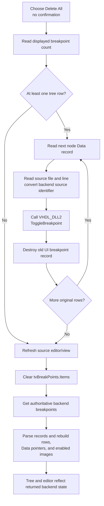

# Delete all displayed HDL breakpoints

## Control

| Property | Recovered value |
| --- | --- |
| Form | HDLDebugger |
| Component path | HDLDebugger.pmPopupMenuBreakPoints.DeleteAll1 |
| Control class | TMenuItem |
| Popup menu | pmPopupMenuBreakPoints |
| Caption | Delete &All |
| Hint, shortcut, or image | Not present in the recovered resource |
| Handler name | DeleteAll1Click |
| Handler address | 0109ec30 |
| Graph node | `resource:dfm:HDLDebugger/HDLDebugger.pmPopupMenuBreakPoints.DeleteAll1` |
| Handler node | `function:0109ec30` |
| Graph layer | UI |

## What happens when clicked

**Delete All** removes the breakpoints represented by the current `tvBreakPoints` tree. It executes immediately. The handler does not show a confirmation dialog and does not require a selected tree node.

`FUN_0109ec30` takes the displayed tree-node count once and then processes the nodes in index order. For each node, it:

1. reads the breakpoint record from the tree node's Data pointer;
2. reads the source line from record offset `+0x8` and the source-file string from `+0x10`;
3. converts the source-file string into the character buffer expected by VHDL_DLL2;
4. calls `_Dbg_ToggleBreakpoint` with the current debugger session, line, and converted source identifier; and
5. destroys the old UI breakpoint record.

The handler uses the backend's toggle operation for each listed record. It does not call a separate bulk-delete API. This is a removal operation because each row was built from an existing backend breakpoint.

After the loop, the handler requests a refresh of the current source editor/view through virtual slot `+0x180`. This updates the editor surface that shows breakpoint gutter markers. It then calls the shared breakpoint reload routine.

## Backend and tree synchronization

`FUN_0109e470` rebuilds the breakpoint tree from VHDL_DLL2:

1. It clears `tvBreakPoints.Items`.
2. It calls `_Dbg_GetBreakPoints` for the active debugger session.
3. It stores and parses the returned breakpoint data against the active HDL source model.
4. For each parsed record, it creates a tree node whose text combines the source name and line number.
5. It stores the record in the node's Data pointer and sets the node image and state indexes from the record's enabled flag.

Form creation loads `icon_breakpoint_line` and `icon_breakpoint_line_disabled` for this tree. The reload therefore restores both the row list and its active or disabled visual state from backend data. The local tree is not treated as authoritative after deletion.

This last reload is important when the display is stale. **Delete All** toggles only the breakpoints that are represented by current tree rows. A breakpoint that exists in the backend but is absent from the tree is not toggled; the authoritative reload can make it appear afterward.

## Click flow

## Selection, empty, and repeated behavior

- The handler does not read the selected-node field at form offset `+0xa20`. It deletes every displayed row independently of the popup selection.
- With an empty tree, the loop is skipped. The source editor refresh and backend tree reload still run.
- A repeated click after a successful deletion follows the empty-tree path and refreshes again.
- The handler records the starting row count and does not delete tree nodes during the loop. It frees each node's Data object, then the reload clears and replaces all nodes after iteration.
- `mnDelete` and `mnToggleEnabled` are selection-specific sibling commands. They guard on `+0xa20`, operate on one record, refresh the editor, and call the same reload routine.

## Error and partial-state behavior

- The handler has no local exception handler, retry loop, confirmation, result check, or error message.
- `_Dbg_ToggleBreakpoint` returns no status that this handler checks. If a toggle returns normally but the backend keeps a breakpoint, the final reload restores that breakpoint row.
- If source conversion, a backend call, record destruction, or another loop operation raises an exception, the remaining displayed breakpoints are not processed. The editor refresh and authoritative reload are also skipped because they occur after the loop.
- A failure can therefore leave a partially changed backend and an old tree until another debugger refresh runs. The handler has no rollback for breakpoints that were already toggled.
- The backend uses toggle semantics. The handler assumes each listed record still identifies an existing backend breakpoint. Concurrent backend changes are not checked before the call; the final reload is the only reconciliation step after a normal return.

## Model and persistence boundary

- The durable state for this operation is the current VHDL_DLL2 debugger session, not the tree nodes. The old node Data objects are destroyed and reconstructed from the backend response.
- The source editor/view receives a repaint or invalidate-style call, but its text, caret, and selection are not changed by this handler.
- The handler does not write a project file, registry value, INI file, or settings object.
- A separate debugger-finalization path later calls `_Dbg_GetBreakPoints` and copies the returned breakpoint data into caller-owned run state. If finalization occurs after this command, it can publish the resulting empty or remaining list. That later copy is not part of this click and does not prove file persistence.

## Evidence

- [Delete All handler `FUN_0109ec30`](../../../DecompiledSources/Tina16/functions/000000000109EC30__FUN_0109ec30.c) enumerates `tvBreakPoints.Items`, toggles every row's backend breakpoint, destroys its Data record, refreshes the source editor/view, and calls the tree reload without a confirmation or selection guard.
- [Breakpoint tree reload `FUN_0109e470`](../../../DecompiledSources/Tina16/functions/000000000109E470__FUN_0109e470.c) clears the tree, calls `_Dbg_GetBreakPoints`, parses the response, creates rows, attaches breakpoint records, and restores enabled or disabled node state.
- [Breakpoint-tree mouse handler `FUN_0109ea20`](../../../DecompiledSources/Tina16/functions/000000000109EA20__FUN_0109ea20.c) proves that form field `+0xa20` is the selected tree node and that its Data pointer is the selected breakpoint record.
- [Single-delete handler `FUN_0109ebc0`](../../../DecompiledSources/Tina16/functions/000000000109EBC0__FUN_0109ebc0.c) and [enabled-toggle handler `FUN_0109ece0`](../../../DecompiledSources/Tina16/functions/000000000109ECE0__FUN_0109ece0.c) establish the shared record fields, backend session call, source editor/view refresh, and reload sequence.
- [FormCreate `FUN_0109c800`](../../../DecompiledSources/Tina16/functions/000000000109C800__FUN_0109c800.c) initializes `tvBreakPoints`, loads the active and disabled breakpoint images, and clears the selected-node field.
- [Debugger finalization `FUN_0109f350`](../../../DecompiledSources/Tina16/functions/000000000109F350__FUN_0109f350.c) shows the later boundary that copies `_Dbg_GetBreakPoints` data into caller-owned state.
- [Recovered Delphi resource evidence](../../../DecompiledSources/Tina16/resources/dfm/ui-evidence.json) supplies the popup-menu hierarchy, **Delete All** caption, sibling menu commands, event binding, and lack of hint or image evidence.

## Annotation ownership and limits

- This Bead owns unique handler `FUN_0109ec30` and canonical shared reload `FUN_0109e470`. Beads `.597` and `.598` cite and omit the reload.
- Broad string conversion helper `FUN_00442620`, generic tree-node helpers, the Delphi destruction helper, and VHDL_DLL2 imports remain evidence-only.
- RTTI and event use prove `+0x7a8` is `tvBreakPoints`. The exact published name of the source editor/view reference at `+0x980` is not recovered, so the article does not invent one.
- The exact serialized syntax returned by `_Dbg_GetBreakPoints` is parsed by shared HDL model code and is not recovered here. The record readers establish source, line, and enabled fields.
- The menu item has no recovered hint, shortcut, glyph, image-list reference, action, checked state, or same-parent label candidate.
