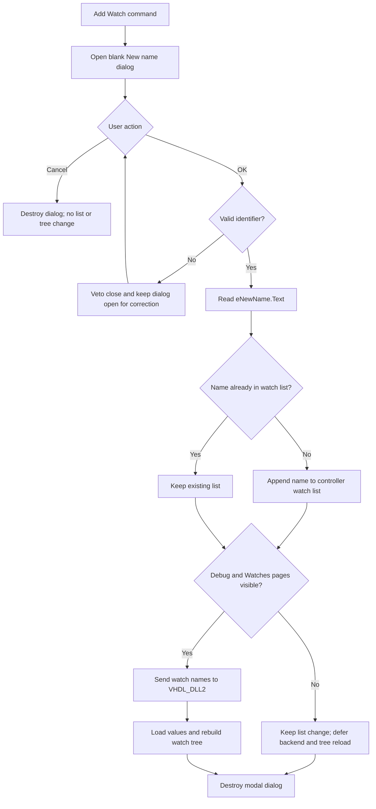

# &Add Watch...

> Analysis status: Complete source review.

## Control

| Property | Recovered value |
| --- | --- |
| Form | HDLDebugger |
| Component path | HDLDebugger.pmPopupWatches.mnAddWatch |
| Control class | TMenuItem |
| Caption | &Add Watch... |
| Hint | Not present in the recovered resource. |
| Text | Not present in the recovered resource. |
| Handler name | mnAddWatchClick |
| Handler address | 0109e250 |
| Graph node | `resource:dfm:HDLDebugger/HDLDebugger.pmPopupWatches.mnAddWatch` |
| Handler node | `function:0109e250` |
| Graph layer | UI |

## What happens when clicked

The command opens a centered modal `NewName` dialog. This dialog has the
caption and label **New name**, a blank `TEdit`, and standard **OK**,
**Cancel**, and **Help** buttons. The handler does not read the selected watch
tree node, the popup-menu sender, or another source control. The typed name is
the only candidate that this command uses.

The `NewName` form starts in identifier-validation mode. Its **OK** handler
accepts these characters:

- the first character must be `A` through `Z`, `a` through `z`, or `_`;
- later characters can also be `0` through `9`.

An empty string or another character sets the dialog's error flag.
`NewName.FormCloseQuery` then vetoes the accepting close and resets the flag
for the next attempt. This caller does not supply the dialog's optional error
message text, so the generic message helper has no text to display. The dialog
stays open and keeps the entered text available for correction. This check
only validates the name format. It does not prove that the HDL object exists
or is accessible.

## Watch-list change

When `ShowModal` returns `1` for **OK**, the handler reads `eNewName.Text`. It
also checks that the returned Delphi string is not empty. It then passes the
name to the debugger controller's watch-list helper.

The helper searches the controller's watch `TStringList` at field `+0x28`:

- if `IndexOf` returns `-1`, it appends the name;
- if the name is already present, it leaves the list unchanged.

The helper does not replace, reorder, or select a watch. It does not report a
duplicate. The recovered source does not establish whether this particular
`TStringList` uses a case-sensitive comparison.

## Backend and tree refresh

After an accepted name, the handler reads two active-page indexes. It calls the
watch reload only when the outer page is **Debug** at index `1` and the inner
debug page is **Watches** at index `2`.

The shared reload serializes the current watch-name list, sends it to
`VHDL_DLL2` through `_Dbg_SetWatchItems`, calls `_Dbg_LoadWatch`, and rebuilds
the watch tree. This reload also runs after an accepted duplicate because the
add helper does not return a changed/not-changed result.

If another page is visible, the name still enters the controller list, but this
click does not update the backend or tree immediately. The debug-page change
dispatcher performs the same watch reload when the user later selects the
**Watches** page.

## Cancel, errors, and persistence

- **Cancel** returns a modal result other than `1`. The handler does not read
  the edit, change the watch list, or reload the tree.
- An invalid identifier cannot return the accepting result because
  `FormCloseQuery` vetoes the close.
- The handler has no local exception handler and does not inspect a backend
  reload status. A dialog, list, or backend exception stops the remaining
  path. The recovered code does not provide rollback for an append that
  succeeded before a reload failure.
- The click changes the live debugger controller. It does not write a file,
  registry setting, or INI setting.
- A separate debugger teardown path serializes the current watch list into the
  active debugger/module state field at `+0x18`. The debugger setup path later
  restores the controller list from that field. The recovered source does not
  prove when or whether that containing state is saved to a project file.

The modal `NewName` instance is destroyed after the normal **OK** or **Cancel**
path returns.

## Click flow

## Handler evidence

- Handler: [FUN_0109e250](../../../DecompiledSources/Tina16/functions/000000000109E250__FUN_0109e250.c)
- Generic modal-form constructor: [FUN_007fc180](../../../DecompiledSources/Tina16/functions/00000000007FC180__FUN_007fc180.c)
- `NewName` **OK** validation: [FUN_0106bab0](../../../DecompiledSources/Tina16/functions/000000000106BAB0__FUN_0106bab0.c)
- Identifier-character validator: [FUN_01055790](../../../DecompiledSources/Tina16/functions/0000000001055790__FUN_01055790.c)
- `NewName.FormCloseQuery`: [FUN_0106ba80](../../../DecompiledSources/Tina16/functions/000000000106BA80__FUN_0106ba80.c)
- Accepted-name getter: [FUN_0106c180](../../../DecompiledSources/Tina16/functions/000000000106C180__FUN_0106c180.c)
- Unique watch-list append: [FUN_00f7d180](../../../DecompiledSources/Tina16/functions/0000000000F7D180__FUN_00f7d180.c)
- Active-page index reader: [FUN_006d8150](../../../DecompiledSources/Tina16/functions/00000000006D8150__FUN_006d8150.c)
- Canonical watch-tree reload: [FUN_0109d7c0](../../../DecompiledSources/Tina16/functions/000000000109D7C0__FUN_0109d7c0.c)
- Debug-subpage dispatcher: [FUN_0109dd80](../../../DecompiledSources/Tina16/functions/000000000109DD80__FUN_0109dd80.c)
- Watch-list state restore: [FUN_0109e3d0](../../../DecompiledSources/Tina16/functions/000000000109E3D0__FUN_0109e3d0.c)
- Teardown state capture: [FUN_0109f350](../../../DecompiledSources/Tina16/functions/000000000109F350__FUN_0109f350.c)
- **Add Object** toolbar wrapper: [FUN_0109f860](../../../DecompiledSources/Tina16/functions/000000000109F860__FUN_0109f860.c)
- Resource evidence: [ui-evidence.json](../../../DecompiledSources/Tina16/resources/dfm/ui-evidence.json)

`FUN_0109e250` is complex. It has seven recovered direct calls. The function is
in the `UI` graph layer. The `NewName` validation and VHDL backend calls occur
in the relevant callees.

## Sibling behavior boundary

- **Delete Watch** uses the selected watch-tree node to remove one matching
  name. Its handler and delete helper belong to the sibling analysis.
- **Delete All Watches** clears the controller's watch-name list. Its handler
  and clear helper belong to the sibling analysis.
- The **Add Object** speed button calls this exact handler. It supplies no
  selected object to the handler, despite its caption.
- The canonical shared watch-tree reload is existing graph knowledge. This
  analysis cites it but does not redefine it.

## Resource evidence

- The popup item caption is **&Add Watch...**.
- Its parent popup also contains **&Delete Watch** and **Delete &All Watches**.
- The menu item has no hint, glyph, image reference, checked state, or modal
  result.
- The modal `NewName` form has a blank edit and standard `bkOK`, `bkCancel`,
  and `bkHelp` buttons.
- The **Add Object** speed button uses the same handler and has its own glyph.
  That image belongs to the toolbar control, not to this menu item.

## Nearby label candidates

No same-parent label candidate is available. The dialog's recovered **New
name** label and the handler data flow identify the input field directly.

## Analysis limits

- The lexical validator does not check the HDL symbol table. Backend load
  behavior for a syntactically valid but unknown name is not recovered here.
- The `TStringList` comparison configuration is not recovered, so duplicate
  case behavior remains unknown.
- The later in-memory state capture is proven. Project-file persistence is not.
