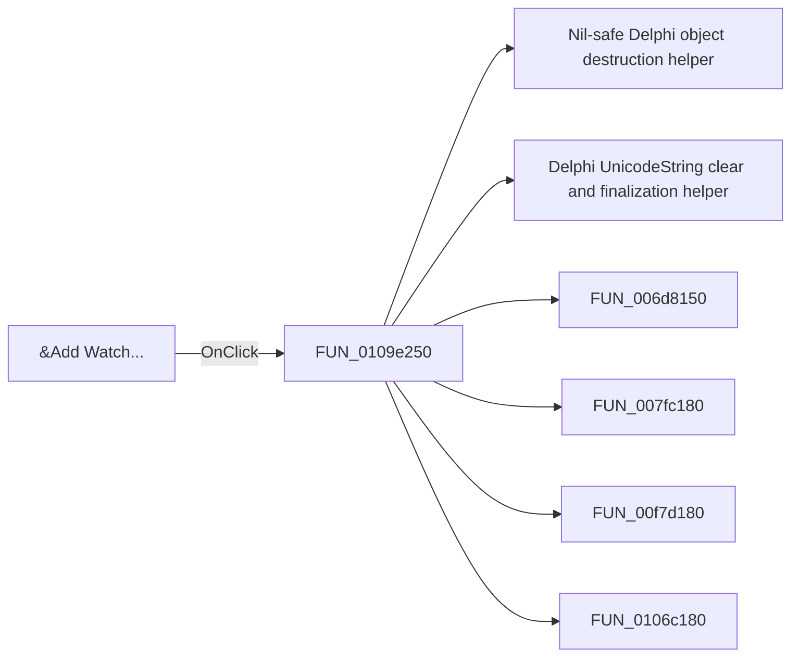

# &Add Watch...

> Analysis status: Pending individual source review.

## Control

| Property | Recovered value |
| --- | --- |
| Form | HDLDebugger |
| Component path | HDLDebugger.pmPopupWatches.mnAddWatch |
| Control class | TMenuItem |
| Caption | &Add Watch... |
| Hint | Not present in the recovered resource. |
| Text | Not present in the recovered resource. |
| Handler name | mnAddWatchClick |
| Handler address | 0109e250 |
| Graph node | `resource:dfm:HDLDebugger/HDLDebugger.pmPopupWatches.mnAddWatch` |
| Handler node | `function:0109e250` |
| Graph layer | UI |

## What happens when clicked

Pending individual analysis. An agent must read the recovered handler source and its relevant callees before it replaces this text.

## Click flow

## Handler evidence

- Source: [DecompiledSources/Tina16/functions/000000000109E250__FUN_0109e250.c](../../../DecompiledSources/Tina16/functions/000000000109E250__FUN_0109e250.c)
- Recovered role: Not present in the recovered resource.
- Current graph summary: Handles 1 Delphi UI event: HDLDebugger.pmPopupWatches.mnAddWatch.OnClick.
- Current graph behavior: Not present in the recovered resource.
- Current graph evidence: Not present in the recovered resource.
- Complexity: complex
- Distinct outgoing calls: 7

## Direct calls

- `function:00410f20` — Nil-safe Delphi object destruction helper
- `function:00414480` — Delphi UnicodeString clear and finalization helper
- `function:006d8150` — FUN_006d8150
- `function:007fc180` — FUN_007fc180
- `function:00f7d180` — FUN_00f7d180
- `function:0106c180` — FUN_0106c180
- `function:0109d7c0` — HDL debugger watch tree reload

## Resource evidence

- Kind: Not present in the recovered resource.
- Modal result: Not present in the recovered resource.
- Checked state: Not present in the recovered resource.
- List items: Not present in the recovered resource.
- Image reference: Not present in the recovered resource.
- Extracted glyph: None.

## Nearby label candidates

Nearby labels are layout candidates only. They are not proof of behavior.

- No same-parent label candidate is available.

## Analysis limits

- Do not infer behavior from the control class, caption, hint, glyph, or nearby label alone.
- Do not replace the pending status until the handler source and relevant call path provide enough evidence.
