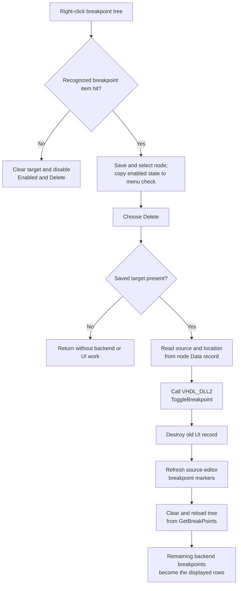

# Delete the targeted HDL breakpoint

> Analysis status: Complete for the popup target, backend call, source-editor refresh, and breakpoint-tree reload boundaries.

## Control

| Property | Recovered value |
| --- | --- |
| Form | HDLDebugger |
| Component path | HDLDebugger.pmPopupMenuBreakPoints.mnDelete |
| Control class | TMenuItem |
| Popup menu | pmPopupMenuBreakPoints |
| Caption | &Delete |
| Hint, shortcut, or image | Not present in the recovered resource |
| Handler name | mnDeleteClick |
| Handler address | 0109ebc0 |
| Graph node | `resource:dfm:HDLDebugger/HDLDebugger.pmPopupMenuBreakPoints.mnDelete` |
| Handler node | `function:0109ebc0` |
| Graph layer | UI |

The ampersand in **&Delete** supplies the menu accelerator. The item has no recovered glyph, image-list reference, action, confirmation text, or modal result.

## How the popup chooses the breakpoint

The tree mouse-down handler `FUN_0109ea20` chooses the target before the menu click runs. It first clears the saved target at form offset `+0xa20` on every mouse-down. For the recovered right-button value `1`, it hit-tests `tvBreakPoints` at the pointer coordinates and gets the node at that point.

When the recognized item-hit flags are absent, the handler disables the popup's first two commands, **Enabled** and **Delete**, and leaves `+0xa20` clear. When a valid item is hit, it:

1. enables **Enabled** and **Delete**;
2. stores the hit node at `+0xa20`;
3. selects that node in `tvBreakPoints`;
4. reads the breakpoint record from the node's Data field at node offset `+0x18`; and
5. copies the record's enabled byte at `+0x18` to the **Enabled** menu check mark.

It then opens the popup at the pointer's screen coordinates. Thus, **Delete** uses the last valid right-click target. It does not resolve the current tree selection again when the menu item is clicked.

## What happens when clicked

`FUN_0109ebc0` ignores `Sender` and checks the saved popup target at `+0xa20`. A clear target causes an immediate return. For a valid target, it performs these operations in order:

1. Gets the attached breakpoint record from the target node's Data field.
2. Reads the numeric source location at record offset `+0x08` and the source-file string at `+0x10`.
3. Copies the source string to the form's null-terminated UTF-16 scratch buffer at `+0xe30`.
4. Calls `VHDL_DLL2.DLL::_Dbg_ToggleBreakpoint` with the active debugger handle at `+0x9c0`, the numeric location, and the converted source string.
5. Destroys the old breakpoint record through the Delphi nil-safe virtual destructor helper.
6. Calls virtual slot `+0x180` on the source editor/view at `+0x980` to refresh its breakpoint markers.
7. Calls shared reload `FUN_0109e470` to rebuild the breakpoint tree from the backend.

The use of the toggle export is a deletion here because the target record came from an existing backend breakpoint. The sibling **Delete All** handler uses the same export for every displayed breakpoint. The handler does not call `_Dbg_SetEnabled`; that separate export belongs to the sibling **Enabled** command.

## Backend and UI synchronization

The click changes the active VHDL debugger backend before it changes the displayed tree. The source-editor refresh then updates the view that shows breakpoint markers. The exact virtual method name at slot `+0x180` is not recovered, but the object at `+0x980` is the HDL source editor/view used for source content, caret location, and breakpoint drawing.

The `.596`-owned reload `FUN_0109e470` treats the backend as authoritative:

1. It clears `tvBreakPoints.Items`.
2. It calls `_Dbg_GetBreakPoints` for the active debugger handle.
3. It parses the returned records against the active HDL source model.
4. It creates one row for each returned source and numeric location.
5. It attaches a new record to each node and sets enabled or disabled image indexes from the record state.

The click does not remove the tree node in place. The old record is destroyed, and the complete row set is replaced from the backend response. The saved pointer at `+0xa20` is not explicitly reset by the click; the next tree mouse-down clears it before it resolves another popup target.

## Click flow

## Empty, repeated, and stale-state behavior

- A normal popup disables **Delete** when the right-click does not hit a breakpoint item. If the handler is invoked with a clear saved target, it returns without a DLL call, record destruction, editor refresh, reload, or error message.
- There is no confirmation dialog, second identity check, or enabled-state check. An enabled or disabled breakpoint is removed by the same source-and-location key.
- A later right-click resolves a newly rebuilt node. Deleting that node follows the same path. A repeated programmatic call without a new mouse-down can reuse the saved node pointer; the handler does not validate that pointer again.
- The backend API has toggle semantics. The handler assumes that its displayed record still identifies an existing backend breakpoint and does not call `_Dbg_IsBreakPoint` before the toggle. The final reload reconciles the tree only after all earlier steps return normally.

## Errors and partial state

- The handler has no local exception handler, retry, status check, rollback, or failure message.
- `_Dbg_ToggleBreakpoint` has no recovered return value that the handler checks. If the backend leaves the breakpoint unchanged but returns normally, the final reload can restore its row.
- A backend exception occurs before local record destruction and both UI refreshes. A later failure can leave the backend changed while the editor markers or tree remain stale.
- The reload clears the tree before it queries and rebuilds it. An exception during reload can leave the tree empty or partly rebuilt until another debugger refresh.
- The handler does not validate the record pointer or its source string after it accepts the saved node. Behavior for corrupt tree Data is not recovered.

## Persistence boundary

- The direct state change belongs to the active VHDL debugger backend. The old tree record and node list are only UI copies.
- The handler does not modify source text, caret position, tree selection by a new lookup, or breakpoint enabled state separately from deletion.
- It does not write a project file, source file, registry value, INI file, settings object, recent-file entry, or project-modified flag.
- A separate debugger-finalization path can later copy `_Dbg_GetBreakPoints` data into caller-owned run state. That later copy is not part of this click and does not prove file persistence. The lifetime of the backend change beyond the active debugger session is not established.

## Source evidence

- [Delete handler `FUN_0109ebc0`](../../../DecompiledSources/Tina16/functions/000000000109EBC0__FUN_0109ebc0.c) guards the saved target, reads its record key, calls the VHDL DLL toggle export, destroys the record, refreshes the editor/view, and reloads the tree.
- [Breakpoint-tree popup resolver `FUN_0109ea20`](../../../DecompiledSources/Tina16/functions/000000000109EA20__FUN_0109ea20.c) clears and resolves the right-click target, controls the first two popup commands, selects a valid node, and copies its enabled state to the menu.
- [Delete All handler `FUN_0109ec30`](../../../DecompiledSources/Tina16/functions/000000000109EC30__FUN_0109ec30.c) proves that toggling an existing displayed record is the recovered deletion operation.
- [Enabled-toggle handler `FUN_0109ece0`](../../../DecompiledSources/Tina16/functions/000000000109ECE0__FUN_0109ece0.c) uses the same target and record fields but calls `_Dbg_SetEnabled` with the inverse enabled byte.
- [Breakpoint tree reload `FUN_0109e470`](../../../DecompiledSources/Tina16/functions/000000000109E470__FUN_0109e470.c) clears the tree, gets the backend list, attaches parsed records, and restores enabled or disabled node images. Its canonical annotation belongs to `.596`.
- [Breakpoint-list parser `FUN_00f7db60`](../../../DecompiledSources/Tina16/functions/0000000000F7DB60__FUN_00f7db60.c) constructs records with numeric location `+0x08`, source string `+0x10`, and enabled byte `+0x18`.
- [UTF-16 buffer copier `FUN_00442620`](../../../DecompiledSources/Tina16/functions/0000000000442620__FUN_00442620.c) copies the record source string and appends a null terminator.
- [VHDL DLL toggle wrapper](../../../DecompiledSources/Tina16/functions/0000000000E03780__VHDL_DLL2.DLL___Dbg_ToggleBreakpoint.c) identifies the external backend operation.
- [FormCreate `FUN_0109c800`](../../../DecompiledSources/Tina16/functions/000000000109C800__FUN_0109c800.c) initializes the saved target and loads active and disabled breakpoint images.
- [Debugger finalization `FUN_0109f350`](../../../DecompiledSources/Tina16/functions/000000000109F350__FUN_0109f350.c) shows the later caller-state copy boundary.
- [Recovered Delphi resource evidence](../../../DecompiledSources/Tina16/resources/dfm/ui-evidence.json) supplies the tree, popup hierarchy, captions, menu order, event bindings, and lack of hint or image evidence for **Delete**.

## Annotation ownership and limits

- `.597` owns direct delete handler `FUN_0109ebc0` and shared popup target resolver `FUN_0109ea20`.
- `.596` owns shared breakpoint-tree reload `FUN_0109e470`; `.598` owns the Enabled handler and cites the popup resolver. This article cites both without redefining their annotations.
- Broad string, tree, menu, editor, Delphi lifetime, breakpoint-parser, and VHDL DLL functions remain evidence-only.
- The VHDL DLL implementation is external. This article documents the recovered call contract and returned list behavior, not the backend's internal storage.
- The exact source-editor virtual method name and the serialized syntax returned by `_Dbg_GetBreakPoints` are not recovered.
