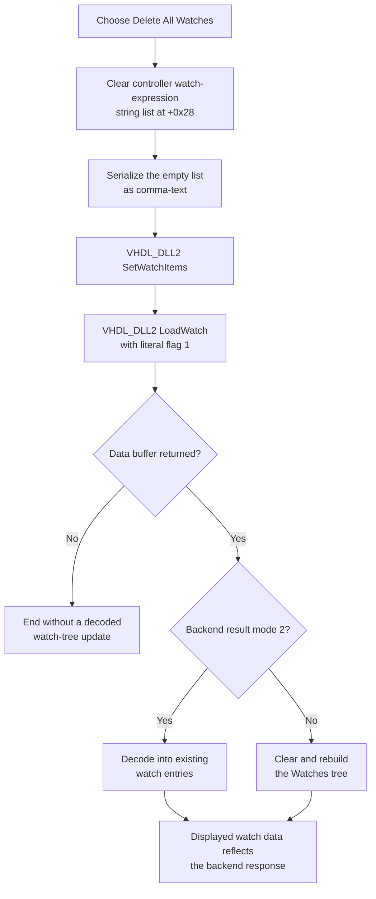

# Delete all HDL debugger watches

> Analysis status: Complete for the watch-list clear, VHDL debugger synchronization, tree refresh, empty-list, failure, and persistence boundaries.

## Control

| Property | Recovered value |
| --- | --- |
| Form | HDLDebugger |
| Component path | HDLDebugger.pmPopupWatches.mnDeleteAllWatches |
| Control class | TMenuItem |
| Popup menu | pmPopupWatches |
| Caption | Delete &All Watches |
| Hint, shortcut, action, or image | Not present in the recovered resource |
| Handler name | mnDeleteAllWatchesClick |
| Handler address | 0109f780 |
| Graph node | `resource:dfm:HDLDebugger/HDLDebugger.pmPopupWatches.mnDeleteAllWatches` |
| Handler node | `function:0109f780` |
| Graph layer | UI |

The ampersand in **Delete &All Watches** supplies the menu accelerator. The resource has no confirmation text, modal result, glyph, image-list reference, or checked state. A separate **Remove All** speed button has a glyph and delegates to this same menu handler through `FUN_0109f850`; the clear and reload operations in the handler provide the decisive evidence for the action.

## What happens when clicked

`FUN_0109f780` ignores `Sender`, does not read the selected watch-tree node, and has no selection or count guard. It performs two operations in order:

1. It calls `FUN_00f7d290` for the active HDL debugger controller at form field `+0x1660`, controller field `+0x3548`. This helper invokes `Clear` on the controller's watch-expression string list at object offset `+0x28`.
2. It calls the canonical watch reload `FUN_0109d7c0` with the literal mode flag `1`.

The list identity is established by the controller constructor and the neighboring operations. `FUN_00f7bc60` creates the object at `+0x28` with the recovered Delphi string-list class. Add Watch uses `FUN_00f7d180` to add a string when it is not already present. Delete Watch uses `FUN_00f7d200` to find and delete one matching string. The reload serializes the same list as comma-text. Thus, this command clears watch expressions, not tree-node objects or sampled values in place.

## Backend and watch-tree synchronization

The shared reload serializes the now-empty list through `FUN_00f7da20` and sends that text to `VHDL_DLL2.DLL::_Dbg_SetWatchItems` for the active debugger handle at form offset `+0x9c0`. It then calls `_Dbg_LoadWatch` with the handler's literal flag `1` and receives a result mode, byte count, and optional data buffer.

When the DLL returns a data buffer, the reload copies it into a Delphi stream and selects the Watches tree at form offset `+0x948`. One result mode updates existing entries; the other path clears the current tree, decodes the returned top-level and child records, and reconciles its supporting node list. This is a backend round trip. The click does not directly delete `TTreeNode` instances.

The exact semantic name of the literal `_Dbg_LoadWatch` flag is not recovered. All recovered callers of this watch reload pass `1`, so this article does not label it as a force, cache, or evaluation option.

## Click flow

## Empty, repeated, and selection behavior

- The handler does not require a selected tree node. This differs from **Delete Watch**, which returns when its saved watch target at `+0xa28` is clear.
- There is no confirmation dialog. The handler contains no prompt call, resource lookup, conditional branch, or modal-result test.
- Clearing an already empty string list leaves it empty. The backend set-and-load sequence still runs, so a repeated click still requests watch synchronization.
- The popup resource does not recover an `OnPopup` enablement handler or an initially disabled state for this item. The click source itself has no count test.
- The toolbar **Remove All** wrapper makes the same call and does not add a confirmation or guard.

## Errors and partial state

- The handler and shared reload have no local exception handler, retry, rollback, or user-facing error call.
- If the string-list clear raises, the backend synchronization does not start. If a later DLL or decode operation raises, the local list has already been cleared.
- Neither `_Dbg_SetWatchItems` nor its result is checked by the handler. `_Dbg_LoadWatch` is checked only for a null data pointer. A null pointer ends the reload without decoding or rebuilding the displayed watch tree.
- A failure after the backend accepts the empty watch text can leave the backend and displayed tree out of sync until another watch reload.
- The recovered code does not validate the controller, watch-list, or debugger pointers in this click path. Their lifetime is an invariant of the active HDL debugger form.

## Ownership and persistence boundary

The immediate source of truth for the command is the controller-owned watch-expression string list. The shared reload copies that list to the active VHDL debugger backend, and the returned backend data drives the visible watch tree.

The click does not write a project file, source file, registry value, INI value, recent-file entry, or modified flag. A separate debugger-finalization path, `FUN_0109f350`, later serializes the same string list and copies it into the caller-owned debug/run-state field at `+0x9a0 -> +0x1f8 -> +0x18`. Debugger initialization `FUN_0109d230` reads that field back through `FUN_0109e3d0`. This proves later in-memory state transfer across the debugger lifecycle, but it does not prove a file write or durable persistence as part of this click.

## Source evidence

- [Delete-all handler `FUN_0109f780`](../../../DecompiledSources/Tina16/functions/000000000109F780__FUN_0109f780.c) clears the watch list and unconditionally calls the shared reload.
- [Watch-list clear helper `FUN_00f7d290`](../../../DecompiledSources/Tina16/functions/0000000000F7D290__FUN_00f7d290.c) dispatches `Clear` to the object at controller offset `+0x28`.
- [Controller base constructor `FUN_00f7bc60`](../../../DecompiledSources/Tina16/functions/0000000000F7BC60__FUN_00f7bc60.c) creates the string-list objects at `+0x28` and `+0x30`.
- [Add-one helper `FUN_00f7d180`](../../../DecompiledSources/Tina16/functions/0000000000F7D180__FUN_00f7d180.c) uses string-list IndexOf and Add on `+0x28`.
- [Delete-one helper `FUN_00f7d200`](../../../DecompiledSources/Tina16/functions/0000000000F7D200__FUN_00f7d200.c) uses IndexOf and Delete on the same list.
- [Shared watch reload `FUN_0109d7c0`](../../../DecompiledSources/Tina16/functions/000000000109D7C0__FUN_0109d7c0.c) sends serialized watch text to the DLL, loads watch data, and updates or rebuilds the Watches tree.
- [Watch-list serializer `FUN_00f7da20`](../../../DecompiledSources/Tina16/functions/0000000000F7DA20__FUN_00f7da20.c) gets comma-text from the list for `_Dbg_SetWatchItems`.
- [VHDL DLL set wrapper](../../../DecompiledSources/Tina16/functions/0000000000E03700__VHDL_DLL2.DLL___Dbg_SetWatchItems.c) and [load wrapper](../../../DecompiledSources/Tina16/functions/0000000000E036E0__VHDL_DLL2.DLL___Dbg_LoadWatch.c) identify the external backend boundary.
- [Toolbar wrapper `FUN_0109f850`](../../../DecompiledSources/Tina16/functions/000000000109F850__FUN_0109f850.c) delegates **Remove All** to this handler.
- [Debugger finalization `FUN_0109f350`](../../../DecompiledSources/Tina16/functions/000000000109F350__FUN_0109f350.c) copies the serialized list to caller-owned run state later.
- [Debugger initialization `FUN_0109d230`](../../../DecompiledSources/Tina16/functions/000000000109D230__FUN_0109d230.c) restores that caller-owned watch text through the add-if-missing path.
- [Recovered Delphi resource evidence](../../../DecompiledSources/Tina16/resources/dfm/ui-evidence.json) supplies the popup hierarchy, captions, event addresses, watch tree, and toolbar duplicate.

## Annotation ownership and limits

- This control owns `FUN_0109f780` and delete-all list helper `FUN_00f7d290`.
- The existing graph annotation owns shared reload `FUN_0109d7c0`. The neighboring Add Watch and Delete Watch articles own their add-one and delete-one helpers. The later toolbar article owns wrapper `FUN_0109f850`.
- Generic Delphi string-list, stream, tree, lifetime, and VHDL DLL functions remain evidence-only.
- The VHDL DLL implementation is external. The internal storage and exact meaning of its result mode and `LoadWatch` flag are not recovered.
