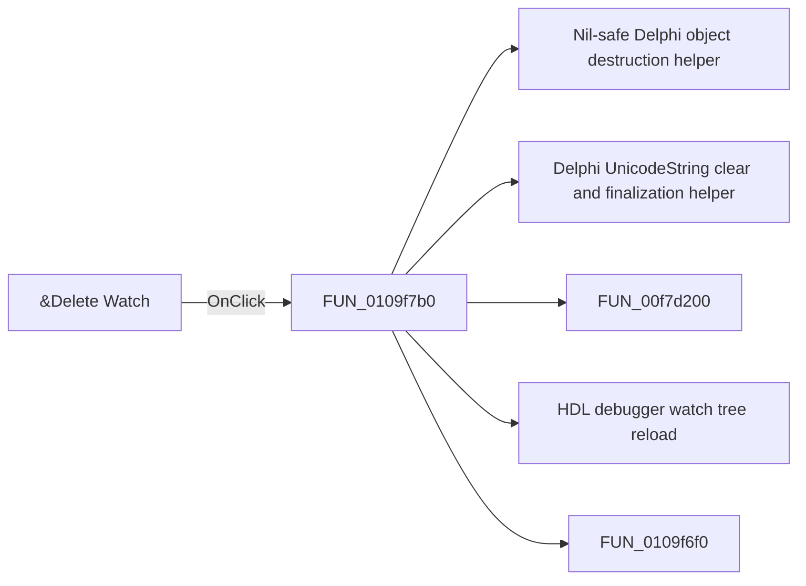

# &Delete Watch

> Analysis status: Pending individual source review.

## Control

| Property | Recovered value |
| --- | --- |
| Form | HDLDebugger |
| Component path | HDLDebugger.pmPopupWatches.mnDeleteWatch |
| Control class | TMenuItem |
| Caption | &Delete Watch |
| Hint | Not present in the recovered resource. |
| Text | Not present in the recovered resource. |
| Handler name | mnDeleteWatchClick |
| Handler address | 0109f7b0 |
| Graph node | `resource:dfm:HDLDebugger/HDLDebugger.pmPopupWatches.mnDeleteWatch` |
| Handler node | `function:0109f7b0` |
| Graph layer | UI |

## What happens when clicked

Pending individual analysis. An agent must read the recovered handler source and its relevant callees before it replaces this text.

## Click flow

## Handler evidence

- Source: [DecompiledSources/Tina16/functions/000000000109F7B0__FUN_0109f7b0.c](../../../DecompiledSources/Tina16/functions/000000000109F7B0__FUN_0109f7b0.c)
- Recovered role: Not present in the recovered resource.
- Current graph summary: Handles 1 Delphi UI event: HDLDebugger.pmPopupWatches.mnDeleteWatch.OnClick.
- Current graph behavior: Not present in the recovered resource.
- Current graph evidence: Not present in the recovered resource.
- Complexity: complex
- Distinct outgoing calls: 5

## Direct calls

- `function:00410f20` — Nil-safe Delphi object destruction helper
- `function:00414480` — Delphi UnicodeString clear and finalization helper
- `function:00f7d200` — FUN_00f7d200
- `function:0109d7c0` — HDL debugger watch tree reload
- `function:0109f6f0` — FUN_0109f6f0

## Resource evidence

- Kind: Not present in the recovered resource.
- Modal result: Not present in the recovered resource.
- Checked state: Not present in the recovered resource.
- List items: Not present in the recovered resource.
- Image reference: Not present in the recovered resource.
- Extracted glyph: None.

## Nearby label candidates

Nearby labels are layout candidates only. They are not proof of behavior.

- No same-parent label candidate is available.

## Analysis limits

- Do not infer behavior from the control class, caption, hint, glyph, or nearby label alone.
- Do not replace the pending status until the handler source and relevant call path provide enough evidence.
