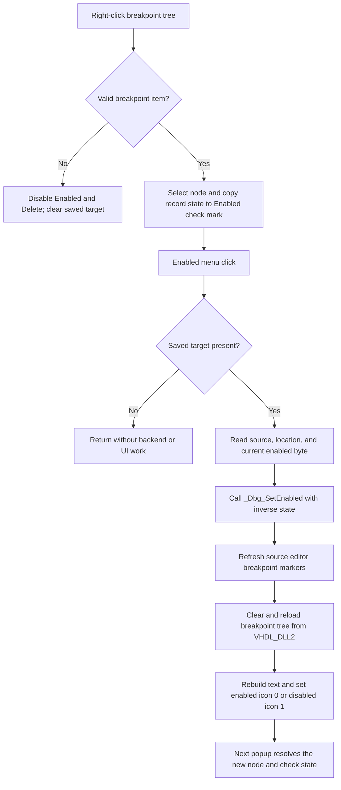

# Toggle the selected HDL breakpoint

> Analysis status: Complete source review.

## Control

| Property | Recovered value |
| --- | --- |
| Form | HDLDebugger |
| Component path | HDLDebugger.pmPopupMenuBreakPoints.mnToggleEnabled |
| Control class | TMenuItem |
| Caption | &Enabled |
| Hint | Not present in the recovered resource. |
| Text | Not present in the recovered resource. |
| Handler name | mnToggleEnabledClick |
| Handler address | 0109ece0 |
| Graph node | `resource:dfm:HDLDebugger/HDLDebugger.pmPopupMenuBreakPoints.mnToggleEnabled` |
| Handler node | `function:0109ece0` |
| Graph layer | UI |

## How the popup selects a breakpoint

The tree mouse-down handler resolves the popup target before this menu handler
runs. On a right-click, it clears the saved target and hit-tests the breakpoint
tree. A hit outside a breakpoint item disables the first two popup commands,
**Enabled** and **Delete**, and leaves the target empty. A valid item hit does
the following work:

- enables both commands;
- stores the hit tree node at form offset `+0xA20`;
- selects that node in the tree;
- reads the breakpoint record attached to the node; and
- sets the **Enabled** menu check mark from the record byte at `+0x18`.

The DFM's initial `Checked = true` value is therefore not the authority for a
particular breakpoint. Each valid popup invocation replaces it with the
selected backend record's current enabled state.

## What happens when clicked

`FUN_0109ece0` does not use `Sender`. It first checks the saved target at
`+0xA20`. If the target is present, it reads the breakpoint record from the
tree node's data field. The record supplies:

- a numeric source location at record offset `+0x08`;
- a source or file name string at `+0x10`; and
- the current enabled byte at `+0x18`.

The handler copies the source name to a null-terminated UTF-16 scratch buffer
at form offset `+0xE30`. It then calls the VHDL debugger export
`_Dbg_SetEnabled` with the active debugger handle, numeric location, source
name, and the inverse of the record's enabled byte. An enabled breakpoint is
therefore disabled, and a disabled breakpoint is enabled.

The handler does not write the attached record, popup check mark, tree text,
or node icon directly. After the DLL call returns, it calls virtual slot
`+0x180` on the source editor. Other recovered uses of this editor prove that
it owns the current source text and caret position; this virtual call requests
the editor refresh that updates source breakpoint markers.

It then calls the shared breakpoint reload. The reload clears the breakpoint
tree, asks `VHDL_DLL2.DLL::_Dbg_GetBreakPoints` for the authoritative list, and
creates new nodes. Each node text combines the recovered source name and
numeric location. The reload attaches the new record and assigns both normal
and selected image indexes from the enabled byte: enabled records use index 0,
and disabled records use index 1. It does not explicitly restore the previous
tree selection. The next right-click resolves a new node and synchronizes the
popup check mark again.

## No selection, repeated click, and failure behavior

- A normal popup cannot choose this command for an invalid hit because the
  target resolver disables it. If the handler is invoked with a null saved
  target, it returns without a DLL call, editor refresh, tree reload, or error.
- There is no confirmation and no local equality check. A later valid popup
  click reads the reloaded record and toggles its current enabled byte again.
- `_Dbg_SetEnabled` has no recovered return value. The handler reloads the
  backend list after a normal return. If the backend leaves the state
  unchanged, the rebuilt tree and the next popup show that unchanged state.
- The handler has no local exception handler, status message, rollback, or
  retry. A DLL-call failure skips both refreshes. A failure after the backend
  changes can leave source markers or the tree stale. Because the reload clears
  the tree first, a later reload failure can leave an empty or partial tree.
- The change belongs to the live HDL debugger backend. The recovered path does
  not write a project file, source file, registry value, INI value, recent-file
  entry, or project-modified flag. Its lifetime beyond the active debugger
  session is not established.

## Click flow

## Handler and call-path evidence

- Handler: [FUN_0109ece0](../../../DecompiledSources/Tina16/functions/000000000109ECE0__FUN_0109ece0.c)
- Popup target resolver: [FUN_0109ea20](../../../DecompiledSources/Tina16/functions/000000000109EA20__FUN_0109ea20.c)
- Shared breakpoint reload: [FUN_0109e470](../../../DecompiledSources/Tina16/functions/000000000109E470__FUN_0109e470.c)
- UTF-16 scratch-buffer copier: [FUN_00442620](../../../DecompiledSources/Tina16/functions/0000000000442620__FUN_00442620.c)
- VHDL DLL enable wrapper: [`_Dbg_SetEnabled`](../../../DecompiledSources/Tina16/functions/0000000000E03800__VHDL_DLL2.DLL___Dbg_SetEnabled.c)
- VHDL DLL breakpoint-list wrapper: [`_Dbg_GetBreakPoints`](../../../DecompiledSources/Tina16/functions/0000000000E037E0__VHDL_DLL2.DLL___Dbg_GetBreakPoints.c)
- Breakpoint-list parser: [FUN_00f7db60](../../../DecompiledSources/Tina16/functions/0000000000F7DB60__FUN_00f7db60.c)
- Delete-one sibling: [FUN_0109ebc0](../../../DecompiledSources/Tina16/functions/000000000109EBC0__FUN_0109ebc0.c)

The graph records three static outgoing calls from this complex UI handler:
the UTF-16 buffer copier, the external `_Dbg_SetEnabled` wrapper, and the
shared tree reload. The source-editor refresh is a virtual call and is not a
separate static edge.

## Resource evidence

- The DFM identifies a checked `TMenuItem` with caption **&Enabled** in
  `pmPopupMenuBreakPoints`.
- The same popup also contains **&Delete**, **&Properties**, **Enable All**,
  **Disable All**, and **Delete All** items.
- No hint, glyph, image-list reference, modal result, action, list item, or
  nearby same-parent label is present.

## Analysis limits and annotation ownership

- Recovered breakpoint record field names are unavailable. The toggle handler,
  popup resolver, backend reload, and Delete handler use the same record
  offsets, which establishes the source, location, and enabled-state roles.
- The DLL implementation is external. This article documents the recovered
  function contract and the state returned by its list API, but not internal
  simulator storage.
- `TIARA-diz.6.7.597` owns popup target resolver `FUN_0109ea20` and the
  breakpoint Delete path. `TIARA-diz.6.7.596` owns shared reload
  `FUN_0109e470`. The Unicode buffer helper and DLL imports remain evidence
  only. This control owns only `FUN_0109ece0`.
