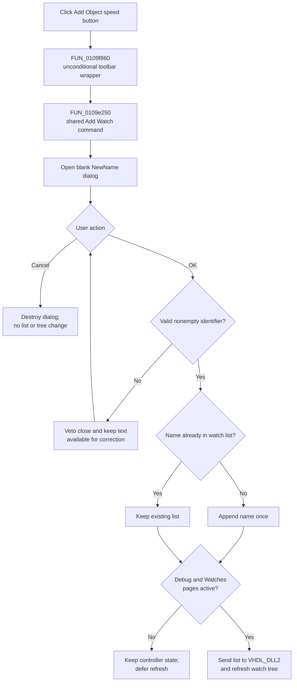

# Add Object

> Analysis status: Complete for toolbar delegation, name entry, unique-list insertion, conditional watch refresh, cancel, error, and persistence boundaries.

## Control

| Property | Recovered value |
| --- | --- |
| Form | HDLDebugger |
| Component path | HDLDebugger.pnClient.pnMessages.pnDebug.pcDebug.tsDebug.pcDebugPages.tsWatches.pnWatchClient.pnWatchButtons.pnWatchButtonsRight.sbAddObjectWatch |
| Control class | TSpeedButton |
| Caption | Add Object |
| Hint | Not present in the recovered resource |
| Handler name | sbAddObjectWatchClick |
| Handler address | 0109f860 |
| Graph node | `resource:dfm:HDLDebugger/HDLDebugger.pnClient.pnMessages.pnDebug.pcDebug.tsDebug.pcDebugPages.tsWatches.pnWatchClient.pnWatchButtons.pnWatchButtonsRight.sbAddObjectWatch` |
| Handler node | `function:0109f860` |
| Graph layer | UI |

The button is on the **Watches** page. Its extracted glyph is a green plus sign. The caption and image support an add command, but the recovered call path establishes what it adds.

## What happens when clicked

`FUN_0109f860` is a toolbar wrapper. It contains one unconditional call to `FUN_0109e250`, the handler for the sibling **Add Watch...** popup command, and then returns. It has no branch, field read, explicit argument construction, tree hit test, or selection lookup. It therefore does not use `Sender` or the selected watch-tree node to choose an object. The untouched form context continues into the shared handler through the Delphi method call.

The shared handler opens a centered modal `NewName` form. That form contains a blank `TEdit`, a **New name** label, and standard **OK**, **Cancel**, and **Help** buttons. The user types the watch name. There is no candidate list and no value copied from a selected object or source editor.

On **OK**, the dialog accepts only an identifier whose first character is a letter or underscore and whose later characters are letters, underscores, or digits. An empty or invalid name sets the dialog error flag; `FormCloseQuery` vetoes the accepting close and leaves the dialog open for correction. After modal result `1`, the shared handler reads `eNewName.Text` and checks again that the returned Delphi string is not nil.

## Watch-list and display changes

The accepted name is passed to the controller watch-list helper owned by the **Add Watch...** analysis. That helper performs `IndexOf` on the watch `TStringList` at controller offset `+0x28` and appends only when the name is absent. A duplicate leaves the list unchanged. The helper does not select, replace, or reorder a watch and does not report the duplicate.

After any accepted nonempty name, including a duplicate, the shared handler tests the active outer and inner page indexes. It calls the canonical watch reload only when the outer page is **Debug** at index `1` and the inner page is **Watches** at index `2`. The reload serializes the current watch list, sends it to `VHDL_DLL2`, loads watch values, and updates or rebuilds the visible tree. If those pages are not active, the controller list still changes, but this click defers the backend and tree refresh until the later page-selection path reloads Watches.

The toolbar wrapper adds no checked, pressed, enabled, focus, or selection state of its own. The recovered resource does not define a hint, action, modal result, or initial disabled state for the speed button.

## Click flow

## Cancel, repeat, errors, and persistence

- **Cancel** returns a value other than `1`. The shared handler does not read the edit, change the list, or reload the tree.
- Repeated entry of an existing name does not add a second list item. If the Watches page is active, the reload still runs because the unique-add helper does not return a changed-state result.
- The wrapper and shared handler have no local exception handler, retry, rollback, or user-facing backend error path. A dialog or list failure stops before later operations. A reload failure can occur after a name was appended, so the controller list can change while the displayed tree remains stale.
- The normal path destroys the temporary modal form after **OK** or **Cancel**. The recovered path has no explicit `try/finally` around that cleanup.
- The click changes the live debugger controller and, when active, its backend and watch tree. It does not write a project file, registry value, or INI value.
- A separate debugger teardown path later serializes the watch list into caller-owned debugger/module state, and setup restores it. This proves in-memory lifecycle transfer, not durable project-file persistence from this click.

## Source evidence

- [Toolbar wrapper `FUN_0109f860`](../../../DecompiledSources/Tina16/functions/000000000109F860__FUN_0109f860.c) contains only the call to the popup handler.
- [Shared Add Watch handler `FUN_0109e250`](../../../DecompiledSources/Tina16/functions/000000000109E250__FUN_0109e250.c) opens the modal dialog, reads the accepted name, updates the list, and applies the active-page refresh guard.
- [`NewName` OK handler `FUN_0106bab0`](../../../DecompiledSources/Tina16/functions/000000000106BAB0__FUN_0106bab0.c) validates the edit before an accepting close.
- [Identifier validator `FUN_01055790`](../../../DecompiledSources/Tina16/functions/0000000001055790__FUN_01055790.c) enforces the recovered letter, underscore, and digit rules.
- [`NewName.FormCloseQuery` `FUN_0106ba80`](../../../DecompiledSources/Tina16/functions/000000000106BA80__FUN_0106ba80.c) converts the dialog error flag into a close veto.
- [Accepted-name getter `FUN_0106c180`](../../../DecompiledSources/Tina16/functions/000000000106C180__FUN_0106c180.c) reads `eNewName.Text`.
- [Unique watch-list add `FUN_00f7d180`](../../../DecompiledSources/Tina16/functions/0000000000F7D180__FUN_00f7d180.c) performs the `IndexOf` and conditional append.
- [Canonical watch reload `FUN_0109d7c0`](../../../DecompiledSources/Tina16/functions/000000000109D7C0__FUN_0109d7c0.c) synchronizes the watch list with the VHDL backend and visible tree.
- [Debugger teardown `FUN_0109f350`](../../../DecompiledSources/Tina16/functions/000000000109F350__FUN_0109f350.c) captures the watch list into caller-owned state later.
- [Recovered Delphi resource evidence](../../../DecompiledSources/Tina16/resources/dfm/ui-evidence.json) identifies the toolbar hierarchy, caption, glyph, handler address, popup command, Watches page, and `NewName` controls.
- [Extracted green-plus glyph](../../../glyph/0225_HDLDebugger_HDLDebugger_pnClient_pnMessages_pnDebug_pcDebug_tsDebug_pcDebugPages_tsWatches_pnWatchClient_pnW_Glyph_Data.png) confirms the toolbar's add affordance only.

## Annotation ownership and limits

- This control owns only wrapper `FUN_0109f860`.
- The sibling **Add Watch...** analysis owns shared handler `FUN_0109e250` and unique-add helper `FUN_00f7d180`. The existing graph annotation owns reload `FUN_0109d7c0`. This article cites those functions and does not redefine them.
- Generic modal-form, text-control, string-list, VCL lifetime, and backend functions remain evidence-only.
- The lexical check does not prove that the HDL object exists. The backend result for a syntactically valid but unknown name is not recovered.
- The `TStringList` comparison mode is not recovered, so case-sensitive duplicate behavior remains unknown.
