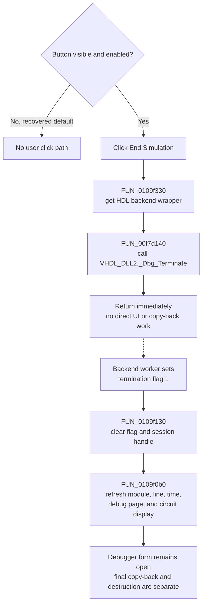

# Request termination of the HDL simulation

> Analysis status: Complete. The DFM, extracted glyph, toolbar handler, VHDL debugger DLL wrapper, thread-watch completion path, Stop path, and external close coordinator support this explanation.

## Control

| Property | Recovered value |
| --- | --- |
| Form | HDLDebugger |
| Component path | HDLDebugger.pnToolbar.sbEndSimulation |
| Control class | TSpeedButton |
| Caption | Not present in the recovered resource. |
| Hint | End Simulation |
| Enabled | `false` in the recovered DFM |
| Visible | `false` in the recovered DFM |
| Handler name | sbEndSimulationClick |
| Handler address | 0109f330 |
| Graph node | `resource:dfm:HDLDebugger/HDLDebugger.pnToolbar.sbEndSimulation` |
| Handler node | `function:0109f330` |
| Graph layer | UI |

The DFM creates this button as hidden and disabled. Its 32-by-16 extracted bitmap contains two 16-by-16 button-state frames and is consistent with an end control, but the image alone cannot distinguish termination from a temporary stop. The `End Simulation` hint and the `_Dbg_Terminate` call provide that distinction. The recovered default form does not give the user a click path unless another path makes the button visible and enabled.

## What happens when clicked

`FUN_0109f330` ignores `Sender` and has one action. It follows the debugger form's controller at field `+0x1660`, gets its HDL backend wrapper at controller field `+0x3548`, and passes that wrapper to `FUN_00f7d140`. The wrapper reads the backend session handle at field `+0x38` and calls the external `VHDL_DLL2.DLL::_Dbg_Terminate` export.

This is a termination request. The click handler does not wait for the worker to finish. It does not clear the backend handle, change a toolbar button, refresh the editor, copy a result, close the form, or destroy the debugger object before it returns.

## Asynchronous completion and UI refresh

`HDLDebugger.FormShow` enables the `ThreadWatch` timer. Its handler, `FUN_0109f130`, polls flags in the shared debugger state. The recovered termination-completion branch is the branch for flag `1`:

1. It clears flag `1`.
2. It sets backend-wrapper field `+0x38`, the session handle used by `_Dbg_Terminate`, to zero.
3. It calls shared refresh routine `FUN_0109f0b0`.

The refresh routine obtains the current source line and module from the debugger state and stores them in the wrapper. It then selects or opens that module, refreshes the active debug page and current-time edit, updates the circuit-node display, selects the current source location, and scrolls it into view. This refresh is the later result of backend completion; it is not a direct call from `sbEndSimulationClick`.

The recovered refresh path does not change the End Simulation button's enabled or visible properties. It also does not close the debugger window. Object destruction is a separate global lifecycle action.

## Difference from Stop

The adjacent `Stop` button uses a different handler and DLL export:

| Command | Toolbar handler | Wrapper | External action | Completion state |
| --- | --- | --- | --- | --- |
| End Simulation | `FUN_0109f330` | `FUN_00f7d140` | `_Dbg_Terminate` | Thread flag `1` clears the backend session handle to zero, then refreshes the debugger UI. |
| Stop | `FUN_0109f2a0` | `FUN_00f7d120` | `_Dbg_Stop` | Thread flag `0x4000` sets the debugger's stopped state, keeps the session handle, then uses the same general refresh path. |

Thus, Stop pauses the live session so Run or a step command can continue it. End Simulation asks the backend worker to finish and invalidates the session handle when completion is observed. Neither toolbar wrapper confirms success synchronously.

## Caller result copy-back and final close

The toolbar click does not copy state back to the caller. A separate application coordinator, `FUN_01c9aab0`, calls `FUN_0109f350` when it ends the global HDL debugger session. `FUN_0109f350` performs the caller-facing work:

- it writes literal value `4` to caller-result field `+0x08`; the enum or field name for this value is not recovered;
- it gets the current breakpoint value through `_Dbg_GetBreakPoints` and assigns it to caller-result field `+0x10`;
- it converts backend-wrapper field `+0x28` to a Unicode string and assigns it to caller-result field `+0x18`; the semantic name of this text is not recovered;
- it sends the same backend terminate request;
- it waits while the backend session handle is nonzero, for at most 200 iterations of 10 ms, and invokes the thread-watch handler during each iteration;
- it shows localized message `HDLStrings.Msg_TimeoutDbg` if the handle is still nonzero after that limit;
- it disables `ThreadWatch`; and
- when form mode byte `+0x9e1` is clear, it posts message `0x123e` to the stored owner and clears a related global state byte.

The global lifecycle later destroys the debugger object and clears its global pointer through `FUN_01c9aa00`. These copy-back, wait, notification, and destruction steps are not in the toolbar click call tree. A caller must invoke the separate close lifecycle to get them.

## Repeated click, missing session, and errors

- There is no in-progress guard or debounce. A direct second call before completion sends another terminate request.
- There is no null-session guard. If the initialized wrapper remains present but its handle is already zero, `FUN_00f7d140` passes zero to the external DLL. The DLL's response to that call is not recovered.
- If the controller or backend wrapper pointer is absent, the handler dereferences it before the external call. The recovered source does not define a safe no-session result. The hidden and disabled DFM state prevents this user path by default.
- The handler has no Boolean result, timeout, local error message, exception handler, or rollback. A DLL delay-load or backend error can propagate through the external-call boundary.
- The asynchronous toolbar path has no timeout. The localized timeout belongs only to the separate synchronous close coordinator.
- The command writes no project, INI, registry, or file data. Breakpoint and backend-text copy-back is in-memory caller state, not persistent storage. The window-size settings saved by the form-close handler are unrelated to this click.

## Click flow

## Source evidence

- [Toolbar handler `FUN_0109f330`](../../../DecompiledSources/Tina16/functions/000000000109F330__FUN_0109f330.c) gets the backend wrapper and makes only the terminate-wrapper call.
- [Backend terminate wrapper `FUN_00f7d140`](../../../DecompiledSources/Tina16/functions/0000000000F7D140__FUN_00f7d140.c) passes its field `+0x38` to [the external `_Dbg_Terminate` export](../../../DecompiledSources/Tina16/functions/0000000000E036A0__VHDL_DLL2.DLL___Dbg_Terminate.c).
- [Thread-watch handler `FUN_0109f130`](../../../DecompiledSources/Tina16/functions/000000000109F130__FUN_0109f130.c) clears the session handle on termination flag `1` and calls the shared refresh path. Its separate flag `0x4000` branch marks the debugger stopped without clearing that handle.
- [Shared state and UI refresh `FUN_0109f0b0`](../../../DecompiledSources/Tina16/functions/000000000109F0B0__FUN_0109f0b0.c) updates the current source context, debug panels, circuit state, and editor location after Stop or termination completion.
- [Stop handler `FUN_0109f2a0`](../../../DecompiledSources/Tina16/functions/000000000109F2A0__FUN_0109f2a0.c) and [Stop wrapper `FUN_00f7d120`](../../../DecompiledSources/Tina16/functions/0000000000F7D120__FUN_00f7d120.c) prove the separate `_Dbg_Stop` route.
- [External end-session coordinator `FUN_0109f350`](../../../DecompiledSources/Tina16/functions/000000000109F350__FUN_0109f350.c) copies caller-result fields, requests termination, waits for completion, disables the timer, and sends the owner notification.
- [Termination wait `FUN_0109ef40`](../../../DecompiledSources/Tina16/functions/000000000109EF40__FUN_0109ef40.c) polls for at most 200 10-ms iterations and shows `HDLStrings.Msg_TimeoutDbg` on timeout.
- [Global HDL session selector `FUN_01c9aab0`](../../../DecompiledSources/Tina16/functions/0000000001C9AAB0__FUN_01c9aab0.c) routes the separate application end-session request to `FUN_0109f350`; [global cleanup `FUN_01c9aa00`](../../../DecompiledSources/Tina16/functions/0000000001C9AA00__FUN_01c9aa00.c) later destroys the form and clears the global pointer.
- [Recovered Delphi resource evidence](../../../DecompiledSources/Tina16/resources/dfm/ui-evidence.json) supplies the hidden and disabled speed button, its hint and click binding, the adjacent Stop control, and the disabled `ThreadWatch` default. [The extracted glyph](../../../glyph/0223_HDLDebugger_HDLDebugger_pnToolbar_sbEndSimulation_Glyph_Data.png) supplies the two button-state frames.

## Analysis limits and ownership

- This Bead owns unique toolbar handler `FUN_0109f330`, backend terminate wrapper `FUN_00f7d140`, and external end-session/copy-back coordinator `FUN_0109f350`.
- Bead `.611` owns the Stop handler and wrapper. This article cites them only for the pause-versus-terminate comparison.
- The timer completion and shared UI refresh functions also serve Stop, Run, and step actions. They remain evidence-only here so sibling execution articles can use one canonical shared annotation owner.
- The external DLL body is unavailable. The exact backend shutdown sequence, the meaning of caller-result literal `4`, the name of backend text field `+0x28`, and the DLL result for a null session handle remain unknown.
