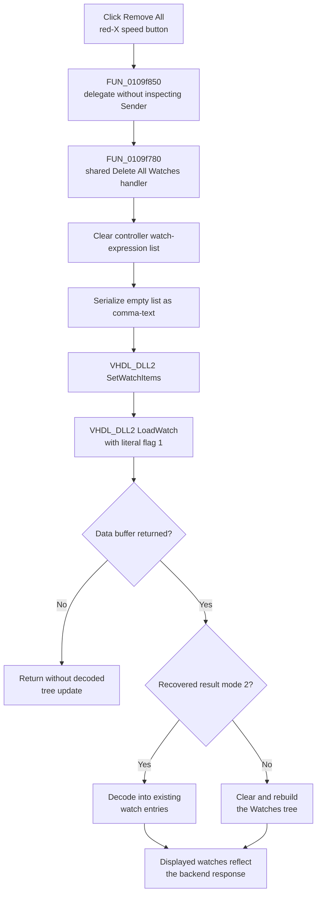

# Remove all HDL debugger watches

> Analysis status: Complete for the toolbar wrapper and the shared delete-all, backend synchronization, tree refresh, empty-list, error, and persistence boundaries.

## Control

| Property | Recovered value |
| --- | --- |
| Form | HDLDebugger |
| Component path | HDLDebugger.pnClient.pnMessages.pnDebug.pcDebug.tsDebug.pcDebugPages.tsWatches.pnWatchClient.pnWatchButtons.pnWatchButtonsRight.sbRemoveAllWatches |
| Control class | TSpeedButton |
| Caption | Remove All |
| Hint | Not present |
| Handler name | sbRemoveAllWatchesClick |
| Handler address | 0109f850 |
| Graph node | `resource:dfm:HDLDebugger/HDLDebugger.pnClient.pnMessages.pnDebug.pcDebug.tsDebug.pcDebugPages.tsWatches.pnWatchClient.pnWatchButtons.pnWatchButtonsRight.sbRemoveAllWatches` |
| Handler node | `function:0109f850` |
| Graph layer | UI |

The button has a recovered 19 by 19 pixel red-X glyph. The caption and glyph support a destructive remove operation, but they do not establish its scope. The wrapper and shared handler prove that it removes all HDL watch expressions.

## Wrapper relationship to Delete All Watches

`FUN_0109f850` contains one call to `FUN_0109f780` and then returns. It does not read or modify the click sender, form fields, control state, selection, watch count, or return value. The call preserves the form context used by the shared handler.

`FUN_0109f780` is also the direct handler for popup command **Delete All Watches**. It ignores `Sender`, so the speed button does not cause a different branch. Both controls execute the same list clear and backend reload. The toolbar wrapper adds no confirmation, guard, status message, or UI update of its own.

## Shared action

The `.600`-owned handler performs two operations in order:

1. It passes the active HDL debugger controller at form `+0x1660`, controller `+0x3548`, to `FUN_00f7d290`.
2. It calls canonical watch reload `FUN_0109d7c0` with literal mode flag `1`.

`FUN_00f7d290` invokes `Clear` on the controller's watch-expression string list at object offset `+0x28`. Neighboring add-one and delete-one helpers use `IndexOf`, `Add`, and `Delete` on this same list. The shared handler therefore clears expression definitions. It does not delete only a selected row or clear only sampled values.

Neither the wrapper nor the shared handler reads the saved watch target at form `+0xa28`. The action applies to the complete controller list even when no tree node is selected.

## Backend and tree synchronization

After the local list is clear, `FUN_0109d7c0` serializes it as empty comma-text and calls `VHDL_DLL2.DLL::_Dbg_SetWatchItems` for the active debugger handle. It then calls `_Dbg_LoadWatch` with literal flag `1`.

When the DLL returns a data buffer, the reload copies it into a Delphi stream and processes the Watches tree at form offset `+0x948`. One recovered result mode updates existing entries. The other path clears and rebuilds the tree from the returned top-level and child records. The speed button does not remove `TTreeNode` instances directly; the backend response drives the visible result.

The exact semantic name of the load flag and result modes is not recovered. All recovered callers of this reload pass `1`, so this article does not label it as a force, cache, or evaluation option.

## Click flow

## Empty, repeated, and UI-state behavior

- The wrapper has no selection or watch-count guard. Clearing an empty list keeps it empty, but the backend set-and-load sequence still runs.
- A repeated click clears the already empty list again and requests another backend synchronization.
- The button handler does not change its own Enabled, Down, Visible, caption, or glyph state. The recovered resource has no group, checked, action, or modal-result binding.
- The shared action does not preserve a selected watch row. The reload can update or replace the visible nodes from backend data.
- The popup **Delete All Watches** command and this button are behaviorally equivalent at the shared-handler boundary.

## Errors and partial state

- The wrapper and shared path have no local exception handler, retry, rollback, confirmation, or user-facing error message.
- If delegation cannot enter the shared handler, no state changes. If list clearing raises, backend synchronization does not start.
- A later DLL or decode exception occurs after the local watch-expression list is empty. This can leave the backend or visible tree out of sync until another reload.
- `_Dbg_SetWatchItems` has no result that this path checks. `_Dbg_LoadWatch` is checked only for a null data pointer. A null pointer ends the reload without decoding or rebuilding the current watch tree.
- The path assumes valid controller, string-list, debugger, and tree objects. It contains no explicit pointer or lifetime validation.

## Persistence boundary

- The immediate source of truth is the controller-owned in-memory watch-expression string list. The reload copies it to the active VHDL debugger backend.
- The handler does not write a project file, source file, registry value, INI file, settings object, recent-file entry, or modified flag.
- A separate debugger-finalization path later serializes the same list into caller-owned debug/run state. Debugger initialization can read that field back. This is a later in-memory lifecycle transfer, not a file write by the button click.
- Persistence outside the active debugger lifecycle is not established by the recovered path.

## Resource and source evidence

- [Toolbar wrapper `FUN_0109f850`](../../../DecompiledSources/Tina16/functions/000000000109F850__FUN_0109f850.c) contains only the call to the shared Delete All Watches handler.
- [Shared handler `FUN_0109f780`](../../../DecompiledSources/Tina16/functions/000000000109F780__FUN_0109f780.c) clears the watch list and unconditionally calls the watch reload. Its canonical annotation belongs to `.600`.
- [Watch-list clear helper `FUN_00f7d290`](../../../DecompiledSources/Tina16/functions/0000000000F7D290__FUN_00f7d290.c) dispatches `Clear` to controller field `+0x28`. Its canonical annotation belongs to `.600`.
- [Shared watch reload `FUN_0109d7c0`](../../../DecompiledSources/Tina16/functions/000000000109D7C0__FUN_0109d7c0.c) sends the serialized list to the DLL and updates or rebuilds the Watches tree.
- [Add-one helper `FUN_00f7d180`](../../../DecompiledSources/Tina16/functions/0000000000F7D180__FUN_00f7d180.c) and [delete-one helper `FUN_00f7d200`](../../../DecompiledSources/Tina16/functions/0000000000F7D200__FUN_00f7d200.c) establish the string-list role at `+0x28`.
- [Watch-list serializer `FUN_00f7da20`](../../../DecompiledSources/Tina16/functions/0000000000F7DA20__FUN_00f7da20.c) gets comma-text from that list for the backend.
- [Debugger finalization `FUN_0109f350`](../../../DecompiledSources/Tina16/functions/000000000109F350__FUN_0109f350.c) copies the serialized list to caller-owned run state later. [Debugger initialization `FUN_0109d230`](../../../DecompiledSources/Tina16/functions/000000000109D230__FUN_0109d230.c) restores that field through the watch setup path.
- [Recovered red-X glyph](../../../glyph/0226_HDLDebugger_HDLDebugger_pnClient_pnMessages_pnDebug_pcDebug_tsDebug_pcDebugPages_tsWatches_pnWatchClient_pnW_Glyph_Data.png) supports destructive intent but does not establish the all-watch scope.
- [Glyph manifest](../../../glyph/manifest.json) records the original BMP source, 19 by 19 dimensions, component path, and extracted PNG hash.
- [Recovered Delphi resource evidence](../../../DecompiledSources/Tina16/resources/dfm/ui-evidence.json) supplies the button caption, class, dimensions, embedded glyph, and event binding.

## Annotation ownership and limits

- `.607` owns only unique toolbar wrapper `FUN_0109f850`.
- `.600` owns shared handler `FUN_0109f780` and clear helper `FUN_00f7d290`. The existing graph annotation owns shared reload `FUN_0109d7c0`. This article cites and omits all three.
- Generic Delphi string-list, stream, tree, lifetime, serializer, and VHDL DLL functions remain evidence-only.
- The DLL implementation is external. Its internal watch storage and exact load-mode meanings are not recovered.
