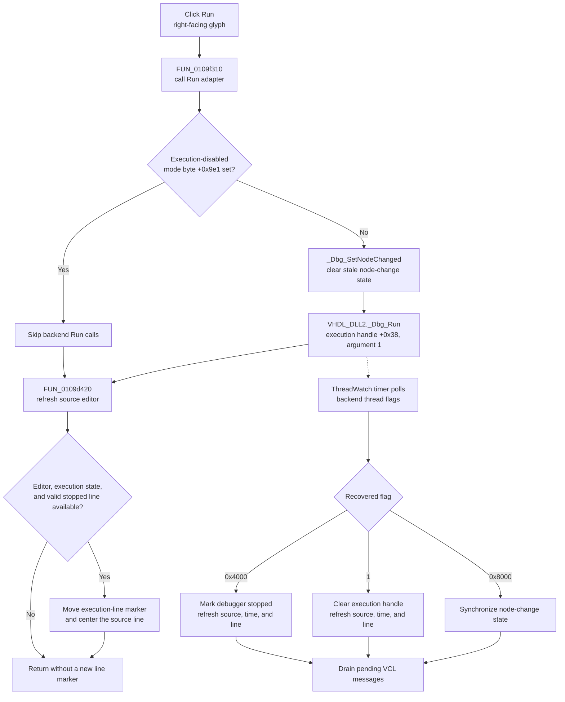

# Run the HDL debugger

> Analysis status: Complete. The recovered DFM, Run wrapper, VHDL debugger calls, execution-context setup, source-line refresh, and thread-watch timer support this explanation.

## Control

| Property | Recovered value |
| --- | --- |
| Form | HDLDebugger |
| Component path | HDLDebugger.pnToolbar.sbRun |
| Control class | TSpeedButton |
| Caption | Not present in the recovered resource. |
| Hint | Run |
| Glyph | Two 16 by 16 right-facing run symbols in one 32 by 16 bitmap strip. |
| Handler name | sbRunClick |
| Handler address | 0109f310 |
| Graph node | `resource:dfm:HDLDebugger/HDLDebugger.pnToolbar.sbRun` |
| Handler node | `function:0109f310` |
| Graph layer | UI |

The embedded glyph has one blue and one yellow right-facing run symbol. `NumGlyphs = 2` tells the VCL to use the two frames as button states. The `Run` hint and glyph support the command name. The recovered handler and DLL call establish its actual behavior.

## What happens when clicked

`FUN_0109f310` performs two operations in a fixed order:

1. it calls Run adapter `FUN_0109f2c0`; and
2. it calls source-position refresher `FUN_0109d420`.

The Run adapter first tests form byte `+0x9e1`. The form launcher supplies this mode flag. Its name is not recovered. When the byte is zero, the adapter clears the backend's node-changed state through `_Dbg_SetNodeChanged(debugger +0x9c0, 0)`. It then calls `VHDL_DLL2.DLL::_Dbg_Run` with the active execution handle at nested field `+0x38` and recovered mode argument `1`.

The source does not define the meaning of Run argument `1`. The exported function name, toolbar hint, and parallel trace commands prove that this is the Run command, but they do not prove a more specific DLL-internal mode.

When mode byte `+0x9e1` is nonzero, the adapter skips both DLL calls. The click handler still invokes the source-position refresh. Thus, this guard disables backend execution, but it does not make the complete click path a no-op.

## Session and run-state guards

The HDL debugger launcher creates the form, supplies debugger handle `+0x9c0`, shows the form, and then initializes its execution controller. The setup stores the same debugger handle in that controller and calls `_Dbg_CheckStartState`, which writes the execution handle at controller field `+0x38`.

The Run adapter assumes this setup is complete. It has no null check for the debugger handle, controller, execution-state object, or execution handle. It also does not call `_Dbg_IsStopped` before `_Dbg_Run`. This differs from the Step and Step Over wrappers, which require `_Dbg_IsStopped` and the same `+0x9e1` guard.

The Run export has no recovered return value. The adapter does not test a status code, show an error, or retry. A delay-load failure, invalid pointer, or DLL exception has no local catch or rollback.

## Immediate source refresh

`FUN_0109d420` runs after the adapter returns, including when the execution-disabled mode flag blocked the DLL call. It first checks that source editor field `+0x980` exists. If it does not, the refresh returns without work.

With an editor, the function obtains the current debugger line through form virtual slot `+0x2f0` and asks the editor to refresh. If the execution-state object exists and the line is not `-1`, it:

- moves the current execution-line marker through `FUN_0109f8b0`; and
- scrolls the source editor so that the line is approximately half a visible page from the top.

The recovered current-line logic returns a line only when the DLL reports that the debugger is stopped and the selected editor file matches the backend module. Otherwise, it returns `-1`. Therefore, a Run click usually performs an immediate editor refresh, but it does not invent a new stopped line while execution continues.

## Background event and message processing

`ThreadWatch` is a form timer. The DFM disables it initially, and `FormShow` enables it. Its timer handler `FUN_0109f130` polls flags on the same debugger handle after commands such as Run:

- flag `0x4000` is cleared, the DLL debugger is marked stopped, and the source, line, time, and editor position are refreshed;
- flag `1` is cleared, execution handle `+0x38` is set to zero, and the same stopped-position refresh runs;
- flag `0x8000` is cleared and the host node-change state is synchronized; and
- after each poll, the handler drains pending VCL application messages.

The exact backend meanings and producers of these numeric flags are inside `VHDL_DLL2.DLL` and are not recovered. The application-side effects above are explicit. The Run click does not wait for these flags. It dispatches the DLL command and returns after its immediate source refresh.

## Breakpoint, Stop, and End interaction

The Toggle Breakpoint handler changes breakpoints on debugger handle `+0x9c0`. The execution controller used by Run was initialized from this same handle. The Run path does not add, remove, enable, or clear a breakpoint. Whether an existing breakpoint stops execution is decided by the DLL backend. A later backend stop flag causes the timer path to mark the debugger stopped and refresh the current source line.

The Stop and End Simulation buttons use the same execution handle at controller field `+0x38`:

- Stop reaches `VHDL_DLL2.DLL::_Dbg_Stop` through `FUN_00f7d120`.
- End Simulation reaches `VHDL_DLL2.DLL::_Dbg_Terminate` through `FUN_00f7d140`.

Run does not call either function. It does not cancel a pending Stop or End request, and it has no local lock that prevents the commands from overlapping. Their exact ordering and completion behavior are backend-owned.

## Button state, repeated clicks, and persistence

- `sbRun` has no recovered `GroupIndex`, `Down`, or `AllowAllUp` state. The click path does not enable, disable, press, or release any toolbar button.
- The DFM creates Run, Stop, Step, and Step Over as enabled controls. Run does not change those states. End Simulation and Run Until are hidden and disabled by their DFM properties, and Run does not expose them.
- A repeated Run click with mode byte `+0x9e1` clear repeats `_Dbg_SetNodeChanged(..., 0)` and `_Dbg_Run(..., 1)`. There is no local `IsStopped`, already-running, debounce, or equality guard. The DLL decides what a repeated Run request does.
- A repeated click with mode byte `+0x9e1` set skips the backend calls each time but still refreshes the editor.
- The command changes live debugger and editor state only. It writes no document, project, INI file, registry value, or other cross-session setting.

## Click flow

## Source evidence

- [Run click handler `FUN_0109f310`](../../../DecompiledSources/Tina16/functions/000000000109F310__FUN_0109f310.c) calls the Run adapter and then the shared source-position refresher.
- [Run adapter `FUN_0109f2c0`](../../../DecompiledSources/Tina16/functions/000000000109F2C0__FUN_0109f2c0.c) tests byte `+0x9e1`, clears node-changed state on debugger handle `+0x9c0`, and calls `_Dbg_Run` with execution handle `+0x38` and argument `1`.
- [Source-position refresh `FUN_0109d420`](../../../DecompiledSources/Tina16/functions/000000000109D420__FUN_0109d420.c) checks editor field `+0x980`, refreshes it, updates a valid current line through `FUN_0109f8b0`, and scrolls through `FUN_00bfcc50`.
- [Current-line query `FUN_0109d310`](../../../DecompiledSources/Tina16/functions/000000000109D310__FUN_0109d310.c) returns the execution line only when `_Dbg_IsStopped` is true and the selected editor file matches the backend module; otherwise, it returns `-1`.
- [Execution-line marker update `FUN_0109f8b0`](../../../DecompiledSources/Tina16/functions/000000000109F8B0__FUN_0109f8b0.c) removes the old line decoration, selects the new line when needed, and applies the new decoration.
- [Source-editor scroll helper `FUN_00bfcc50`](../../../DecompiledSources/Tina16/functions/0000000000BFCC50__FUN_00bfcc50.c) clamps and updates the editor's top visible line.
- [HDL debugger constructor `FUN_0109cf80`](../../../DecompiledSources/Tina16/functions/000000000109CF80__FUN_0109cf80.c) stores the mode flag and debugger handle and creates the execution controller.
- [Execution setup `FUN_0109d230`](../../../DecompiledSources/Tina16/functions/000000000109D230__FUN_0109d230.c), [controller initializer `FUN_00f7d070`](../../../DecompiledSources/Tina16/functions/0000000000F7D070__FUN_00f7d070.c), and [start-state check `FUN_00f7d0f0`](../../../DecompiledSources/Tina16/functions/0000000000F7D0F0__FUN_00f7d0f0.c) connect debugger handle `+0x9c0` to the execution controller and initialize handle `+0x38`.
- [Form-show handler `FUN_0109cb40`](../../../DecompiledSources/Tina16/functions/000000000109CB40__FUN_0109cb40.c) enables the initially disabled ThreadWatch timer.
- [Thread-watch timer `FUN_0109f130`](../../../DecompiledSources/Tina16/functions/000000000109F130__FUN_0109f130.c) processes thread flags `0x4000`, `0x8000`, and `1`, updates debugger state, and invokes the VCL message-drain loop.
- [Stopped-state refresh `FUN_0109f0b0`](../../../DecompiledSources/Tina16/functions/000000000109F0B0__FUN_0109f0b0.c) reads the backend line and module and refreshes the dependent source, time, node, debugger-pane, and editor state.
- [Breakpoint handler `FUN_0109e630`](../../../DecompiledSources/Tina16/functions/000000000109E630__FUN_0109e630.c) changes breakpoints on the same debugger handle used to initialize the Run controller.
- [Stop adapter `FUN_00f7d120`](../../../DecompiledSources/Tina16/functions/0000000000F7D120__FUN_00f7d120.c) calls `_Dbg_Stop` on execution handle `+0x38`. [Terminate adapter `FUN_00f7d140`](../../../DecompiledSources/Tina16/functions/0000000000F7D140__FUN_00f7d140.c) calls `_Dbg_Terminate` on the same field.
- [Recovered Delphi resource evidence](../../../DecompiledSources/Tina16/resources/dfm/ui-evidence.json) supplies the Run hint, click binding, initial toolbar states, and ThreadWatch timer binding.
- [Extracted Run glyph](../../../glyph/0218_HDLDebugger_HDLDebugger_pnToolbar_sbRun_Glyph_Data.png) and [glyph manifest](../../../glyph/manifest.json) provide the two-frame 32 by 16 bitmap resource.

## Analysis limits and ownership

- This Bead owns Run click handler `FUN_0109f310`, backend Run adapter `FUN_0109f2c0`, and shared source-line refresh and recenter function `FUN_0109d420`.
- Thread-watch handler `FUN_0109f130`, stopped-state refresh `FUN_0109f0b0`, current-line query, marker and scroll helpers, and generic VCL message processing remain evidence-only here.
- Bead `.611` owns the Stop handler and `_Dbg_Stop` adapter. Bead `.608` owns the End Simulation handler and `_Dbg_Terminate` adapter. Step, Step Over, and breakpoint Beads own their command wrappers.
- The Delphi names of the execution-disabled byte `+0x9e1`, debugger handle `+0x9c0`, source editor `+0x980`, and execution handle `+0x38` are not recovered. Their roles follow from their writers, readers, and named DLL calls.
