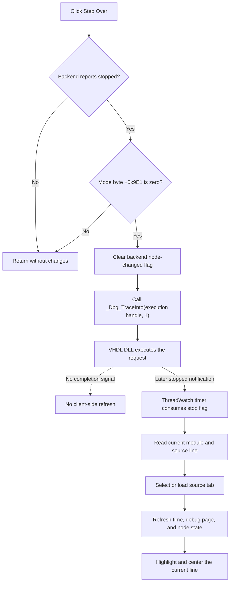

# Step Over

`sbStepOver` asks the active HDL debugger backend to step over one source-level operation. The recovered client does not implement call-depth handling itself. It distinguishes Step Over from the adjacent Step command by passing mode `1` to the same `_Dbg_TraceInto` DLL entry point for which Step passes mode `0`.

## Control

| Property | Recovered value |
| --- | --- |
| Form | HDLDebugger |
| Component path | HDLDebugger.pnToolbar.sbStepOver |
| Control class | TSpeedButton |
| Caption | Not present in the recovered resource. |
| Hint | Step Over |
| Text | Not present in the recovered resource. |
| Handler name | sbStepOverClick |
| Handler address | 0109f250 |
| Graph node | `resource:dfm:HDLDebugger/HDLDebugger.pnToolbar.sbStepOver` |
| Handler node | `function:0109f250` |
| Graph layer | UI |

## What happens when clicked

The click handler first asks `_Dbg_IsStopped` about the debugger context stored at form offset `+0x9C0`. It does nothing while that context reports that execution is running. It also requires the recovered mode byte at form offset `+0x9E1` to be zero. That byte is set when the debugger form is initialized and gates Step, Step Over, Run, and node-change propagation, but its Delphi field name and higher-level mode meaning are not recovered.

When both guards pass, the handler clears the backend's node-changed flag with `_Dbg_SetNodeChanged(context, 0)`. It then obtains the active execution handle through the debugger manager at form offset `+0x1660`, manager field `+0x3548`, and execution field `+0x38`. It passes that handle and constant `1` to `_Dbg_TraceInto`. The parallel Step handler performs the same operations but passes `0`; this paired implementation is the evidence that `1` selects Step Over.

The click does not move the source caret or refresh a debugger pane directly. The `ThreadWatch` timer later consumes backend/thread completion flags. On a stopped notification, that path marks the debugger stopped, obtains the current module and line, selects or loads the matching source tab, refreshes time and the active debugger data page, propagates node changes, highlights the current line, and scrolls it near the editor center. Therefore, source movement and visible refresh depend on a later backend notification; they are not proof that the click completed successfully.

Step Over shares the live execution handle with Run, Stop, and End Simulation, but this handler does not invoke those commands. It does not add, remove, disable, or bypass breakpoints. Any call-stack and breakpoint behavior inside a step-over operation belongs to `VHDL_DLL2.DLL` and is not visible in the recovered client.

## State, failures, and persistence

- If `_Dbg_IsStopped` returns false, or if form byte `+0x9E1` is nonzero, the handler returns without changing backend or UI state.
- There is no local busy flag. After the backend reports running, another click is rejected by the stopped guard. If rapid clicks occur before that state changes, the recovered client has no additional debounce that prevents another request.
- The handler assumes an initialized debugger context and execution handle. It does not test either pointer for null, check return values, show an error, retry, time out, or roll back the cleared node-change flag.
- If the DLL rejects the request or never produces a completion notification, this function has no local recovery path and the timer-driven source refresh does not follow from this click.
- The command changes only live debugger state. It does not write the project, source file, settings, registry, or another persistent store, and it does not mark the source as modified.

## Click flow

## Handler evidence

- Source: [DecompiledSources/Tina16/functions/000000000109F250__FUN_0109f250.c](../../../DecompiledSources/Tina16/functions/000000000109F250__FUN_0109f250.c)
- Paired Step source: [DecompiledSources/Tina16/functions/000000000109F200__FUN_0109f200.c](../../../DecompiledSources/Tina16/functions/000000000109F200__FUN_0109f200.c)
- Timer completion path: [DecompiledSources/Tina16/functions/000000000109F130__FUN_0109f130.c](../../../DecompiledSources/Tina16/functions/000000000109F130__FUN_0109f130.c)
- Stopped-state refresh: [DecompiledSources/Tina16/functions/000000000109F0B0__FUN_0109f0b0.c](../../../DecompiledSources/Tina16/functions/000000000109F0B0__FUN_0109f0b0.c)
- Source-line refresh: [DecompiledSources/Tina16/functions/000000000109D420__FUN_0109d420.c](../../../DecompiledSources/Tina16/functions/000000000109D420__FUN_0109d420.c)
- Recovered role: Issue one HDL debugger Step Over command while execution is stopped.
- Current graph summary: Handles 1 Delphi UI event: HDLDebugger.pnToolbar.sbStepOver.OnClick.
- Current graph behavior: Requires a stopped debugger and recovered mode byte zero, clears the backend node-changed flag, then requests trace mode 1. Visible source and debugger-pane changes occur later through the timer-driven completion path.
- Current graph evidence: The handler's constants and field accesses are direct recovered source evidence. The paired Step handler passes 0 to the same backend entry point. The timer, stopped-state refresh, and source-line refresh functions prove the delayed UI update path.
- Complexity: complex
- Distinct outgoing calls: 3

## Direct calls

- `function:00e03600` — Calls the VHDL_DLL2.DLL export _Dbg_TraceInto.
- `function:00e03680` — Calls the VHDL_DLL2.DLL export _Dbg_IsStopped.
- `function:00e03840` — Calls the VHDL_DLL2.DLL export _Dbg_SetNodeChanged.

## Resource evidence

- Kind: Not present in the recovered resource.
- Modal result: Not present in the recovered resource.
- Checked state: Not present in the recovered resource.
- List items: Not present in the recovered resource.
- Image reference: Not present in the recovered resource.
- Extracted glyph: [`0222_HDLDebugger_HDLDebugger_pnToolbar_sbStepOver_Glyph_Data.png`](../../../glyph/0222_HDLDebugger_HDLDebugger_pnToolbar_sbStepOver_Glyph_Data.png)

## Nearby label candidates

Nearby labels are layout candidates only. They are not proof of behavior.

- Rank 1: time:  at distance 123.

## Analysis limits

- The resource hint identifies the command as Step Over, and the recovered handler proves the backend mode value. The glyph alone does not establish debugger semantics.
- `_Dbg_TraceInto` is imported from `VHDL_DLL2.DLL`. Its internal step algorithm, breakpoint rules, error reporting, and return contract are outside the recovered client.
- The exact Delphi names and domain meanings of form offsets `+0x9C0`, `+0x9E1`, and `+0x1660` are not recovered. This article uses their observed roles only.
- The handler does not verify success. A later stopped notification is evidence of backend progress, not a synchronous return value from this click.
