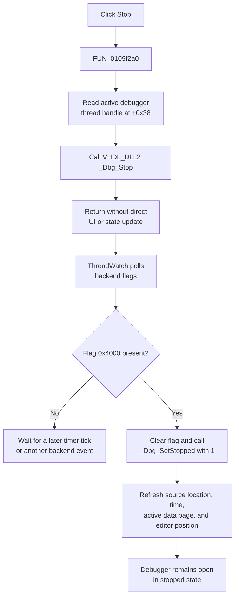

# Stop the running HDL simulation

> Analysis status: Complete for the backend stop request, asynchronous stopped-state refresh, execution-command distinctions, repeat and invalid-session boundaries, errors, and persistence.

## Control

| Property | Recovered value |
| --- | --- |
| Form | HDLDebugger |
| Component path | HDLDebugger.pnToolbar.sbStop |
| Control class | TSpeedButton |
| Caption | Not present in the recovered resource |
| Hint | Stop |
| Handler name | sbStopClick |
| Handler address | 0109f2a0 |
| Graph node | `resource:dfm:HDLDebugger/HDLDebugger.pnToolbar.sbStop` |
| Handler node | `function:0109f2a0` |
| Graph layer | UI |

The button has a two-frame 32-by-16 pixel glyph. Its active frame is a solid square, and the second frame is an outlined disabled-state variant. The stop hint and square confirm the control's presentation. The handler and `_Dbg_Stop` call establish its behavior.

## What happens when clicked

`FUN_0109f2a0` ignores `Sender` and performs one operation. It follows form field `+0x1660` to the active controller, follows controller field `+0x3548` to the HDL debugger controller, and calls `FUN_00f7d120`. The helper reads the current debugger thread handle at controller offset `+0x38` and passes it to `VHDL_DLL2.DLL::_Dbg_Stop`.

This is a stop or pause request to the active debugger thread. It is not complete simulator teardown. The handler does not call `_Dbg_Terminate`, clear the thread handle, set the debugger's stopped state, refresh the source view, update watch or local rows, change a toolbar property, disable the polling timer, or close the form.

## Asynchronous state and UI refresh

The form enables `ThreadWatch` when it is shown. Stop leaves that timer enabled. Its `OnTimer` handler, `FUN_0109f130`, polls backend thread flags and performs the later state transition:

- For flag `0x4000`, it clears the flag, calls `_Dbg_SetStopped` with `1`, and runs `FUN_0109f0b0`.
- For flag `0x8000`, it clears the flag and refreshes the backend node-change state.
- For flag `1`, it clears the flag, clears the controller's thread handle at `+0x38`, and runs `FUN_0109f0b0`.

The `0x4000` branch is the recovered stopped-state notification because it explicitly marks the debugger stopped before the common refresh. The external DLL implementation that sets this flag is not available, so the exact scheduling delay after `_Dbg_Stop` is not known.

`FUN_0109f0b0` gets the current source line and module from the debugger, stores them in the controller, selects the matching source module, refreshes the simulation-time display, refreshes the active debugger data page, updates global node-change state, and moves the source editor to the current execution position. Thus, the visible stopped state is backend-driven and asynchronous. It is not an immediate effect of the click handler.

## Run, Step, and End distinctions

- **Run** uses `_Dbg_Run` on the same thread handle and then refreshes the source editor. It does not run when form mode byte `+0x9e1` is set.
- **Step** and **Step Over** first require `_Dbg_IsStopped` to be true and require `+0x9e1` to be clear. They call `_Dbg_TraceInto` with different mode values.
- **Stop** has no local `_Dbg_IsStopped` or form-mode check. It always forwards the current thread handle to `_Dbg_Stop`.
- **End Simulation** calls `_Dbg_Terminate`, not `_Dbg_Stop`. Its separate finalization path later saves breakpoint and watch text to caller-owned run state, waits for the thread handle to clear, disables `ThreadWatch`, and notifies the owner.

The recovered Stop path does not destroy or replace the debugger session, thread object, breakpoints, watch expressions, source view, or form. A later Run or Step can continue from a stopped state. End Simulation owns termination and teardown.

## Click flow

## Repeated, inactive, and error behavior

- The handler has no stopped-state, null-handle, form-mode, or reentrancy guard. A repeated or programmatic click calls `_Dbg_Stop` again with the current value at `+0x38`.
- If the thread handle has already become zero, the handler still calls the DLL. The external behavior for a zero or stale handle is not recovered, so this article does not claim that it is a safe no-op.
- The handler has no confirmation, return-value test, retry, rollback, status message, or local exception handler.
- If `_Dbg_Stop` returns normally but the backend does not publish a recognized flag, the click ends without the stopped-state refresh.
- If `_Dbg_Stop` raises, no later work in the click exists. If the timer or a refresh helper raises after the backend stops, the simulation can be stopped while one or more displayed values remain stale until another refresh.
- The DFM does not mark **Stop** as initially disabled. Any later enabled-state policy is outside this handler and is not established by the recovered click path.

## Persistence boundary

Stop changes only the live debugger execution state. It does not edit HDL source, breakpoints, watch expressions, project data, dialog state, or the project-modified flag. It does not write a source file, project file, registry value, INI value, or recent-file entry.

The separate End Simulation finalization serializes breakpoints and watches into caller-owned run state. Stop does not call that path. No durable stopped-state persistence beyond the active debugger session is established.

## Source evidence

- [Stop handler `FUN_0109f2a0`](../../../DecompiledSources/Tina16/functions/000000000109F2A0__FUN_0109f2a0.c) forwards the active debugger controller to the stop adapter.
- [Backend stop adapter `FUN_00f7d120`](../../../DecompiledSources/Tina16/functions/0000000000F7D120__FUN_00f7d120.c) passes thread handle `+0x38` to `_Dbg_Stop`.
- [VHDL DLL stop wrapper](../../../DecompiledSources/Tina16/functions/0000000000E03640__VHDL_DLL2.DLL___Dbg_Stop.c) identifies the external backend boundary.
- [ThreadWatch timer `FUN_0109f130`](../../../DecompiledSources/Tina16/functions/000000000109F130__FUN_0109f130.c) consumes stopped, changed-node, and terminated flags and invokes the later refresh.
- [Stopped-state refresh `FUN_0109f0b0`](../../../DecompiledSources/Tina16/functions/000000000109F0B0__FUN_0109f0b0.c) reads the current module and line and refreshes debugger views.
- [FormShow `FUN_0109cb40`](../../../DecompiledSources/Tina16/functions/000000000109CB40__FUN_0109cb40.c) enables the `ThreadWatch` timer.
- [Run handler `FUN_0109f310`](../../../DecompiledSources/Tina16/functions/000000000109F310__FUN_0109f310.c) and [Run helper `FUN_0109f2c0`](../../../DecompiledSources/Tina16/functions/000000000109F2C0__FUN_0109f2c0.c) show the resume path and its form-mode guard.
- [Step handler `FUN_0109f200`](../../../DecompiledSources/Tina16/functions/000000000109F200__FUN_0109f200.c) and [Step Over handler `FUN_0109f250`](../../../DecompiledSources/Tina16/functions/000000000109F250__FUN_0109f250.c) show the stopped-state and form-mode guards and the two trace modes.
- [End Simulation handler `FUN_0109f330`](../../../DecompiledSources/Tina16/functions/000000000109F330__FUN_0109f330.c) calls the distinct termination adapter.
- [End finalization `FUN_0109f350`](../../../DecompiledSources/Tina16/functions/000000000109F350__FUN_0109f350.c) saves caller-owned debug state, requests termination, waits for completion, disables the timer, and notifies the owner.
- [Recovered Delphi resource evidence](../../../DecompiledSources/Tina16/resources/dfm/ui-evidence.json) supplies the toolbar hierarchy, hint, two-glyph state, event binding, and neighboring execution controls.
- [Extracted Stop glyph](../../../glyph/0224_HDLDebugger_HDLDebugger_pnToolbar_sbStop_Glyph_Data.png) supplies the solid and outlined square frames.

## Annotation ownership and limits

- This control owns Stop handler `FUN_0109f2a0` and backend adapter `FUN_00f7d120`.
- `.608` owns End Simulation, termination, and finalization functions. `.609` owns Run and the shared source-editor refresh. Step and Step Over own their unique handlers. This article cites those functions without redefining them.
- The timer, stopped-state refresh, generic VCL timer setter, application event pump, thread-flag APIs, and VHDL DLL imports remain evidence-only.
- The external DLL implementation is unavailable. The precise native meaning of thread flags, the scheduling interval between request and acknowledgement, and invalid-handle behavior are not recovered.
