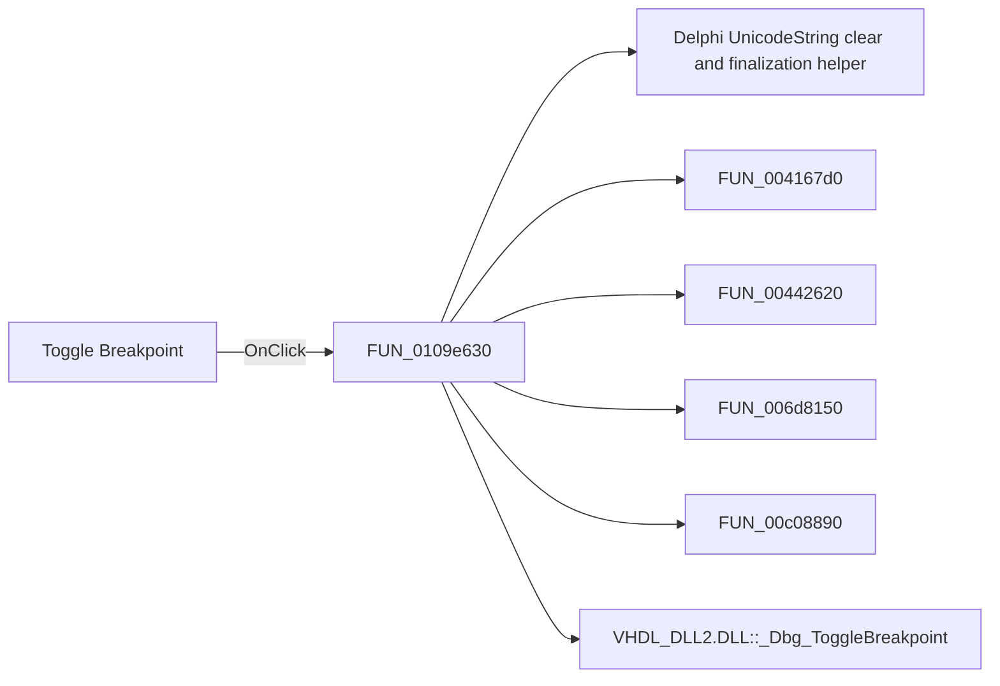

# Toggle Breakpoint

> Analysis status: Pending individual source review.

## Control

| Property | Recovered value |
| --- | --- |
| Form | HDLDebugger |
| Component path | HDLDebugger.pnToolbar.sbToggleBreakPoint |
| Control class | TSpeedButton |
| Caption | Not present in the recovered resource. |
| Hint | Toggle Breakpoint |
| Text | Not present in the recovered resource. |
| Handler name | sbToggleBreakPointClick |
| Handler address | 0109e630 |
| Graph node | `resource:dfm:HDLDebugger/HDLDebugger.pnToolbar.sbToggleBreakPoint` |
| Handler node | `function:0109e630` |
| Graph layer | UI |

## What happens when clicked

Pending individual analysis. An agent must read the recovered handler source and its relevant callees before it replaces this text.

## Click flow

## Handler evidence

- Source: [DecompiledSources/Tina16/functions/000000000109E630__FUN_0109e630.c](../../../DecompiledSources/Tina16/functions/000000000109E630__FUN_0109e630.c)
- Recovered role: Not present in the recovered resource.
- Current graph summary: Handles 1 Delphi UI event: HDLDebugger.pnToolbar.sbToggleBreakPoint.OnClick.
- Current graph behavior: Not present in the recovered resource.
- Current graph evidence: Not present in the recovered resource.
- Complexity: complex
- Distinct outgoing calls: 9

## Direct calls

- `function:00414480` — Delphi UnicodeString clear and finalization helper
- `function:004167d0` — FUN_004167d0
- `function:00442620` — FUN_00442620
- `function:006d8150` — FUN_006d8150
- `function:00c08890` — FUN_00c08890
- `function:00e03780` — Calls the VHDL_DLL2.DLL export _Dbg_ToggleBreakpoint.
- `function:0109e470` — HDL debugger breakpoint tree reload
- `function:0109e760` — FUN_0109e760
- `function:0109f870` — FUN_0109f870

## Resource evidence

- Kind: Not present in the recovered resource.
- Modal result: Not present in the recovered resource.
- Checked state: Not present in the recovered resource.
- List items: Not present in the recovered resource.
- Image reference: Not present in the recovered resource.
- Extracted glyph: [`0219_HDLDebugger_HDLDebugger_pnToolbar_sbToggleBreakPoint_Glyph_Data.png`](../../../glyph/0219_HDLDebugger_HDLDebugger_pnToolbar_sbToggleBreakPoint_Glyph_Data.png)

## Nearby label candidates

Nearby labels are layout candidates only. They are not proof of behavior.

- Rank 1: time:  at distance 98.

## Analysis limits

- Do not infer behavior from the control class, caption, hint, glyph, or nearby label alone.
- Do not replace the pending status until the handler source and relevant call path provide enough evidence.
