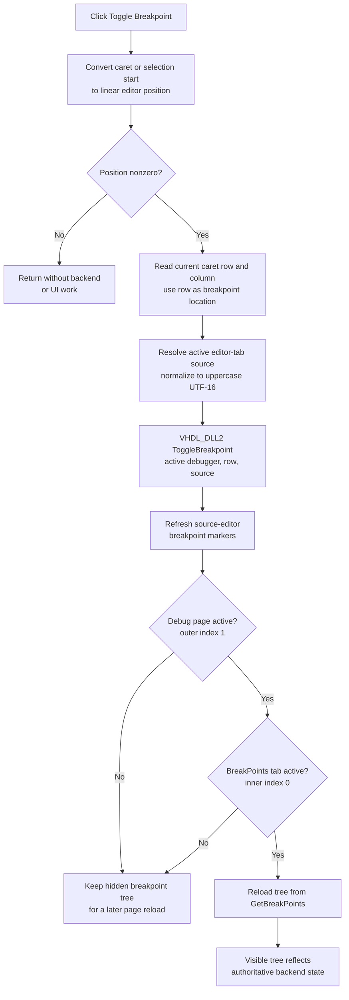

# Toggle a breakpoint at the active HDL source row

> Analysis status: Complete for editor-position selection, source-key resolution, VHDL debugger toggle, editor refresh, conditional breakpoint-tree reload, and persistence boundaries.

## Control

| Property | Recovered value |
| --- | --- |
| Form | HDLDebugger |
| Component path | HDLDebugger.pnToolbar.sbToggleBreakPoint |
| Control class | TSpeedButton |
| Caption | Not present |
| Hint | Toggle Breakpoint |
| Handler name | sbToggleBreakPointClick |
| Handler address | 0109e630 |
| Graph node | `resource:dfm:HDLDebugger/HDLDebugger.pnToolbar.sbToggleBreakPoint` |
| Handler node | `function:0109e630` |
| Graph layer | UI |

The embedded 32 by 16 pixel sprite contains two 16-pixel visual states because the resource sets `NumGlyphs = 2`. The first state is a colored red-and-yellow breakpoint symbol, and the second is gray. The hint and glyph support toggle intent. The source establishes the exact active-editor target and backend operation.

## Target resolution

This toolbar action does not use the breakpoint-tree popup target at form `+0xa20`. It derives a key from the active HDL source editor.

First, `FUN_00c08890` converts either the caret coordinate or the earlier selection endpoint into a linear editor position. `FUN_0109e630` continues only when this result is nonzero. A zero result causes an immediate no-op after temporary-string cleanup. The exact design reason for excluding linear position zero is not recovered; the code does not replace this test with a document-empty or valid-line API.

When the guard passes, `FUN_0109f870` reads the current `TSynEdit` caret row and column. It writes the row to the first output and the column to the second. The toggle handler passes only the row to the backend. The column is captured but is not part of the breakpoint key.

`FUN_0109e760` resolves the source identifier:

1. It gets the selected editor-tab index from the tab control at form `+0x878`.
2. It reads the matching source string from the form-owned list at `+0x9d8`.
3. It converts the source string to uppercase.
4. It caches that normalized string at `+0x9b8`.
5. It copies the string to the null-terminated UTF-16 scratch buffer at `+0xe30` and returns the buffer address.

The special-line-color handler uses the same resolver when it asks `_Dbg_IsBreakPoint` whether a row needs breakpoint coloring. This establishes that the normalized active-tab source and row form the backend breakpoint key.

## What happens when clicked

After the guard and target resolution, `FUN_0109e630` performs these operations in order:

1. Calls `VHDL_DLL2.DLL::_Dbg_ToggleBreakpoint` with the active debugger handle at `+0x9c0`, the current caret row, and the normalized active-source string.
2. Calls virtual slot `+0x180` on the source editor at `+0x980` to refresh its breakpoint markers.
3. Gets the active page index from the outer debug page control at `+0x750`.
4. If that index is `1`, gets the active page index from inner `pcDebugPages` at `+0x770`.
5. Only when the inner index is `0`, calls canonical breakpoint-tree reload `FUN_0109e470`.

The debug-page dispatcher proves the page mapping: outer index `1` is the **Debug** page, and inner indexes `0`, `1`, and `2` select **BreakPoints**, **Locals**, and **Watches**. Thus, the tree reload runs immediately only while the BreakPoints page is visible. Opening that page later calls the same reload through the page-change dispatcher.

The backend export has toggle semantics. If the source-and-row key is absent, the click adds it. If it is present, the click removes it. The handler does not call `_Dbg_IsBreakPoint` or `_Dbg_PossibleBreakpoint` before the toggle and does not inspect a backend status result.

## Click flow

## UI state and repeated clicks

- The click ignores `Sender` and does not use the selected breakpoint-tree node, popup menu state, or the popup target resolver owned by `.597`.
- A zero linear editor position causes no backend call, editor refresh, tree reload, message, or button-state change.
- The handler does not change the speed button's Enabled, Down, Visible, hint, or glyph state.
- Repeated clicks at the same source and row alternate the backend breakpoint state when the backend key remains stable.
- The editor refresh runs after every normal backend call. The visible BreakPoints tree is then rebuilt from `_Dbg_GetBreakPoints`; a hidden tree is not reloaded until its page becomes active or another refresh path runs.
- The current column does not distinguish breakpoints on the same source row.

## Errors and partial state

- The handler has no local exception handler, retry, rollback, confirmation, or user-facing error call.
- It assumes a valid active editor tab, source-list entry, debugger handle, and editor object. It has no explicit index, pointer, source-string, or row-range validation.
- The backend call provides no recovered result that the handler checks. If the backend rejects the row but returns normally, the editor refresh and any visible tree reload still run and show the returned backend state.
- A backend exception skips both UI refreshes. A later exception can leave the backend changed while editor markers or the visible tree remain stale.
- The canonical reload clears the tree before it gets and decodes the backend list. A reload exception can leave the visible tree empty or partly rebuilt.
- Because `_Dbg_PossibleBreakpoint` is not called here, whether the DLL accepts a non-executable HDL row is an external backend decision.

## Persistence boundary

- The direct state change belongs to the active VHDL debugger backend. The editor marker and breakpoint tree are derived views.
- The handler does not change source text, caret position, selection, project-modified state, or breakpoint enabled state separately from presence.
- It does not write a project file, source file, registry value, INI file, settings object, or recent-file entry.
- A separate debugger-finalization path later gets the backend breakpoint list and copies it into caller-owned debug/run state. That later in-memory lifecycle transfer is not part of this click and does not prove file persistence.

## Source evidence

- [Toggle handler `FUN_0109e630`](../../../DecompiledSources/Tina16/functions/000000000109E630__FUN_0109e630.c) applies the position guard, resolves row and source, calls the DLL toggle, refreshes the editor, and conditionally reloads the visible breakpoint tree.
- [Caret reader `FUN_0109f870`](../../../DecompiledSources/Tina16/functions/000000000109F870__FUN_0109f870.c) returns the editor row and column through two output pointers.
- [Active-source resolver `FUN_0109e760`](../../../DecompiledSources/Tina16/functions/000000000109E760__FUN_0109e760.c) selects the current tab's source string, normalizes it to uppercase, caches it, and returns a UTF-16 scratch-buffer address.
- [Linear-position reader `FUN_00c08890`](../../../DecompiledSources/Tina16/functions/0000000000C08890__FUN_00c08890.c) selects the caret or earlier selection endpoint. [Coordinate-to-position converter `FUN_00c0fa70`](../../../DecompiledSources/Tina16/functions/0000000000C0FA70__FUN_00c0fa70.c) converts that coordinate to a linear offset.
- [Breakpoint marker handler `FUN_0109f960`](../../../DecompiledSources/Tina16/functions/000000000109F960__FUN_0109f960.c) uses the same active-source resolver and row with `_Dbg_IsBreakPoint` to select marker colors.
- [Debug subpage dispatcher `FUN_0109dd80`](../../../DecompiledSources/Tina16/functions/000000000109DD80__FUN_0109dd80.c) maps inner page index `0` to the breakpoint reload, `1` to Locals, and `2` to Watches.
- [Shared breakpoint reload `FUN_0109e470`](../../../DecompiledSources/Tina16/functions/000000000109E470__FUN_0109e470.c) clears the tree, gets the backend list, and rebuilds rows and enabled-state images. Its canonical annotation belongs to `.596`.
- [VHDL DLL toggle wrapper](../../../DecompiledSources/Tina16/functions/0000000000E03780__VHDL_DLL2.DLL___Dbg_ToggleBreakpoint.c) identifies the external backend operation.
- [Debugger finalization `FUN_0109f350`](../../../DecompiledSources/Tina16/functions/000000000109F350__FUN_0109f350.c) shows the later breakpoint-list copy into caller-owned run state.
- [Recovered two-state glyph](../../../glyph/0219_HDLDebugger_HDLDebugger_pnToolbar_sbToggleBreakPoint_Glyph_Data.png) supplies supporting visual evidence.
- [Glyph manifest](../../../glyph/manifest.json) records the original BMP, 32 by 16 dimensions, component path, and extracted PNG hash.
- [Recovered Delphi resource evidence](../../../DecompiledSources/Tina16/resources/dfm/ui-evidence.json) supplies the TSpeedButton class, hint, two-glyph count, event binding, page hierarchy, and tab captions.

## Annotation ownership and limits

- `.612` owns direct handler `FUN_0109e630`, active-source resolver `FUN_0109e760`, and caret row/column helper `FUN_0109f870`.
- `.596` owns canonical breakpoint-tree reload `FUN_0109e470`. `.597` owns the unrelated breakpoint-tree popup target resolver `FUN_0109ea20`. This article cites only the reload.
- Generic SynEdit, UnicodeString, tab, page-control, external DLL, and Delphi lifetime helpers remain evidence-only.
- The VHDL DLL implementation is external. Exact acceptance rules for HDL rows and durable storage beyond the debugger lifecycle are not recovered.
