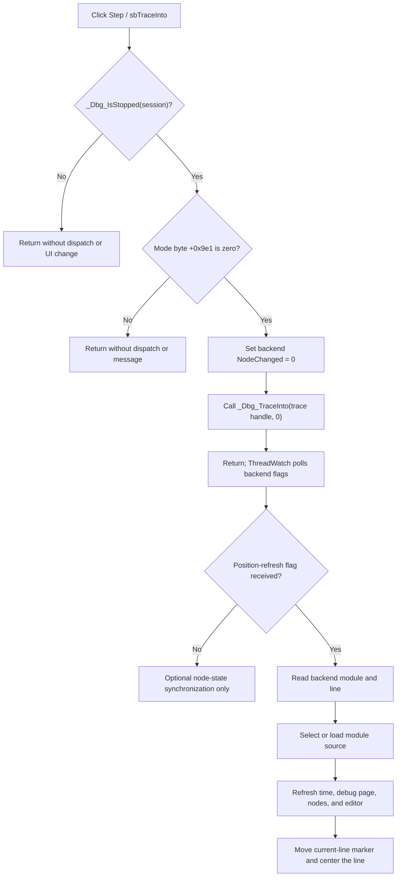

# Step into the next HDL execution point

> Analysis status: Source-reviewed. The DFM, extracted glyph, direct handler, Step Over comparison, debugger timer, source-position refresh, and Run, Stop, and End handlers establish the behavior below. VHDL_DLL2 internals are not present in the recovered executable.

## Control

| Property | Recovered value |
| --- | --- |
| Form | HDLDebugger |
| Form caption | HDL Debugger |
| Component path | HDLDebugger.pnToolbar.sbTraceInto |
| Control class | TSpeedButton |
| Hint | Step |
| Number of glyph states | 2 |
| Handler name | sbTraceIntoClick |
| Handler address | 0109f200 |
| Graph node | `resource:dfm:HDLDebugger/HDLDebugger.pnToolbar.sbTraceInto` |
| Handler node | `function:0109f200` |
| Graph layer | UI |

The DFM does not store a caption, text, action, button kind, modal result, group index, or down state. The extracted 32-by-16 raster contains two 16-by-16 button states. Its active state shows a small blue downward arrow entering an outlined target; the second state is gray. This image supports a step or enter operation, while the handler and named debugger export prove the Trace Into dispatch.

## What happens when clicked

`FUN_0109f200` performs two guards before it changes debugger state:

1. It calls `_Dbg_IsStopped` with the debugger session at form field `+0x9c0`. The session must report stopped.
2. It reads mode byte `+0x9e1`. That byte must be zero.

If either condition fails, the handler returns. It does not call Trace Into, change source position, refresh the UI, or show a message.

When both conditions pass, the handler:

1. calls `_Dbg_SetNodeChanged(session, 0)` to clear the backend's pending node-change state; and
2. calls `_Dbg_TraceInto(traceHandle, 0)`.

The trace handle comes from field `+0x38` of the active simulation state under the object at `+0x1660`. Argument `0` selects the Trace Into variant. The adjacent Step Over handler has the same guards and state clear but passes argument `1` to the same export. This direct comparison establishes the recovered distinction even though the DLL algorithm is unavailable.

The click does not directly change the editor line, module tab, simulation time, Local Variables tree, toolbar state, or stopped flag. It dispatches work to the backend and returns.

## Asynchronous completion and source movement

The DFM creates `ThreadWatch` disabled. `FUN_0109cb40`, the form-show handler, enables it after the debugger form and source view are prepared. Its timer handler `FUN_0109f130` polls backend thread flags.

The recovered completion branches are:

- Flag `0x4000`: clear that flag, set the backend stopped state to true, and run the full position refresh.
- Flag `0x8000`: clear that flag and synchronize node-change state without moving the source position.
- Flag `0x0001`: clear that flag, clear the stored trace handle, and run the full position refresh.

The DLL source is absent, so the recovered executable does not prove which completion flag a specific Trace Into operation raises. It proves what the UI does when each flag becomes visible.

The full refresh in `FUN_0109f0b0`:

1. gets the current line through `_GetLineNo(session)`;
2. gets the current module through `_GetModuleName(session)`;
3. stores both values in the simulation state;
4. selects or loads the matching source module;
5. refreshes the simulation-time text and the active Debug subpage;
6. synchronizes the main application's node-change state; and
7. repaints the source editor, moves the current-line marker, and scrolls that line near the center.

Thus a successful step can move to another module and line, but that visible movement is a later timer result. `FUN_0109f200` does not calculate the next line itself.

## Relationship to Step Over, Run, Stop, and End

| Command | Recovered direct behavior |
| --- | --- |
| Step | Requires stopped state and mode byte zero; clears NodeChanged; calls `_Dbg_TraceInto(handle, 0)`. |
| Step Over | Uses the same guards and clear; calls `_Dbg_TraceInto(handle, 1)`. |
| Run | When mode byte zero, clears NodeChanged and calls `_Dbg_Run(handle, 1)`; its outer handler then requests an editor refresh in either mode. |
| Stop | Calls `_Dbg_Stop(handle)` without the Step guards. |
| End Simulation | Calls `_Dbg_Terminate(handle)` without the Step guards. |

Trace Into does not call Run, Stop, or Terminate. While the backend reports running, its stopped-state guard makes another Trace Into click a silent no-op. Stop provides the separate backend-stop request. End Simulation terminates rather than stepping. The exact backend scheduling, call-stack entry rule, and response time are inside VHDL_DLL2 and remain unknown.

## Click and completion flow

## Guard, error, and repeated-click boundaries

- Guard failure is silent. The handler does not disable the speed button or explain why the step was not dispatched.
- The normal opener creates the form, stores the supplied session at `+0x9c0`, creates the simulation/source controller at `+0x1660`, and then shows the form. This is the proved interactive setup path.
- The handler has no explicit null check for the session, controller, simulation state, or trace handle. It calls `_Dbg_IsStopped` before it dereferences the trace-handle chain. Missing or invalid state outside the normal setup path can therefore be forwarded to the DLL or fail during the nested dereference.
- `_Dbg_SetNodeChanged` and `_Dbg_TraceInto` return no status in the recovered call sites. The handler has no local exception catch, user error, timeout, or rollback.
- NodeChanged is cleared before Trace Into is called. If dispatch fails or never raises a watched flag, that clear can remain without a matching source or node refresh.
- The code relies on `_Dbg_IsStopped` to prevent another dispatch while execution is active. If the backend still reports stopped during a rapid repeated click, the handler has no separate local busy flag and can call Trace Into again.
- If no watched completion flag arrives, the handler leaves the visible module and line unchanged. The timer path shows no local error for that condition.

## Persistence boundary

Trace Into changes current debugger and simulation state. Later timer work can change the selected source module, current line marker, time display, Local Variables or other active debug-page data, and node display. The inspected click and completion paths do not write a project file, source file, settings file, registry value, database, or undo record. No execution-position persistence across debugger sessions or application restart is proved.

## Source evidence

- [Trace Into handler `FUN_0109f200`](../../../DecompiledSources/Tina16/functions/000000000109F200__FUN_0109f200.c) checks stopped and mode state, clears NodeChanged, and calls `_Dbg_TraceInto` with argument `0`.
- [Step Over handler `FUN_0109f250`](../../../DecompiledSources/Tina16/functions/000000000109F250__FUN_0109f250.c) proves the parallel argument `1` branch.
- [ThreadWatch timer `FUN_0109f130`](../../../DecompiledSources/Tina16/functions/000000000109F130__FUN_0109f130.c) consumes the three recovered backend flags and selects full-position or node-only refresh work.
- [Position refresh `FUN_0109f0b0`](../../../DecompiledSources/Tina16/functions/000000000109F0B0__FUN_0109f0b0.c) reads the module and line and invokes all later UI refresh helpers.
- [Module selector `FUN_0109d4a0`](../../../DecompiledSources/Tina16/functions/000000000109D4A0__FUN_0109d4a0.c) selects an existing module tab or creates and loads a missing one.
- [Source marker refresh `FUN_0109d420`](../../../DecompiledSources/Tina16/functions/000000000109D420__FUN_0109d420.c) repaints and centers the recovered current line. [Marker updater `FUN_0109f8b0`](../../../DecompiledSources/Tina16/functions/000000000109F8B0__FUN_0109f8b0.c) removes the old marker and applies the new one.
- [Run handler `FUN_0109f310`](../../../DecompiledSources/Tina16/functions/000000000109F310__FUN_0109f310.c) and [Run dispatcher `FUN_0109f2c0`](../../../DecompiledSources/Tina16/functions/000000000109F2C0__FUN_0109f2c0.c) prove the separate continuous-execution path.
- [Stop handler `FUN_0109f2a0`](../../../DecompiledSources/Tina16/functions/000000000109F2A0__FUN_0109f2a0.c) reaches `_Dbg_Stop` through [its wrapper](../../../DecompiledSources/Tina16/functions/0000000000F7D120__FUN_00f7d120.c).
- [End Simulation handler `FUN_0109f330`](../../../DecompiledSources/Tina16/functions/000000000109F330__FUN_0109f330.c) reaches `_Dbg_Terminate` through [its wrapper](../../../DecompiledSources/Tina16/functions/0000000000F7D140__FUN_00f7d140.c).
- [Debugger configuration `FUN_0109cf80`](../../../DecompiledSources/Tina16/functions/000000000109CF80__FUN_0109cf80.c) stores the supplied session and creates the simulation/source controller before the form is shown.
- [Form-show handler `FUN_0109cb40`](../../../DecompiledSources/Tina16/functions/000000000109CB40__FUN_0109cb40.c) enables `ThreadWatch`.
- [Extracted Trace Into glyph](../../../glyph/0220_HDLDebugger_HDLDebugger_pnToolbar_sbTraceInto_Glyph_Data.png) provides supplementary direction/entry imagery only.
- [Recovered Delphi resource evidence](../../../DecompiledSources/Tina16/resources/dfm/ui-evidence.json) supplies the button hierarchy, hint, glyph metadata, and event binding.

## Analysis limits and ownership

- This Bead owns only direct Trace Into handler `FUN_0109f200`.
- The Step Over, Run, Stop, End Simulation, and Toggle Breakpoint Beads own their direct handlers and execution commands.
- `ThreadWatch`, the position-refresh chain, source-module loading, marker movement, and VHDL_DLL2 imports are shared evidence only here.
- The mode byte name, backend call-stack semantics, thread-flag producer, exception behavior, and exact definition of one Trace Into step are not recovered. This article does not infer them from the hint or glyph.
