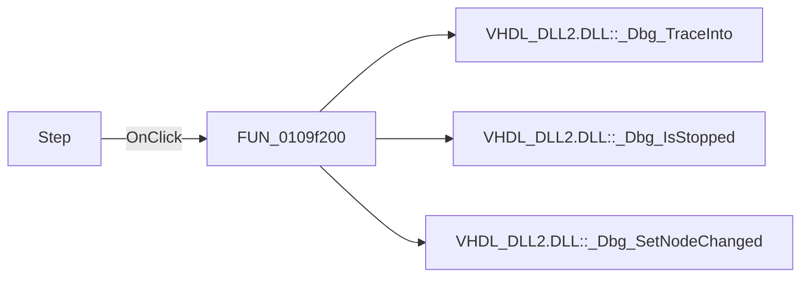

# Step

> Analysis status: Pending individual source review.

## Control

| Property | Recovered value |
| --- | --- |
| Form | HDLDebugger |
| Component path | HDLDebugger.pnToolbar.sbTraceInto |
| Control class | TSpeedButton |
| Caption | Not present in the recovered resource. |
| Hint | Step |
| Text | Not present in the recovered resource. |
| Handler name | sbTraceIntoClick |
| Handler address | 0109f200 |
| Graph node | `resource:dfm:HDLDebugger/HDLDebugger.pnToolbar.sbTraceInto` |
| Handler node | `function:0109f200` |
| Graph layer | UI |

## What happens when clicked

Pending individual analysis. An agent must read the recovered handler source and its relevant callees before it replaces this text.

## Click flow

## Handler evidence

- Source: [DecompiledSources/Tina16/functions/000000000109F200__FUN_0109f200.c](../../../DecompiledSources/Tina16/functions/000000000109F200__FUN_0109f200.c)
- Recovered role: Not present in the recovered resource.
- Current graph summary: Handles 1 Delphi UI event: HDLDebugger.pnToolbar.sbTraceInto.OnClick.
- Current graph behavior: Not present in the recovered resource.
- Current graph evidence: Not present in the recovered resource.
- Complexity: complex
- Distinct outgoing calls: 3

## Direct calls

- `function:00e03600` — Calls the VHDL_DLL2.DLL export _Dbg_TraceInto.
- `function:00e03680` — Calls the VHDL_DLL2.DLL export _Dbg_IsStopped.
- `function:00e03840` — Calls the VHDL_DLL2.DLL export _Dbg_SetNodeChanged.

## Resource evidence

- Kind: Not present in the recovered resource.
- Modal result: Not present in the recovered resource.
- Checked state: Not present in the recovered resource.
- List items: Not present in the recovered resource.
- Image reference: Not present in the recovered resource.
- Extracted glyph: [`0220_HDLDebugger_HDLDebugger_pnToolbar_sbTraceInto_Glyph_Data.png`](../../../glyph/0220_HDLDebugger_HDLDebugger_pnToolbar_sbTraceInto_Glyph_Data.png)

## Nearby label candidates

Nearby labels are layout candidates only. They are not proof of behavior.

- Rank 1: time:  at distance 148.

## Analysis limits

- Do not infer behavior from the control class, caption, hint, glyph, or nearby label alone.
- Do not replace the pending status until the handler source and relevant call path provide enough evidence.
