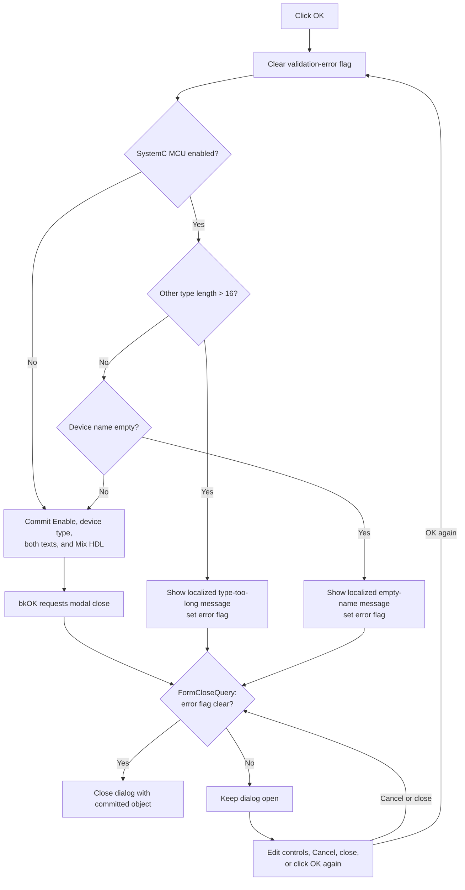

# Validate and apply HDL options

## Control

| Property | Recovered value |
| --- | --- |
| Form | HDLOptions |
| Component path | HDLOptions.OK |
| Control class | TBitBtn |
| Button kind | bkOK |
| Caption, hint, image, or nearby label | Not present in the recovered resource |
| Handler name | OKClick |
| Handler address | 01c323f0 |
| Graph node | `resource:dfm:HDLOptions/HDLOptions.OK` |
| Handler node | `function:01c323f0` |
| Graph layer | UI |

## Purpose and input state

This dialog edits an HDL-options object that belongs to the Macro Wizard. `FormShow` copies the current object values into these controls:

| Control | Value loaded and later committed |
| --- | --- |
| `cbSC_MCU` | Enable SystemC Microcontroller mode |
| `rgDeviceType` | Device type; the stored value is one-based |
| `eDeviceOther` | Other device-type text |
| `eDeviceName` | Device name |
| `cbMixHDL` | Enable HDL and SystemVerilog/SystemC mixing |

The radio-group items map to stored values `1` through `9`: PIC10/12/14/16, PIC18, PIC24, PIC32, AVR, 8051, ARM7, ARM9, and Other. `FormShow` subtracts one to produce the radio-group item index. OK adds one when it commits the selected index.

The Macro Wizard creates this options object with SystemC mode disabled, device type `1`, both text fields empty, and Mix HDL disabled. These values are the initial state unless the same Macro Wizard instance changed the object earlier.

## Validation

The handler first clears its validation-error flag. It validates the text fields only when **Enable** (`cbSC_MCU`) is checked.

1. It reads **Other type**. More than 16 UTF-16 code units is invalid. The check runs even when the selected radio item is not **Other**.
2. If the first check passes, it reads **Device name**. An empty Delphi string is invalid.

The first failure has priority. The handler obtains a localized message through `HDLStrings.Msg_DevTypTooLong` or `HDLStrings.Msg_DevNameEmpty`, shows a message dialog, sets the validation-error flag, and stops before it writes any option field.

There is no trim operation. A name that contains only spaces is not empty to this handler. It does not limit the Device name length. It also does not validate the radio-group index. If the index is `-1`, it stores device type `0`.

When SystemC mode is disabled, both text validations are skipped. The handler still copies the current device type and both text fields so they remain available if the mode is enabled later.

## Commit

After validation succeeds, the handler writes directly to the caller-owned object in this order:

1. SystemC mode enabled state;
2. radio-group index plus one;
3. Other device-type text;
4. Device name;
5. Mix HDL checked state.

The edit controls are the staging area. There is no second Apply step and no temporary options copy. An invalid attempt writes none of these fields because all validation occurs before the first write.

## Modal close and Cancel behavior

The resource marks OK as `bkOK` and Cancel as `bkCancel`. The OK handler does not set a modal result itself; the standard button kind supplies the modal close request. `FormCloseQuery` permits closure only while the validation-error flag is clear.

- A valid OK attempt leaves the flag clear, commits the object, and permits the modal dialog to close.
- Cancel or the window close control before any validation error permits closure and leaves the caller-owned object unchanged.
- An invalid OK attempt sets the flag. The same `FormCloseQuery` then blocks the OK close request.
- The error flag is not cleared by editing a field or by the Cancel button. A later Cancel or window-close request is also blocked after a failed OK attempt.
- A later OK attempt clears the flag at its start. The user must make that attempt valid, or disable SystemC mode so the text checks are skipped, before the form can close.

The launcher does not inspect the modal result. It binds the Macro Wizard object, shows the dialog, and destroys the form. This is safe for a normal Cancel because only the valid OK handler writes the object.

## Click flow

## Downstream use

The Macro Wizard owns the options object for its lifetime. During the recovered SystemC/HDL macro-generation path, it passes this object to the generated HDL model. The downstream writer reads the one-based device type, Other type, and Device name and writes them to the SystemC generation stream. If the SystemC-enable field is set, it also enables the recovered SystemC output-mode flags.

The recovered downstream path does not establish how the separate Mix HDL Boolean is consumed. The click proves that the value is stored in the caller-owned wrapper, but this article does not assign it an unproven compiler effect.

## Errors and partial state

- The two expected validation failures show a message and perform no commit.
- The handler does not set focus or select the invalid text after either message.
- The commit has no local exception handler or rollback. It writes scalar fields before it assigns both Unicode strings. If a string assignment or later operation raises, the caller-owned object can contain a partial update.
- A successful commit occurs before the modal close is accepted. If later close processing fails, the options object remains changed.
- The launcher destroys the dialog after the modal call. It does not copy data after the form closes and cannot undo a partial commit.

## Persistence boundary

OK changes the object stored in the current Macro Wizard instance. It does not write a registry value, INI file, settings file, project file, or macro file. The later generation path can place the SystemC fields in generated output, but that is not part of this click. The Macro Wizard destroys its options object when the wizard is destroyed.

## Evidence

- [OK handler `FUN_01c323f0`](../../../DecompiledSources/Tina16/functions/0000000001C323F0__FUN_01c323f0.c) proves the conditional validation, 16-code-unit limit, localized message keys, direct field-write order, one-based device type, and Mix HDL commit.
- [FormShow `FUN_01c322a0`](../../../DecompiledSources/Tina16/functions/0000000001C322A0__FUN_01c322a0.c) resets the error flag and loads all five values from the caller-owned object.
- [FormCloseQuery `FUN_01c32290`](../../../DecompiledSources/Tina16/functions/0000000001C32290__FUN_01c32290.c) sets `CanClose` to the inverse of the validation-error flag.
- [Macro Wizard launcher `FUN_01c3c630`](../../../DecompiledSources/Tina16/functions/0000000001C3C630__FUN_01c3c630.c) binds the existing options object, shows the form modally, and destroys it without reading a result.
- [Macro Wizard destructor `FUN_01c38100`](../../../DecompiledSources/Tina16/functions/0000000001C38100__FUN_01c38100.c) destroys the options object with the wizard.
- [Options-wrapper constructor `FUN_0154bad0`](../../../DecompiledSources/Tina16/functions/000000000154BAD0__FUN_0154bad0.c) and [nested SystemC-options constructor `FUN_0154ba10`](../../../DecompiledSources/Tina16/functions/000000000154BA10__FUN_0154ba10.c) prove the initial disabled flags, device type `1`, and empty strings.
- [Generation-object options setter `FUN_0156b140`](../../../DecompiledSources/Tina16/functions/000000000156B140__FUN_0156b140.c) and [SystemC generation consumer `FUN_01774e00`](../../../DecompiledSources/Tina16/functions/0000000001774E00__FUN_01774e00.c) establish the later device-option stream fields and SystemC-enable effect.
- [Recovered Delphi resource evidence](../../../DecompiledSources/Tina16/resources/dfm/ui-evidence.json) supplies the control hierarchy, captions and radio items, `bkOK` and `bkCancel` kinds, and the OnShow, OnCloseQuery, and OnClick bindings.

## Annotation ownership and limits

- This Bead owns `FUN_01c323f0`, `FUN_01c322a0`, and `FUN_01c32290`.
- The Macro Wizard launcher `FUN_01c3c630`, options-pointer setter `FUN_01c32280`, constructors, VCL text helpers, localization helpers, message dialog, and downstream HDL functions remain evidence-only.
- The recovered source proves the object offsets and value flow. The original Delphi type names for the options wrapper and nested SystemC record are not recovered, so the article does not invent them.
