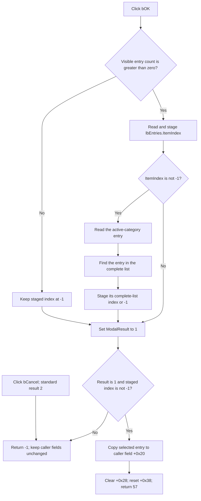

# Accept the selected HDL entry

> Analysis status: Reviewed from the recovered handler, picker list setup,
> category rebuild path, modal caller, and UI resource.

## Control

| Property | Recovered value |
| --- | --- |
| Form | `HDLPickerForm` (`THDLPickerForm`) |
| Form caption | `HDL Picker` |
| Component path | `HDLPickerForm.bOK` |
| Control class | `TBitBtn` |
| Kind | `bkOK` |
| Handler name | `bOKClick` |
| Handler address | `017066d0` |
| Graph node | `resource:dfm:HDLPickerForm/HDLPickerForm.bOK` |
| Handler node | `function:017066d0` |
| Graph layer | UI |

## What happens when clicked

`FUN_017066d0` converts the selected visible HDL entry to an index in the
picker's complete entry list. It stores this index in form field `+0x730` and
then sets `ModalResult` to `1` (`mrOk`). It does not change the caller's object
directly.

The picker uses three related lists:

- form field `+0x708` is the complete, caller-supplied entry list;
- form field `+0x710` contains the unpadded entries for the active category;
- `lbEntries.Items` receives a separate display list at `+0x718`. The display
  builder can pad text and append recovered metadata.

The OK handler deliberately reads the selected string from the unpadded list
at `+0x710`, not from the display text. It then calls `IndexOf` on the complete
list at `+0x708`. Therefore, a category filter and display formatting do not
change the index that the caller receives.

## Selection rules

The handler applies these rules in order:

1. Read `lbEntries.Items.Count`.
2. If the count is greater than zero, read `lbEntries.ItemIndex` and store it
   in `+0x730`.
3. If that index is not `-1`, read the string at the same index from the active
   category list.
4. Find that string in the complete list and replace `+0x730` with the
   resulting complete-list index.
5. Set the form modal result to `1` in all normal branches.

Form creation initializes `+0x730` to `-1`. An empty visible list leaves this
value unchanged. A nonempty list with no selection also stores `-1`. A selected
string that is not in the complete list produces the same `-1` result from
`IndexOf`.

The recovered code does not display an error for any of these cases. It also
does not keep the dialog open. Thus, `mrOk` alone does not mean that a valid
entry was selected.

## Modal caller and copy-back

`FUN_01709150` builds the complete entry list, creates the picker, supplies the
list, and shows the form modally. After `ShowModal` returns, it accepts the
selection only when both conditions are true:

- the modal result is `1`;
- the staged complete-list index at `+0x730` is not `-1`.

On acceptance, the caller reads that entry from the complete list and writes
it to its owned string field at `+0x20`. It then clears the string field at
`+0x28`, resets the 64-bit field at `+0x38` to zero, and returns `57`.

If either condition fails, the function returns `-1` and does not change these
three caller fields. The meaning of return value `57` and the original Delphi
names of the three caller fields are not recovered.

The picker form and all temporary lists are destroyed after the modal call.
The accepted string is copied into the caller object before this cleanup, so
the caller does not retain a reference to a picker-owned list item.

## Accept flow

## Category and count interaction

Form show selects list index `0` before it builds the category list. The
category handler rebuilds the active unpadded list, creates the formatted
display list, assigns that display list to `lbEntries.Items`, and updates the
count label. These operations determine which entry text the OK handler maps
back to the complete list.

`lbEntriesClick` only writes a current-position and total-count string to
`lCount`. It does not update `+0x730`. The final complete-list index is staged
only by the OK handler.

The category handler and shared list and display-format helpers are owned by
the `cbCategories` control analysis. This article uses them as evidence but
does not duplicate their function annotations.

## Cancel, errors, and partial state

- `bCancel` is a standard `bkCancel` button with no application `OnClick`
  handler. Its modal result is `2`, so the caller takes the unchanged failure
  branch.
- The form has no recovered `OnCloseQuery` event. There is no application
  close veto after the OK handler sets `mrOk`.
- An empty list, no selection, or a failed complete-list lookup closes the
  form with `mrOk`, but the caller rejects the staged `-1` index and leaves its
  fields unchanged.
- A normal repeated OK path reads the current selection again. No selection is
  retained after the picker is destroyed.
- The handler has no local exception handler. An exception while it reads the
  list or allocates the temporary string can occur before the modal-result
  write. The recovered application code has no rollback or custom message for
  this path.
- The caller copies the selected string before it clears `+0x28` and resets
  `+0x38`. An exceptional failure during this sequence can leave a partial
  caller update. The caller has no transaction or local rollback.

## Persistence boundary

The click handler writes only the form-local selected index and modal result.
The modal caller writes only the three fields of its caller-owned object. This
path contains no file, registry, INI, database, or settings write.

The category choice, visible list, staged index, picker form, and temporary
complete list are destroyed or discarded when the modal call ends. A later
save of the modified caller object, if any, is outside the recovered picker
path.

## Evidence

- [OK handler `FUN_017066d0`](../../../DecompiledSources/Tina16/functions/00000000017066D0__FUN_017066d0.c)
  reads visible count and selection, maps the selected active-category text to
  the complete list, stages its index, and writes modal result `1`.
- [Modal caller `FUN_01709150`](../../../DecompiledSources/Tina16/functions/0000000001709150__FUN_01709150.c)
  builds the complete list, shows the picker, checks both the modal result and
  staged index, copies the accepted entry, and owns temporary-object cleanup.
- [Form-create handler `FUN_01706600`](../../../DecompiledSources/Tina16/functions/0000000001706600__FUN_01706600.c)
  creates the picker's string lists and initializes the staged index to `-1`.
- [Master-list setup `FUN_01706360`](../../../DecompiledSources/Tina16/functions/0000000001706360__FUN_01706360.c)
  assigns the supplied entries to the picker's complete list and starts its
  width calculation.
- [Form-show handler `FUN_017068a0`](../../../DecompiledSources/Tina16/functions/00000000017068A0__FUN_017068a0.c)
  selects the first list position, fills the category combo box, and requests
  the initial category rebuild.
- [Category/list rebuild `FUN_01706ab0`](../../../DecompiledSources/Tina16/functions/0000000001706AB0__FUN_01706ab0.c)
  filters the active entries, builds display items, assigns them to the list
  box, and updates the count label.
- [Display formatter `FUN_01706490`](../../../DecompiledSources/Tina16/functions/0000000001706490__FUN_01706490.c)
  prepares the padded or annotated list-box text without changing the
  unpadded active-category strings used by OK.
- [List click handler `FUN_017067b0`](../../../DecompiledSources/Tina16/functions/00000000017067B0__FUN_017067b0.c)
  updates only the current-position and total-count label.
- [Recovered UI evidence](../../../DecompiledSources/Tina16/resources/dfm/ui-evidence.json)
  supplies the form caption, control kinds, component classes, and event
  bindings. It also shows that no `OnCloseQuery` event is present.

## Resource and graph evidence

`bOK` has built-in kind `bkOK`. It has no recovered caption, hint, action,
image reference, or custom glyph. The nearby `Category:` and `0000/0000`
labels support the picker context, but they do not prove the accept behavior.

The graph contains the `bOK.OnClick` trigger and one direct call from
`FUN_017066d0` to the Delphi UnicodeString finalization helper. List count,
item access, `IndexOf`, and modal-result behavior use virtual calls or direct
field writes, so they do not appear as named direct graph calls.

This Bead owns the annotations for `FUN_017066d0` and modal caller
`FUN_01709150`. The sibling category analysis owns `FUN_01706a80`,
`FUN_01706ab0`, and `FUN_01706490`. Generic VCL, Delphi string, form-lifecycle,
and master-list setup helpers remain evidence-only.

## Analysis limits

- The original names of form fields `+0x708`, `+0x710`, `+0x718`, and
  `+0x730` are not recovered. Their roles come from their initialization,
  reads, writes, and virtual list operations.
- The exact `TStringList.IndexOf` comparison settings are not recovered. This
  article does not infer case sensitivity or duplicate-entry policy.
- The exact HDL entry source and the later consumer of the accepted caller
  field are outside this modal path.
