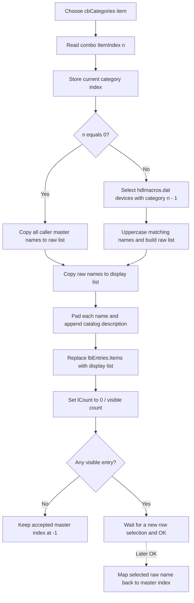

# Select an HDL category

> Analysis status: Complete source review.

## Control

| Property | Recovered value |
| --- | --- |
| Form | HDLPickerForm |
| Form caption | HDL Picker |
| Component path | HDLPickerForm.cbCategories |
| Control class | TComboBox |
| Style | csDropDownList |
| Nearby label | Category: |
| Handler name | cbCategoriesClick |
| Handler address | 01706a80 |
| Graph node | `resource:dfm:HDLPickerForm/HDLPickerForm.cbCategories` |
| Handler node | `function:01706a80` |
| Graph layer | UI |

The combo box has no design-time items, caption, hint, glyph, or image. The form
builds its items when it opens.

## Category source

`HDLPickerForm.FormCreate` constructs an HDL catalog object and parses
`hdlmacros.dat`. The file has recovered `# Categories`, `# Descriptions`, and
`# Devices` sections. `FormShow` then builds the combo-box items in this order:

1. a localized **All** item at index `0`;
2. the category names from the parsed category records.

`FormShow` selects index `0` and runs the same rebuild function used by this
click handler. The caller separately supplies a master list of HDL entries.
This list is stored at form field `+0x708`.

## What happens when clicked

`FUN_01706a80` reads `cbCategories.ItemIndex` from the combo box at form field
`+0x6e0`. It passes the index to `FUN_01706ab0`. The shared rebuild stores the
index in form field `+0x6f0` and creates a raw working-name list at `+0x710`:

- index `0`, **All**, copies the caller's complete master list from `+0x708`;
- index `n > 0` clears the working list and selects device records whose parsed
  category number is `n - 1`. It uppercases and appends each matching device
  name from `hdlmacros.dat`.

The category-specific path does not intersect its file-derived names with the
master list during this rebuild. The later **OK** path maps a selected raw name
back to the master list with `IndexOf`. That mapping can return `-1` if a file
entry is not present in the caller's master list.

## Display-list rebuild

The rebuild next calls `FUN_01706490` to create a separate display list at
`+0x718`. This formatter keeps the same count and order as the raw working
list. For each raw name it:

1. makes a lowercase key for catalog lookup;
2. pads the original name to the longest master-entry width plus two padding
   characters;
3. resolves the device's description through the parsed device and description
   records;
4. appends that description to the padded name.

If no matching description exists, the appended description is empty. The raw
list remains unchanged, so **OK** maps the name rather than the decorated
display text.

After formatting, the rebuild assigns the display list to `lbEntries.Items`.
It then sets `lCount` to position zero over the new visible count, such as
`0/12`. It does not preserve a row by name or index and does not write the
accepted result field at `+0x730`. The user must select a visible row before
the result can map to a master entry.

## Empty, repeated, and error behavior

- An empty master list under **All**, or a category with no matching device
  records, produces empty raw, display, and list-box collections. The count
  label becomes `0/0`.
- Selecting the current category again is not a no-op. The handler rebuilds and
  reassigns both lists and resets the position display again.
- The combo box is a `csDropDownList` and `FormShow` selects index `0`. The
  handler has no explicit bounds check if code invokes it with another invalid
  index.
- The handler and rebuild functions have no local exception handler or
  rollback. An allocation, formatting, or VCL assignment exception can leave
  the stored category index and internal working lists changed while the old
  visible list or count label remains.
- Missing or malformed `hdlmacros.dat` data takes localized file-not-found or
  syntax-error paths during form construction. The category click itself uses
  the already parsed in-memory catalog and does not read the file again.

## Selection, OK, Cancel, and persistence

The sibling `lbEntries` click handler only updates `lCount` to the one-based
visible position over the visible count. It does not commit a result.

The sibling **OK** handler reads the current visible index, gets the
corresponding raw name from `+0x710`, finds that name in the master list at
`+0x708`, and stores the master index at `+0x730`. The caller copies the master
entry only when the modal result is **OK** and this index is not `-1`. An empty
list, no selection, or a raw name absent from the master list therefore yields
no copied result.

Changing a category is form-local staging. **Cancel** discards the dialog
without caller copy-back. The click does not write a file, registry setting,
INI setting, backend object, or project model.

## Click flow

## Source evidence

- Category click handler: [FUN_01706a80](../../../DecompiledSources/Tina16/functions/0000000001706A80__FUN_01706a80.c)
- Shared category and list rebuild: [FUN_01706ab0](../../../DecompiledSources/Tina16/functions/0000000001706AB0__FUN_01706ab0.c)
- Category-specific device-name filter: [FUN_01705800](../../../DecompiledSources/Tina16/functions/0000000001705800__FUN_01705800.c)
- Display-name and description formatter: [FUN_01706490](../../../DecompiledSources/Tina16/functions/0000000001706490__FUN_01706490.c)
- Device-description lookup: [FUN_01705640](../../../DecompiledSources/Tina16/functions/0000000001705640__FUN_01705640.c)
- Catalog file parser: [FUN_01704d80](../../../DecompiledSources/Tina16/functions/0000000001704D80__FUN_01704d80.c)
- Form-show initialization: [FUN_017068a0](../../../DecompiledSources/Tina16/functions/00000000017068A0__FUN_017068a0.c)
- Master-list setup: [FUN_01706360](../../../DecompiledSources/Tina16/functions/0000000001706360__FUN_01706360.c)
- Entry position display: [FUN_017067b0](../../../DecompiledSources/Tina16/functions/00000000017067B0__FUN_017067b0.c)
- **OK** selection mapping: [FUN_017066d0](../../../DecompiledSources/Tina16/functions/00000000017066D0__FUN_017066d0.c)
- Picker caller and copy-back: [FUN_01709150](../../../DecompiledSources/Tina16/functions/0000000001709150__FUN_01709150.c)
- Recovered resource evidence: [ui-evidence.json](../../../DecompiledSources/Tina16/resources/dfm/ui-evidence.json)

The graph places `FUN_01706a80` in the `UI` layer. It is simple and has one
recovered direct call, the shared rebuild function. The filtering, formatting,
and VCL list assignment occur below that call.

## Analysis ownership

- This analysis owns category handler `FUN_01706a80`, shared rebuild
  `FUN_01706ab0`, and display formatter `FUN_01706490`.
- Sibling `.615` owns the **OK** mapping and caller copy-back boundary.
- Sibling `.617` owns only the entry-list click and position-label update.
- The catalog parser, raw category filter, master-list setup, Delphi string
  helpers, and VCL list operations remain evidence-only.

## Analysis limits

- The recovered repository does not contain `hdlmacros.dat`, so the actual
  runtime category names and device membership are not listed here.
- The padding constant is not exported as text. The source proves width-based
  padding and appended descriptions, but this article does not name the exact
  padding character.
- The click stages form-local lists. Only the later **OK** path can select a
  caller result.
