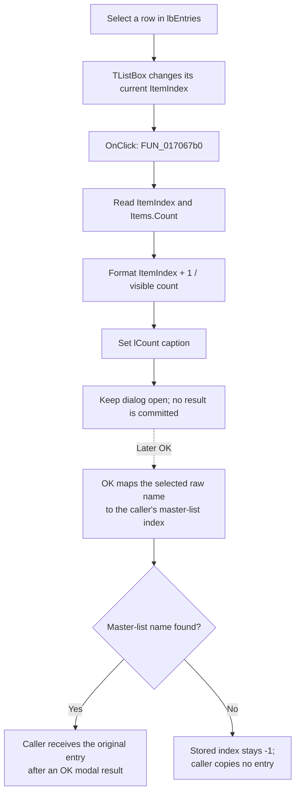

# Select an HDL picker entry

> Analysis status: Complete for the recovered control boundary. The click updates the position display only. Category list construction and the later OK name mapping are separate paths. No separate double-click event, preview action, durable write, or local error handler is present.

## Control

| Property | Recovered value |
| --- | --- |
| Form | HDLPickerForm |
| Form caption | HDL Picker |
| Component path | HDLPickerForm.lbEntries |
| Control class | TListBox |
| Handler name | lbEntriesClick |
| Handler address | 017067b0 |
| Event binding | OnClick only |
| Graph node | `resource:dfm:HDLPickerForm/HDLPickerForm.lbEntries` |
| Handler node | `function:017067b0` |
| Graph layer | UI |

The recovered resource has no caption, hint, preset items, glyph, or `OnDblClick` binding for this list.

## What happens when clicked

`FUN_017067b0` reads two values from `lbEntries`:

1. the current zero-based `ItemIndex`; and
2. the current number of strings in `Items`.

It adds one to the index, converts both numbers to text, joins them with the recovered separator, and writes the result to `lCount`. The label's resource caption is `0000/0000`, so the displayed value is `position/total`. For example, selecting the first of 12 visible entries changes the label to `1/12`.

This handler does not read the selected entry text. It does not copy a result into the picker form, enable or disable OK, open a preview, close the dialog, or call application model code.

The list box itself owns the current `ItemIndex`. The separate OK handler reads that index later. If an item is selected, OK reads the corresponding raw name from the current category list and searches for that name in the caller-supplied master list. It stores the search result, including `-1` when no master-list match exists. The caller reads a master-list string only after the dialog returns OK and the stored index is not `-1`. Thus a list click identifies the current visible row for the UI, but it does not commit the caller's result.

## Category interaction

The category combo box uses shared rebuild function `FUN_01706ab0`. Category zero copies the caller-supplied master list into the current raw-name list. For a category index above zero, the rebuild does not filter that master list. It obtains the category-mapped names from the loaded `hdlmacros.dat` records and uppercases the names while it constructs the display list. It assigns the resulting display strings to `lbEntries.Items` and resets `lCount` to `0/visible-count`. FormShow prepares category zero as the translated **All** category.

A later click uses the rebuilt list's current index and count. The count is therefore the number of entries visible for the current category, not the size of the unfiltered master list. The click does not change the category or rebuild the entries.

## Click flow

## Selection, empty, and repeat behavior

- A normal row click updates the label from the list's current state. Repeated clicks on the same selected row compute and write the same text; there is no equality branch or other application-side change.
- If the handler is invoked with `ItemIndex = -1`, it formats position zero because it adds one before conversion. If the list is also empty, the result is `0/0`. A user cannot select a row in an empty list, but this arithmetic makes a programmatic call safe from an item dereference.
- The handler does not validate that the index is less than the count. It never uses the index to fetch an item, so this handler cannot cause an item lookup failure.
- The DFM binds only `OnClick`. A double-click can first change the normal list selection and cause the click update, but there is no recovered double-click handler and no proven double-click accept or preview command.
- `bOK` is a `bkOK` button and is not disabled by this handler. If OK is pressed with no selection, its handler keeps the staged index at `-1` and still sets the form modal result to OK. The recovered caller then rejects the `-1` index and does not copy an entry.

## Error and state boundaries

- The handler has no condition that reports an error, no message dialog, no retry, and no local exception catch.
- Its only lasting change is the current `lCount.Caption` while this dialog instance is open. It does not change the master entry list, filtered list, category, staged selected index, or caller data.
- It performs no file, registry, INI, database, or backend write. Reopening the picker reconstructs its form-local lists and count display; the click itself has no persistence path.
- The string conversion and VCL text setter are shared runtime operations. Failures outside the recovered handler have no proved recovery or rollback path, but there is no partial model update because the handler does not touch the model.

## Source evidence

- [Entry click handler `FUN_017067b0`](../../../DecompiledSources/Tina16/functions/00000000017067B0__FUN_017067b0.c) reads `ItemIndex`, adds one, reads `Items.Count`, formats both values, and writes one string to the label at form offset `+0x6d0`.
- [Category handler `FUN_01706a80`](../../../DecompiledSources/Tina16/functions/0000000001706A80__FUN_01706a80.c) passes the combo box index to the [shared list rebuild `FUN_01706ab0`](../../../DecompiledSources/Tina16/functions/0000000001706AB0__FUN_01706ab0.c), which assigns the visible items and writes `0/count` to the same label.
- [Form show handler `FUN_017068a0`](../../../DecompiledSources/Tina16/functions/00000000017068A0__FUN_017068a0.c) adds the translated **All** category and invokes the rebuild for category zero.
- [OK handler `FUN_017066d0`](../../../DecompiledSources/Tina16/functions/00000000017066D0__FUN_017066d0.c) reads the selected raw name from the category list, searches the caller-supplied master list, and stores the resulting index, which can be `-1`.
- [Picker caller `FUN_01709150`](../../../DecompiledSources/Tina16/functions/0000000001709150__FUN_01709150.c) supplies the master list, shows the dialog, and copies an original entry only when the modal result is OK and the stored index is not `-1`.
- [Recovered Delphi resource evidence](../../../DecompiledSources/Tina16/resources/dfm/ui-evidence.json) identifies `lbEntries`, its sole `OnClick` binding, `lCount` with caption `0000/0000`, the category combo box, and the OK and Cancel button kinds.

## Analysis ownership

- `.617` owns only entry-click handler `FUN_017067b0`.
- Sibling `.615` owns the OK selection mapping and copy-back boundary.
- Sibling `.616` owns the category handler and shared category-list construction helpers, including `FUN_01706ab0`.
- Delphi string conversion, concatenation, finalization, and VCL text-setter functions remain evidence-only.
