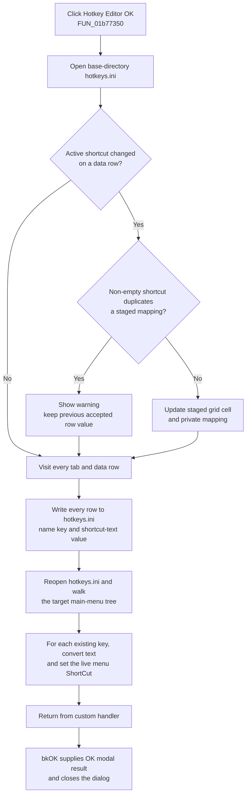

# Save and apply menu shortcuts

> Analysis status: Evidence-backed source review complete.

## Control

| Property | Recovered value |
| --- | --- |
| Form | HotkeyEditor |
| Form caption | Menu shortcut editor |
| Component path | HotkeyEditor.btnOK |
| Control class | TBitBtn |
| Button kind | bkOK |
| Handler name | btnOKClick |
| Handler address | 01b77350 |
| Graph node | `resource:dfm:HotkeyEditor/HotkeyEditor.btnOK` |
| Handler node | `function:01b77350` |
| Graph layer | UI |

The DFM has no custom caption, hint, action, or image reference for this button. It records `NumGlyphs = 2`, but the extracted glyph manifest has no image for this event. The `bkOK` kind, the event binding, and the source provide the control identity and behavior.

## What happens when clicked

`FUN_01b77350` commits the Hotkey Editor's private state. It performs these actions in order:

1. It builds `<application base directory>\hotkeys.ini` and constructs the INI object.
2. It calls `FUN_01b79440` to flush the currently visible `THotKey` editor into the selected grid row.
3. It visits every menu tab and every data row in its two-column grid. It writes all rows, not only changed rows.
4. It destroys the INI object and calls `FUN_01b770b0` to read `hotkeys.ini` and apply the stored shortcuts to the live target menu.
5. The custom handler returns. Because the button is a standard `bkOK` bit button, VCL modal-button handling supplies the OK result and closes the dialog after a normal return.

Each stored entry has a section derived from the target form and menu root, a key from the menu item's stable component name, and a value from the staged shortcut text. This path does not write an editor document, a circuit, or the outer Editor Options settings.

## Final active-cell validation

The OK handler does not revalidate the complete grid. `FUN_01b79440` checks only the active shortcut editor, and only when that editor is visible, the current row is a data row, and its shortcut differs from the value captured when editing started.

For a changed value, it converts the VCL shortcut value to text and calls `FUN_01b795f0`:

- Empty shortcut text is valid and skips the duplicate scan.
- A non-empty value is compared for exact equality with the current private shortcut mapping list.
- A duplicate produces a modal warning that includes the conflicting shortcut value. The grid cell and mapping list keep their previous accepted value.
- A unique value replaces both the selected grid cell and its entry in the private mapping list.

A rejected duplicate does not cancel OK. The handler continues and saves the previous accepted value for that row together with all other rows. It does not swap commands, clear the other command, or automatically choose a new shortcut.

## Live menu update and persistence

After the writer is destroyed, `FUN_01b770b0` opens the same `hotkeys.ini` path and walks the target main menu roots. `FUN_01b76f80` recursively visits child menu items. For each item whose section contains its component-name key, it reads the shortcut text, converts it to the VCL shortcut representation, and assigns the menu item's live `ShortCut` property. A missing key leaves that item unchanged.

The application initialization path calls the same loader. Accepted shortcuts therefore remain available in later sessions. The file is separate from the outer Editor Options state. If the user accepts the Hotkey Editor and later cancels Editor Options, that outer Cancel does not undo the file or live menu changes.

## Click flow

## Reset, Cancel, and repeated actions

- Reset (`FUN_01b775c0`) loads `_default` entries into the private grids and rebuilds the private mapping list. It does not write or apply them. Reset followed by OK writes and applies those staged defaults.
- Reset followed by Cancel discards the staged defaults. Cancel is a `bkCancel` button without a custom click handler, so it does not call the writer or live loader.
- Empty shortcut text is a valid stored value. When its key is reloaded, the conversion and assignment clear that menu item's key combination.
- If there are no menu pages or no data rows, the row loops write nothing, but the handler still calls the live loader.
- A normal modal session cannot click OK twice because `bkOK` closes the form after the first successful handler return. A new editor session can save the same accepted values again; the writer still visits every row.

## Error and partial-state behavior

The recovered handler, validator, writer, and loader have no local exception handler, retry, transaction, temporary-file replacement, or rollback.

- An INI construction or write failure can stop the handler before the live reload and modal close. A failure after earlier row writes can leave a partially changed file.
- A reload failure happens after the write phase. It can leave the file changed and only part of the live menu tree updated.
- An exception prevents the custom handler from returning normally, so this source does not establish a successful `bkOK` close in that case.
- The code does not show a write-access probe, success message, error conversion, or rollback into the previous file or menu state.
- The exact INI encoding, line endings, and overwrite implementation are inside the generic INI class and are not established by this handler.

## Source evidence

- OK writer, row traversal, and immediate reload call: [FUN_01b77350](../../../DecompiledSources/Tina16/functions/0000000001B77350__FUN_01b77350.c)
- Active editor flush and accepted-row update: [FUN_01b79440](../../../DecompiledSources/Tina16/functions/0000000001B79440__FUN_01b79440.c)
- Exact duplicate check and modal warning: [FUN_01b795f0](../../../DecompiledSources/Tina16/functions/0000000001B795F0__FUN_01b795f0.c)
- `hotkeys.ini` menu-root loader: [FUN_01b770b0](../../../DecompiledSources/Tina16/functions/0000000001B770B0__FUN_01b770b0.c)
- Recursive key lookup and live `ShortCut` assignment: [FUN_01b76f80](../../../DecompiledSources/Tina16/functions/0000000001B76F80__FUN_01b76f80.c)
- Reset-to-default staging path: [FUN_01b775c0](../../../DecompiledSources/Tina16/functions/0000000001B775C0__FUN_01b775c0.c)
- Application initialization call to the same loader: [FUN_01c69770](../../../DecompiledSources/Tina16/functions/0000000001C69770__FUN_01c69770.c)
- Launcher, modal ownership, and outer-dialog boundary: [FUN_01b7c5a0](../../../DecompiledSources/Tina16/functions/0000000001B7C5A0__FUN_01b7c5a0.c)
- Recovered form caption, `bkOK`, `bkCancel`, `NumGlyphs`, and event binding: [ui-evidence.json](../../../DecompiledSources/Tina16/resources/dfm/ui-evidence.json)

## Evidence and annotation limits

- The source proves the write-before-reload order and the recursive live assignment. It does not expose the human-readable section separator or the exact INI serializer format.
- The standard `bkOK` resource establishes the modal result and close behavior. `FUN_01b77350` itself does not assign `ModalResult` or call `Close`.
- `NumGlyphs = 2` is standard bit-button metadata. No embedded image bytes or extracted glyph are available for independent visual interpretation.
- Bead `.628` owns `FUN_01b77350`, `FUN_01b79440`, `FUN_01b795f0`, `FUN_01b770b0`, and `FUN_01b76f80`. Bead `.629` owns Reset handler `FUN_01b775c0`. Bead `.461` owns the launcher and constructor. Generic grid, INI, VCL conversion, and child-component lookup helpers remain evidence only here.
