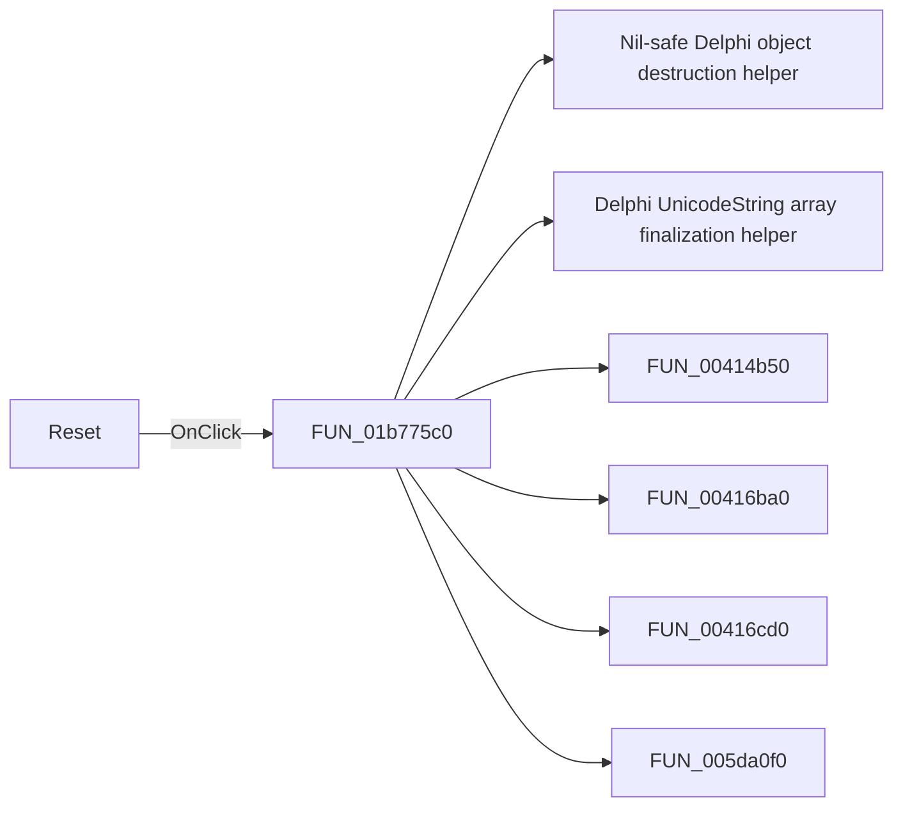

# Reset

> Analysis status: Pending individual source review.

## Control

| Property | Recovered value |
| --- | --- |
| Form | HotkeyEditor |
| Component path | HotkeyEditor.btnReset |
| Control class | TButton |
| Caption | Reset |
| Hint | Not present in the recovered resource. |
| Text | Not present in the recovered resource. |
| Handler name | btnResetClick |
| Handler address | 01b775c0 |
| Graph node | `resource:dfm:HotkeyEditor/HotkeyEditor.btnReset` |
| Handler node | `function:01b775c0` |
| Graph layer | UI |

## What happens when clicked

Pending individual analysis. An agent must read the recovered handler source and its relevant callees before it replaces this text.

## Click flow

## Handler evidence

- Source: [DecompiledSources/Tina16/functions/0000000001B775C0__FUN_01b775c0.c](../../../DecompiledSources/Tina16/functions/0000000001B775C0__FUN_01b775c0.c)
- Recovered role: Not present in the recovered resource.
- Current graph summary: Handles 1 Delphi UI event: HotkeyEditor.btnReset.OnClick.
- Current graph behavior: Not present in the recovered resource.
- Current graph evidence: Not present in the recovered resource.
- Complexity: complex
- Distinct outgoing calls: 11

## Direct calls

- `function:00410f20` — Nil-safe Delphi object destruction helper
- `function:00414560` — Delphi UnicodeString array finalization helper
- `function:00414b50` — FUN_00414b50
- `function:00416ba0` — FUN_00416ba0
- `function:00416cd0` — FUN_00416cd0
- `function:005da0f0` — FUN_005da0f0
- `function:006d7610` — FUN_006d7610
- `function:006d7630` — FUN_006d7630
- `function:0084e390` — FUN_0084e390
- `function:0084e3e0` — FUN_0084e3e0
- `function:01b79750` — FUN_01b79750

## Resource evidence

- Kind: Not present in the recovered resource.
- Modal result: Not present in the recovered resource.
- Checked state: Not present in the recovered resource.
- List items: Not present in the recovered resource.
- Image reference: Not present in the recovered resource.
- Extracted glyph: None.

## Nearby label candidates

Nearby labels are layout candidates only. They are not proof of behavior.

- No same-parent label candidate is available.

## Analysis limits

- Do not infer behavior from the control class, caption, hint, glyph, or nearby label alone.
- Do not replace the pending status until the handler source and relevant call path provide enough evidence.
