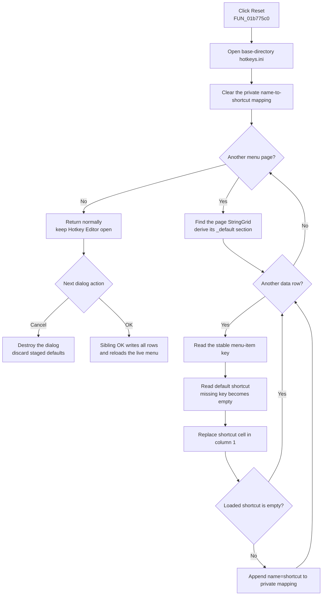

# Stage the default menu shortcuts

> Analysis status: Reviewed from the recovered Reset handler, dynamic
> menu-grid construction, private shortcut mapping, OK commit path, launcher,
> and UI resource.

## Control

| Property | Recovered value |
| --- | --- |
| Form | `HotkeyEditor` (`THotkeyEditor`) |
| Form caption | `Menu shortcut editor` |
| Component path | `HotkeyEditor.btnReset` |
| Control class | `TButton` |
| Caption | `Reset` |
| Handler name | `btnResetClick` |
| Handler address | `01b775c0` |
| Graph node | `resource:dfm:HotkeyEditor/HotkeyEditor.btnReset` |
| Handler node | `function:01b775c0` |
| Graph layer | UI |

The resource has no hint, action, image reference, button kind, modal result,
or glyph for this button. The `Reset` caption agrees with the source behavior,
but the source and data flow establish what is reset.

## What happens when clicked

`FUN_01b775c0` loads the configured default shortcut for every command row and
stages those values in the Hotkey Editor. It uses the same
`<application base directory>\hotkeys.ini` file as the sibling OK handler, but
it reads sections whose derived menu-section name has the `_default` suffix.

The handler performs these operations:

1. Construct the `hotkeys.ini` path and open the INI object.
2. Clear the private name-to-shortcut mapping list at form field `+0x6e8`.
3. Visit every dynamic page in `pctrlMainMenu`.
4. Derive that page's default section from the target form name, the page
   name, and `_default`.
5. Find the page's dynamically created `StringGrid` child.
6. Visit every data row from `FixedRows` through `RowCount - 1`.
7. Read the row's stable menu-item key from its hidden grid object value.
8. Read that key's value from the default INI section, with an empty string as
   the fallback.
9. Replace the row's visible shortcut cell in column `1`.
10. When the loaded shortcut is nonempty, append the corresponding
    `menu-item name=shortcut` entry to the private mapping list.

The handler destroys its temporary INI object after a normal pass. It does not
change the menu-item caption path in column `0`, rebuild the pages, add or
remove command rows, or change the target menu directly.

## Empty and missing defaults

The INI read supplies an empty default value. Therefore, a row whose key is
missing from its `_default` section is not left unchanged: Reset writes an
empty shortcut into that row. It also omits that row from the private mapping
list.

An explicit empty default has the same result. If every default is empty, all
shortcut cells become empty and the mapping list remains empty. This is a
valid staged state. The Reset handler does not display a required-value error.

## Mapping and duplicate behavior

Form creation builds one tab and two-column grid for each supported main-menu
root. Its recursive row builder stores:

- the menu caption path in column `0` for display;
- the shortcut text in column `1` for editing;
- the stable menu-item component name in the row's hidden object value.

Reset uses the stable name for the `_default` INI lookup. It does not depend on
translated captions or a user's current shortcut text.

The handler clears the private mapping list before it reads the first row and
then reconstructs that list from the nonempty defaults. It does not call the
duplicate-shortcut validator. If the default sections contain the same
nonempty shortcut for more than one command, Reset stages all those values.
The sibling OK path validates only a changed active editor, not the complete
grid, so it does not prove that such pre-existing default duplicates are
rejected before save.

Reset also does not call the active-cell flush helper. It replaces the grid
backing cells directly. The separate OK handler performs its own active-editor
flush before it writes the rows. The recovered Reset handler does not establish
how a VCL focus change affects an editor control that was active when the
button was clicked.

## Reset and commit flow

## OK, Cancel, and persistence boundary

`btnReset` is a plain `TButton`. It has no modal result, and
`FUN_01b775c0` does not write the form's modal-result field or call `Close`.
After a normal click, the Hotkey Editor stays open so the user can review or
edit the staged defaults.

- **OK** calls `FUN_01b77350`. It writes every staged grid row to the normal
  menu sections in `hotkeys.ini`, then reloads the file into the live target
  menu. Reset followed by OK therefore persists and applies the staged
  defaults.
- **Cancel** is a standard `bkCancel` button with no custom click handler. It
  does not call the writer or menu loader. The modal owner destroys the dialog,
  and the private grids and mapping list are discarded.
- The outer Editor Options dialog receives no copy of the shortcut state. Its
  later OK or Cancel action does not commit or undo this modal editor.

Reset itself performs no INI write, file replacement, live-menu assignment,
settings update, or document change. Reading the defaults does not change the
current INI sections. Persistence waits for Hotkey Editor OK.

## Repeated, empty, and error cases

- Repeated Reset clicks clear and rebuild the private mapping list each time.
  If `hotkeys.ini` is unchanged, the grid receives the same default values.
- If the page control has no pages, Reset only clears the private mapping list
  and returns. If a page has no data rows, that page contributes no entries.
- A missing default key clears that row's shortcut. There is no warning or
  no-op branch for a missing key.
- The expected dynamic form setup creates one `StringGrid` on every page. The
  Reset handler does not null-check the child lookup before it reads grid
  fields. A missing or malformed dynamic grid can therefore enter the normal
  Delphi exception path.
- The handler has no application retry, transaction, snapshot, or rollback.
  It clears the mapping list before the first INI read and changes grid rows
  one at a time. An exception after some reads can leave a partly reset grid
  and a partly rebuilt mapping list before the handler returns through the
  normal path.
- The source does not establish that the INI reader creates a missing file,
  the exact INI encoding, or how low-level read errors are reported.

## Ownership and lifetime

The constructor retains the target menu host at `+0x6d8` and the base-directory
string at `+0x6f8`. Reset borrows the target and the dynamic pages and grids.
It does not destroy or replace them.

Form creation owns the private mapping list at `+0x6e8` and the excluded-name
list at `+0x6e0`. Form destruction frees both. The dynamic pages own their
grids and shortcut editor controls through normal VCL component ownership.
Reset owns only its temporary INI object and temporary strings during the
click.

## Evidence

- [Reset handler `FUN_01b775c0`](../../../DecompiledSources/Tina16/functions/0000000001B775C0__FUN_01b775c0.c)
  opens `hotkeys.ini`, clears the private mapping, reads every `_default`
  row value, replaces the grid cells, and rebuilds nonempty mappings.
- [Form-create handler `FUN_01b778f0`](../../../DecompiledSources/Tina16/functions/0000000001B778F0__FUN_01b778f0.c)
  creates the two private string lists and dispatches dynamic page creation
  for supported menu roots.
- [Page and grid creator `FUN_01b78990`](../../../DecompiledSources/Tina16/functions/0000000001B78990__FUN_01b78990.c)
  creates each tab, its two-column `StringGrid`, and the overlaid shortcut
  editor.
- [Recursive row builder `FUN_01b78c70`](../../../DecompiledSources/Tina16/functions/0000000001B78C70__FUN_01b78c70.c)
  connects command caption paths, stable component names, current shortcut
  text, and the private mapping list.
- [Child-component lookup `FUN_01b79750`](../../../DecompiledSources/Tina16/functions/0000000001B79750__FUN_01b79750.c)
  locates each page's `StringGrid` by component name.
- [Grid object getter `FUN_0084e390`](../../../DecompiledSources/Tina16/functions/000000000084E390__FUN_0084e390.c)
  returns the stable hidden value used as the INI key; [grid cell setter
  `FUN_0084e3e0`](../../../DecompiledSources/Tina16/functions/000000000084E3E0__FUN_0084e3e0.c)
  replaces the visible shortcut text.
- [OK writer `FUN_01b77350`](../../../DecompiledSources/Tina16/functions/0000000001B77350__FUN_01b77350.c)
  performs the later file commit and calls the live-menu reload.
- [Active-editor flush `FUN_01b79440`](../../../DecompiledSources/Tina16/functions/0000000001B79440__FUN_01b79440.c)
  and [duplicate validator `FUN_01b795f0`](../../../DecompiledSources/Tina16/functions/0000000001B795F0__FUN_01b795f0.c)
  show the validation that Reset itself does not perform.
- [Live menu loader `FUN_01b770b0`](../../../DecompiledSources/Tina16/functions/0000000001B770B0__FUN_01b770b0.c)
  applies saved current-section values only after OK or during application
  initialization.
- [Launcher `FUN_01b7c5a0`](../../../DecompiledSources/Tina16/functions/0000000001B7C5A0__FUN_01b7c5a0.c)
  shows the Hotkey Editor modally, ignores its result, and destroys it after
  return.
- [Recovered UI evidence](../../../DecompiledSources/Tina16/resources/dfm/ui-evidence.json)
  supplies the form and button captions, plain `TButton` class, and Reset event
  binding. It also identifies the sibling `bkOK` and `bkCancel` controls.

## Graph and annotation ownership

The graph contains the `btnReset.OnClick` trigger and eleven direct calls from
`FUN_01b775c0`. These cover page enumeration, child-grid lookup, grid get and
set operations, INI construction, Delphi string helpers, and object cleanup.
The virtual INI read and string-list operations are not named direct edges.

This Bead owns only Reset handler `FUN_01b775c0`. Bead `.628` owns the OK,
validation, persistence, and live-menu functions. Bead `.461` owns the launcher
and Hotkey Editor constructor. Dynamic form-building and generic VCL, grid,
INI, string-list, and component-lookup functions remain evidence-only.

## Analysis limits

- The original Delphi field names at `+0x6e0`, `+0x6e8`, `+0x6f8`, and the
  active-editor state offsets are not recovered. Their roles come from repeated
  construction, read, write, and destruction paths.
- The handler reads the default data that exists in `hotkeys.ini`; it does not
  reconstruct compiled defaults from menu resources.
- The later runtime behavior when two menu items have the same shortcut is not
  established here. This article states only that Reset does not reject those
  duplicate default values.
