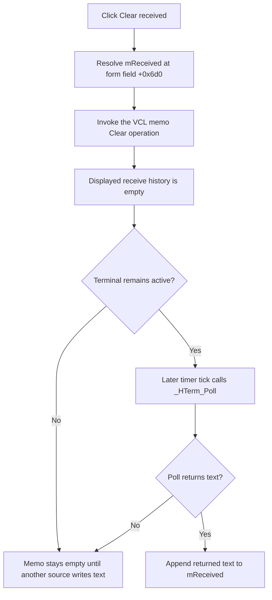

# Clear the serial monitor received-text view

> Analysis status: Complete for the button boundary. The form resource, handler, receive timer, terminal setup, Send path, timed-sequence path, and settings persistence establish the behavior below.

## Control

| Property | Recovered value |
| --- | --- |
| Form | HTerm |
| Form caption | Serial monitor |
| Component path | HTerm.Panel2.Panel3.Panel4.bClearReceived |
| Control class | TButton |
| Caption | Clear received |
| Handler name | bClearReceivedClick |
| Handler address | 014ba1a0 |
| Graph node | `resource:dfm:HTerm/HTerm.Panel2.Panel3.Panel4.bClearReceived` |
| Handler node | `function:014ba1a0` |
| Graph layer | UI |

The button has no hint, action, image reference, or glyph. Its parent panel is captioned **Received data**, and the only display below that panel is `HTerm.Panel2.Panel3.mReceived`, a `TMemo`.

## What happens when clicked

`FUN_014ba1a0` invokes one no-argument virtual method at VMT offset `+0x298` on the form field at `+0x6d0`. The form resource and the receive timer identify this field as `mReceived`. The same virtual slot is used as the complete VCL memo-clear operation in other recovered memo paths. The click therefore clears all text that is currently visible in `mReceived`.

The handler does not read a selection, preserve a line, copy the text, or update another form field. It does not clear the outgoing `eSend` edit, change the transmitted-data area, change the terminal configuration, or close the form.

## Receive buffer boundary

The visible memo and the terminal backend receive queue are separate:

- Terminal setup in `FUN_014ba120` calls `VHDL_DLL2.DLL::_HTerm_ClearBuffer` after a successful `_HTerm_Configure` call. This is the recovered backend-buffer clear.
- The **Clear received** handler does not call `_HTerm_ClearBuffer`, `_HTerm_Poll`, `_HTerm_Configure`, or another DLL function. Its graph has no direct call edge because its only operation is the indirect VCL memo call.
- `TimerTimer` at `FUN_014ba290` checks the active-terminal byte at `+0x748`, calls `_HTerm_Poll` with the backend handle at `+0xd58`, and appends a nonempty result to the current text of the same `mReceived` field at `+0x6d0`.

The click therefore discards the displayed receive history only. It does not discard bytes that are still pending in the terminal backend. If the terminal remains active, a later timer tick can add newly polled text to the now-empty memo.

## Send and timed-sequence interaction

- **Send** uses the separate `eSend` control at `+0x6e0`, constructs the outgoing text, and calls `_HTerm_SendText` only when the terminal-active byte is set. Clearing `mReceived` does not change that edit, active byte, backend handle, line-ending options, or send path.
- **Set...** constructs and opens the separate timed-sequence dialog. The clear handler does not call that dialog path or change its data.
- The clear handler does not enable, disable, start, or stop the receive timer. It has no connection-state guard, so it also clears the memo while the terminal is inactive.

## Click flow

## Repeated, empty, and error behavior

- The handler has no empty-text test. Clicking when the memo is already empty calls the same clear operation and leaves it empty.
- Repeated clicks perform the same operation. There is no confirmation, status message, alternate branch, or application-level undo record.
- The handler does not test the memo reference for null. The normal DFM construction supplies the component. It has no local exception handler or rollback; a VCL exception follows the application's normal Delphi exception path.
- The clear call has no return value to inspect. The handler reports neither success nor failure.
- A timer poll can add text after the clear. This is later input, not a rollback of the button action.

## State and persistence

The changed state is the in-memory text owned by the `mReceived` VCL control. The handler does not write a file, registry value, terminal model, or backend buffer.

`FormShow` and `FormClose` load and save only the recovered `SermonOptions` bit mask for the **Add \\r** and **Add \\n** checkboxes. They do not persist `mReceived`. The DFM also has no initial `Lines` value for the memo. The cleared display state therefore lasts only until new receive text is appended or the form instance is recreated.

## Source evidence

- [Clear-received handler `FUN_014ba1a0`](../../../DecompiledSources/Tina16/functions/00000000014BA1A0__FUN_014ba1a0.c) makes the single virtual call on form field `+0x6d0`.
- [Receive timer `FUN_014ba290`](../../../DecompiledSources/Tina16/functions/00000000014BA290__FUN_014ba290.c) polls the terminal and appends returned text to the same field.
- [Terminal setup `FUN_014ba120`](../../../DecompiledSources/Tina16/functions/00000000014BA120__FUN_014ba120.c) shows that `_HTerm_ClearBuffer` is a separate backend operation used after configuration, not by this click.
- [Send button handler `FUN_014ba4f0`](../../../DecompiledSources/Tina16/functions/00000000014BA4F0__FUN_014ba4f0.c) and [send helper `FUN_014ba390`](../../../DecompiledSources/Tina16/functions/00000000014BA390__FUN_014ba390.c) use separate send state and the `_HTerm_SendText` backend call.
- [Timed-sequence button handler `FUN_014ba580`](../../../DecompiledSources/Tina16/functions/00000000014BA580__FUN_014ba580.c) constructs and opens its separate dialog.
- [Form settings reader `FUN_014b9ca0`](../../../DecompiledSources/Tina16/functions/00000000014B9CA0__FUN_014b9ca0.c) and [settings writer `FUN_014b9f00`](../../../DecompiledSources/Tina16/functions/00000000014B9F00__FUN_014b9f00.c) handle only the line-ending option mask.
- [FileSelect default loader `FUN_0142a7b0`](../../../DecompiledSources/Tina16/functions/000000000142A7B0__FUN_0142a7b0.c) independently uses the same no-argument VMT slot to clear a recovered `TMemo` when its default file is missing.
- [Recovered Delphi resource evidence](../../../DecompiledSources/Tina16/resources/dfm/ui-evidence.json) identifies the form, button, received-data panel, `mReceived` memo, and event binding.

## Analysis limits and annotation ownership

- `.618` owns only unique handler `FUN_014ba1a0`. Shared VCL text operations and the `.619` Send and `.620` timed-sequence paths remain evidence-only here.
- The VCL virtual call is indirect, so the recovered graph does not contain a direct call edge to a named `TMemo.Clear` function. Its target and complete-clear effect are established by the component field, receive timer data flow, button binding, and repeated memo use of the same virtual slot.
- The imported terminal DLL bodies are unavailable. The source proves that this handler does not invoke their exports; it does not establish how the DLL stores pending bytes internally.
