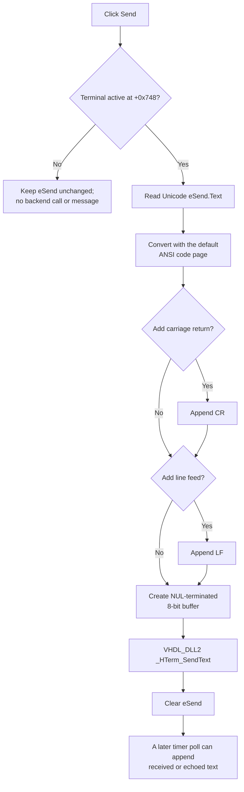

# Send text through the serial monitor

> Analysis status: Complete for input, encoding, line endings, terminal-state guard, backend dispatch, input clearing, receive polling, timed-sequence interaction, errors, and persistence.

## Control

| Property | Recovered value |
| --- | --- |
| Form | HTerm |
| Form caption | Serial monitor |
| Component path | HTerm.Panel2.bSend |
| Control class | TButton |
| Caption | Send |
| Handler name | bSendClick |
| Handler address | 014ba4f0 |
| Graph node | `resource:dfm:HTerm/HTerm.Panel2.bSend` |
| Handler node | `function:014ba4f0` |
| Graph layer | UI |

The button has no hint, action, image reference, glyph, initial disabled state, or modal result. The recovered **Send now:** label identifies the neighboring `eSend` edit. The **Line ending - Send now** group contains **Add \r** and **Add \n** checkboxes; **Add \r** is checked in the DFM and **Add \n** is not.

## What happens when clicked

`FUN_014ba4f0` first tests the terminal-active byte at form offset `+0x748`. Terminal setup sets this byte only after it receives a nonzero terminal handle, `_HTerm_Configure` succeeds, and `_HTerm_ClearBuffer` runs. If the byte is clear, the click returns without reading or clearing `eSend`, calling the backend, changing a control, or showing an error.

When the terminal is active, the handler reads the current Unicode text from `eSend` at form field `+0x6e0`. It assigns that text to the form's outgoing 8-bit string at `+0xd50` with Delphi code-page value `0`. The RTL resolves `0` to the process default ANSI code page and performs the conversion. The recovered path does not send UTF-16 and does not request UTF-8 explicitly. Characters that are not representable in that code page follow the RTL converter's default replacement behavior; this handler does not detect or report a lossy conversion.

The handler then calls shared immediate-send helper `FUN_014ba390`:

1. If **Add \r** is checked, it appends carriage return.
2. If **Add \n** is checked, it appends line feed. If both are checked, the order is CR then LF.
3. It copies the 8-bit string to a NUL-terminated buffer beginning at form offset `+0x74a`.
4. It calls `VHDL_DLL2.DLL::_HTerm_SendText` with the configured handle at `+0xd58` and that buffer.
5. After the DLL call returns, it clears `eSend`.

The same preparation and helper are used by `eSendKeyDown` when the terminal is active and the key code is `0x0d`. Thus, pressing Enter in the edit and clicking **Send** use the same payload, line-ending, backend, and input-clear path. The key handler remains evidence-only for this control.

## Empty input, output, and display behavior

An empty `eSend` value is not a no-op when the terminal is active:

- With **Add \r**, **Add \n**, or both selected, the handler sends only the selected line-ending bytes.
- With both checkboxes clear, it still calls `_HTerm_SendText` with an empty NUL-terminated string.
- In both cases, it clears the already empty edit after the call returns.

The handler does not append the outgoing payload to `mReceived`, update the **Transmitted data** panel, add a history item, change focus, or select text. Receive display is asynchronous and separate: the form timer calls `_HTerm_Poll` only while the same active byte is set and appends nonempty returned text to `mReceived`. If the target echoes the command, it can appear later through that poll path, but the send handler does not synthesize an echo.

## Timed-sequence interaction

The **Set...** button opens the separate `HTermData` modal dialog for a timed sequence. Manual Send does not read that dialog's enable checkbox or sequence data, call its parser, pause a sequence, cancel it, or change its stored settings. Its only runtime guard is the terminal-active byte.

Therefore, a manual click remains eligible while a timed sequence is enabled and sends an additional payload through the same configured terminal handle. The imported DLL implementation is unavailable, so ordering between a manual payload and backend-generated timed-sequence traffic is not proven.

## Click flow

## Disabled, repeated, and error behavior

- The DFM does not disable the button, and the handler does not change its `Enabled` state. Normal VCL dispatch prevents a disabled control from generating a user click; the recovered handler's separate protection is the terminal-active byte.
- Repeated clicks repeat the send operation. The first successful return clears `eSend`, so a second click sends only the configured line endings, or an empty string if both options are clear, unless the user enters new text.
- The handler and shared helper have no input-length guard, local exception handler, retry, timeout, result check, rollback, or user-facing success or error message.
- `_HTerm_SendText` is imported as a procedure and its return is not inspected. If the call returns after failing internally, the edit is still cleared. If conversion or the DLL call raises before the clear operation, the remaining path stops and `eSend` can remain unchanged.
- The buffer-copy helper receives the outgoing string length but no explicit destination capacity. The recovered type declaration and safe maximum size are unavailable, so this article does not state a supported maximum command length.
- A send is an external side effect. A later application failure cannot retract bytes that the backend already accepted.

## State and persistence

This click does not write a project file, data file, registry value, INI value, sent-command history, or document-modified flag. The outgoing edit is transient and is cleared after the normal backend return.

The two line-ending choices are persistent form options, but not because of this click. `FormShow` reads the `SermonOptions` registry bit mask and applies bit `1` to **Add \r** and bit `2` to **Add \n**. If the value is absent, it uses `1`, which selects CR only. `FormClose` writes the current two-bit mask back to the same registry value. Manual Send consumes the current checkbox states without persisting them itself.

## Source evidence

- [Send handler `FUN_014ba4f0`](../../../DecompiledSources/Tina16/functions/00000000014BA4F0__FUN_014ba4f0.c) tests the active byte, reads `eSend`, prepares the outgoing string, and calls the shared sender.
- [Immediate-send helper `FUN_014ba390`](../../../DecompiledSources/Tina16/functions/00000000014BA390__FUN_014ba390.c) applies the two line-ending choices, calls `_HTerm_SendText`, and clears `eSend`.
- [Enter-key handler `FUN_014ba450`](../../../DecompiledSources/Tina16/functions/00000000014BA450__FUN_014ba450.c) proves that Enter uses the same active guard and send helper.
- [Terminal setup `FUN_014ba120`](../../../DecompiledSources/Tina16/functions/00000000014BA120__FUN_014ba120.c) defines the configured-handle and active-byte boundary.
- [Receive timer `FUN_014ba290`](../../../DecompiledSources/Tina16/functions/00000000014BA290__FUN_014ba290.c) shows that receive text and any echo enter `mReceived` through later polling, not this click.
- [Default-code-page assignment `FUN_00415dd0`](../../../DecompiledSources/Tina16/functions/0000000000415DD0__FUN_00415dd0.c), [ANSI conversion `FUN_00414a20`](../../../DecompiledSources/Tina16/functions/0000000000414A20__FUN_00414a20.c), and [code-page resolver `FUN_004146a0`](../../../DecompiledSources/Tina16/functions/00000000004146A0__FUN_004146a0.c) establish the Unicode-to-default-ANSI conversion.
- [NUL-terminated buffer copier `FUN_004425e0`](../../../DecompiledSources/Tina16/functions/00000000004425E0__FUN_004425e0.c) and its [bounded-to-source-length copy `FUN_00442530`](../../../DecompiledSources/Tina16/functions/0000000000442530__FUN_00442530.c) establish the DLL input representation.
- [VHDL_DLL2 send import](../../../DecompiledSources/Tina16/functions/0000000000E03F00__VHDL_DLL2.DLL___HTerm_SendText.c) identifies the external terminal backend boundary.
- [Timed-sequence opener `FUN_014ba580`](../../../DecompiledSources/Tina16/functions/00000000014BA580__FUN_014ba580.c) uses a separate modal configuration path.
- [Settings reader `FUN_014b9ca0`](../../../DecompiledSources/Tina16/functions/00000000014B9CA0__FUN_014b9ca0.c) and [settings writer `FUN_014b9f00`](../../../DecompiledSources/Tina16/functions/00000000014B9F00__FUN_014b9f00.c) load and save only the line-ending option mask.
- [Recovered Delphi resource evidence](../../../DecompiledSources/Tina16/resources/dfm/ui-evidence.json) supplies the form, input, buttons, labels, line-ending controls, default states, timer, and event bindings.

## Annotation ownership and limits

- `.619` owns unique click handler `FUN_014ba4f0` and shared immediate-send helper `FUN_014ba390`.
- `.618` owns only its received-memo clear. `.620` owns the timed-sequence dialog path. Enter-key handler `FUN_014ba450`, terminal setup, receive polling, registry, RTL conversion, VCL text, and imported DLL functions remain evidence-only here.
- The imported `VHDL_DLL2` body is unavailable. The source proves the payload and call boundary, but not the physical serial transport, device-side acceptance, timed-traffic ordering, or backend error reporting.
