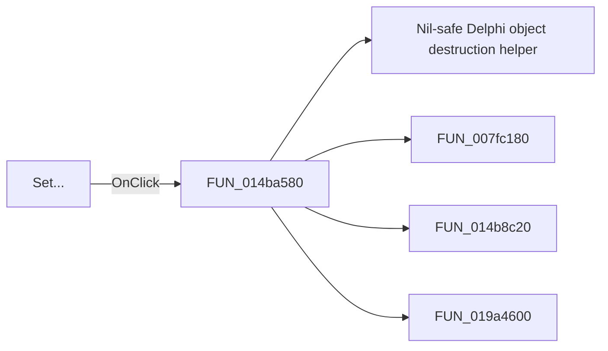

# Set...

> Analysis status: Pending individual source review.

## Control

| Property | Recovered value |
| --- | --- |
| Form | HTerm |
| Component path | HTerm.Panel2.bSetTimedSeq |
| Control class | TButton |
| Caption | Set... |
| Hint | Not present in the recovered resource. |
| Text | Not present in the recovered resource. |
| Handler name | bSetTimedSeqClick |
| Handler address | 014ba580 |
| Graph node | `resource:dfm:HTerm/HTerm.Panel2.bSetTimedSeq` |
| Handler node | `function:014ba580` |
| Graph layer | UI |

## What happens when clicked

Pending individual analysis. An agent must read the recovered handler source and its relevant callees before it replaces this text.

## Click flow

## Handler evidence

- Source: [DecompiledSources/Tina16/functions/00000000014BA580__FUN_014ba580.c](../../../DecompiledSources/Tina16/functions/00000000014BA580__FUN_014ba580.c)
- Recovered role: Not present in the recovered resource.
- Current graph summary: Handles 1 Delphi UI event: HTerm.Panel2.bSetTimedSeq.OnClick.
- Current graph behavior: Not present in the recovered resource.
- Current graph evidence: Not present in the recovered resource.
- Complexity: complex
- Distinct outgoing calls: 4

## Direct calls

- `function:00410f20` — Nil-safe Delphi object destruction helper
- `function:007fc180` — FUN_007fc180
- `function:014b8c20` — FUN_014b8c20
- `function:019a4600` — FUN_019a4600

## Resource evidence

- Kind: Not present in the recovered resource.
- Modal result: Not present in the recovered resource.
- Checked state: Not present in the recovered resource.
- List items: Not present in the recovered resource.
- Image reference: Not present in the recovered resource.
- Extracted glyph: None.

## Nearby label candidates

Nearby labels are layout candidates only. They are not proof of behavior.

- Rank 1: Timed sequence:  at distance 115.
- Rank 2: Send now:  at distance 147.

## Analysis limits

- Do not infer behavior from the control class, caption, hint, glyph, or nearby label alone.
- Do not replace the pending status until the handler source and relevant call path provide enough evidence.
