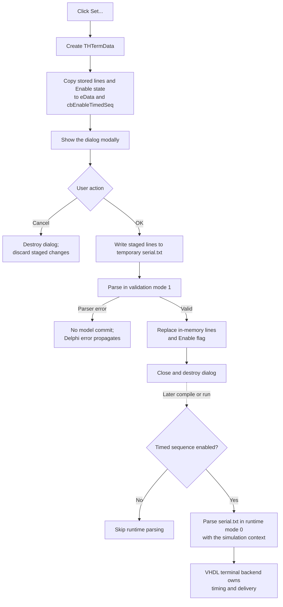

# Configure the timed terminal sequence

> Analysis status: Complete for dialog staging, validation and commit boundaries, later runtime parsing, manual-send separation, cancellation, errors, and persistence.

## Control

| Property | Recovered value |
| --- | --- |
| Form | HTerm |
| Form caption | Serial monitor |
| Component path | HTerm.Panel2.bSetTimedSeq |
| Control class | TButton |
| Caption | Set... |
| Handler name | bSetTimedSeqClick |
| Handler address | 014ba580 |
| Graph node | `resource:dfm:HTerm/HTerm.Panel2.bSetTimedSeq` |
| Handler node | `function:014ba580` |
| Graph layer | UI |

The button has no hint, action, image reference, or glyph. The nearest label is **Timed sequence:**. The handler and the `THTermData` form prove that this label describes the button; label distance alone is not the evidence.

## What happens when clicked

`FUN_014ba580` creates a `THTermData` form, gets the active application model, and initializes the form from the model's timed-terminal configuration. The initializer copies the sequence lines to the dialog's `eData` memo and copies the enabled state to `cbEnableTimedSeq`. The stored list uses its first string as the Boolean enabled value; the remaining strings are the sequence text.

The handler then shows the dialog modally. It ignores the returned modal result and destroys the dialog after a normal return. The handler itself does not validate text, change the project model, schedule data, send text, or save a file.

The modal dialog has these relevant controls:

- `eData`, an editable memo for the sequence.
- `cbEnableTimedSeq`, an **Enable** check box.
- **Clear**, which clears only the staged memo.
- **Load**, which loads a selected file only into the staged memo.
- A built-in `bkOK` button with handler `FUN_014b8d70`.
- A built-in `bkCancel` button with no application OnClick handler.

Thus, opening, editing, clearing, and loading do not change the project model.

## Validation and commit boundary

The dialog's OK handler writes the staged memo to a temporary file named `serial.txt`. It passes that file to `VHDL_DLL2.DLL::_HTerm_ParseDataFile` through `FUN_0160d4e0` with validation mode `1`. The imported parser owns the sequence grammar and the meaning of time values. The recovered code does not prove the syntax, time units, repeat rules, or delivery order.

If validation returns normally, OK replaces the in-memory configuration with the memo lines and inserts the **Enable** state as string item zero. It then deletes the temporary file. This is an immediate in-memory commit; the outer Set handler does not copy a result after `ShowModal`.

The dialog has a close-query flag at offset `+0x708`. Form creation clears it. OK sets it from the inverse of the validator result, and the close-query handler refuses one close while the flag is set and then clears it. The recovered validator returns `1` after a successful parse. A parser-reported failure raises a Delphi exception instead of returning normally. Therefore, normal success leaves the close flag clear, and a parser error occurs before model commit.

Cancel uses the VCL `bkCancel` behavior. Because the outer handler ignores the modal result and only OK calls the commit helper, Cancel closes the dialog and discards the staged memo and checkbox changes. No rollback is necessary.

## Runtime scheduling and manual Send

The click does not start a timer. The `HTerm` form's Delphi `TTimer` only calls `_HTerm_Poll` and appends received text to `mReceived` while the terminal is active.

Timed-sequence interpretation occurs later in the design compile or run setup:

1. `FUN_01778ce0` reads the saved in-memory sequence and enabled state.
2. If **Enable** is clear, it does not create or parse a sequence file.
3. If **Enable** is set, it writes a temporary `serial.txt` and calls `_HTerm_ParseDataFile` in runtime mode `0` with the active simulation context.
4. The surrounding compile/start coordinator later attaches the same simulation context to the serial-monitor form.

This later parser call is the recovered scheduling boundary. The imported DLL implements the actual timing and terminal output.

The **Send** button is separate. It sends the current `eSend` text immediately through `_HTerm_SendText`, with the selected CR and LF suffixes. The timed-sequence editor does not read `eSend`, does not use those line-ending check boxes, and does not call the manual-send helper. Both paths use the same configured terminal backend, but their traffic ordering is not visible in the recovered code.

## Click and later-use flow

## Empty, repeated, and error behavior

- The Set button has no terminal-active guard. It opens the editor even when the serial-monitor backend is not active.
- Repeated clicks reopen a new dialog from the current in-memory configuration. A prior accepted edit is visible; a canceled edit is not.
- If **Enable** is clear, the stored sequence can remain present, but the later runtime path skips its parser call.
- The recovered code does not define whether an enabled empty sequence is valid. The imported parser decides this during OK validation.
- If validation reports a parser error, the exception occurs before model commit. Cleanup after the parser call is also skipped in that recovered branch, so the temporary `serial.txt` can remain.
- Construction, initialization, modal display, and destruction have no local exception handler. The normal application model and DFM-created controls are assumed. The recovered handler destroys the dialog only after a normal modal return.
- The later runtime parser result is not checked by the caller. The recovered application code has no retry or user message at that boundary. DLL exception and partial-scheduling behavior are not available.

## State and persistence

An accepted OK changes the timed-sequence list in the active in-memory project model. The Set handler does not set a recovered document-modified flag and does not write a project file, registry key, or INI value.

A later project save serializes the `serialmonitor` enabled state and sequence text. Project load reads `ts_enabled` and `ts_text` and rebuilds the same list representation. Cancel does not affect that persisted state. The click itself does not make an accepted edit durable; the recovered persistence boundary is a later project save.

The temporary `serial.txt` files are transport files for the parser. They are not the persistent project format and are deleted after normal validation or runtime parsing.

## Source evidence

- [Set handler `FUN_014ba580`](../../../DecompiledSources/Tina16/functions/00000000014BA580__FUN_014ba580.c) creates, initializes, shows, and destroys the modal dialog.
- [Dialog initializer `FUN_014b8c20`](../../../DecompiledSources/Tina16/functions/00000000014B8C20__FUN_014b8c20.c) stages the model lines and enabled state in the dialog controls.
- [Stored-configuration reader `FUN_01779060`](../../../DecompiledSources/Tina16/functions/0000000001779060__FUN_01779060.c) extracts item zero as the enabled flag and copies the remaining sequence lines.
- [Dialog OK handler `FUN_014b8d70`](../../../DecompiledSources/Tina16/functions/00000000014B8D70__FUN_014b8d70.c) writes the temporary file, validates it, commits the staged controls, and deletes the file after normal validation.
- [Parser adapter `FUN_0160d4e0`](../../../DecompiledSources/Tina16/functions/000000000160D4E0__FUN_0160d4e0.c) calls `_HTerm_ParseDataFile` in validation mode and raises the recovered parser error.
- [Configuration commit helper `FUN_01778ec0`](../../../DecompiledSources/Tina16/functions/0000000001778EC0__FUN_01778ec0.c) replaces the list and inserts the enabled flag at item zero.
- [Dialog close query `FUN_014b8fc0`](../../../DecompiledSources/Tina16/functions/00000000014B8FC0__FUN_014b8fc0.c) and [form initializer `FUN_014b8fe0`](../../../DecompiledSources/Tina16/functions/00000000014B8FE0__FUN_014b8fe0.c) implement the close-veto flag.
- [Runtime sequence adapter `FUN_01778ce0`](../../../DecompiledSources/Tina16/functions/0000000001778CE0__FUN_01778ce0.c) skips disabled data or passes an enabled sequence to the runtime parser.
- [Compile/run coordinator `FUN_015f47a0`](../../../DecompiledSources/Tina16/functions/00000000015F47A0__FUN_015f47a0.c) calls the runtime adapter and later attaches the simulation context to the terminal form.
- [Terminal setup `FUN_014ba120`](../../../DecompiledSources/Tina16/functions/00000000014BA120__FUN_014ba120.c), [receive timer `FUN_014ba290`](../../../DecompiledSources/Tina16/functions/00000000014BA290__FUN_014ba290.c), and the [.619 Send analysis](bsend-2dc19d8005.md) establish the separate backend, polling, and immediate-send boundaries.
- [Project serializer `FUN_01268900`](../../../DecompiledSources/Tina16/functions/0000000001268900__FUN_01268900.c), [project loader `FUN_01284d20`](../../../DecompiledSources/Tina16/functions/0000000001284D20__FUN_01284d20.c), and [loaded-value setter `FUN_01778f80`](../../../DecompiledSources/Tina16/functions/0000000001778F80__FUN_01778f80.c) establish later persistence and restoration.
- [Recovered Delphi resource evidence](../../../DecompiledSources/Tina16/resources/dfm/ui-evidence.json) identifies the HTerm button, timed-sequence label, `THTermData` controls, button kinds, and event bindings.

## Annotation ownership and limits

- `.620` owns only unique Set handler `FUN_014ba580`.
- `.623` owns the timed-sequence dialog initializer, OK handler, validator, model getter/setter, runtime parser adapter, and persistence-load helpers. `.619` owns manual Send. Terminal attach/configuration, receive polling, project serialization, VCL modal behavior, and imported DLL functions remain evidence-only here.
- The imported terminal DLL is unavailable. The recovered calls prove validation and runtime-parser boundaries, but not the sequence grammar, time units, repeat rules, physical transport, or backend error recovery.
