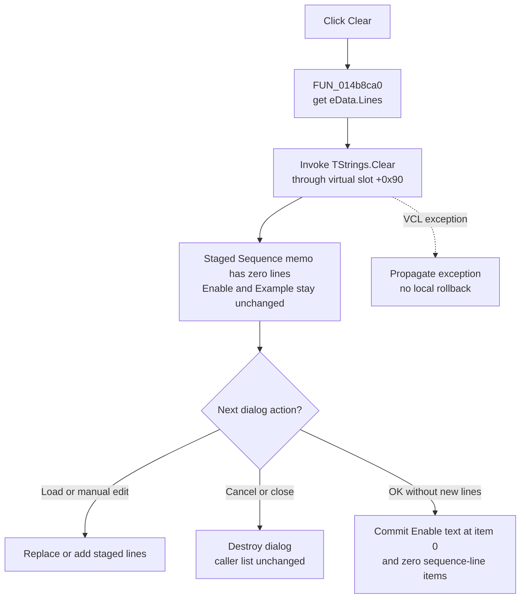

# Clear the staged timed-sequence lines

> Analysis status: Complete. The DFM, dialog setup, indirect `TStrings` method slots, Load and OK handlers, stored-list decoder, and commit encoder support this explanation.

## Control

| Property | Recovered value |
| --- | --- |
| Form | HTermData |
| Form caption | Timed sequence |
| Component path | HTermData.bClear |
| Control class | TButton |
| Caption | Clear |
| Hint | Not present in the recovered resource. |
| Handler name | bClearClick |
| Handler address | 014b8ca0 |
| Graph node | `resource:dfm:HTermData/HTermData.bClear` |
| Handler node | `function:014b8ca0` |
| Graph layer | UI |

The button has no hint, action, image, checked state, or confirmation property. The nearby `Example:` and `Sequence:` labels identify two different memo controls. The handler and dialog data flow, not label distance alone, establish that Clear targets the editable `Sequence` memo named `eData`.

## What happens when clicked

`FUN_014b8ca0` gets the `Lines` object at `eData` field `+0x4d8` and invokes its virtual method at slot `+0x90`. The surrounding methods identify this object and slot precisely:

- dialog setup assigns decoded timed-sequence lines to the same `eData.Lines` object through the `TStrings.Assign` slot;
- Load passes a selected file to the same object through the `TStrings.LoadFromFile` slot;
- OK passes the same object to the timed-sequence commit helper; and
- that commit helper uses slot `+0x90` to clear the caller's stored `TStrings` before it writes the replacement.

Thus, slot `+0x90` is `TStrings.Clear`. The click removes every line from the staged `eData` memo. It does not remove one selected row because the memo has no row-selection branch in this handler.

The normal VCL `TMemo.Lines` update makes the visible `Sequence` memo empty. The handler does not call a second rebuild, repaint, focus, selection, or caret routine. The exact caret and scroll positions after the VCL update are not recovered.

## Data that Clear does not change

The handler does not change:

- read-only memo `eExample` under the `Example:` label;
- the `Enable` check box;
- the caller's stored timed-sequence list;
- the transient file-selection dialog or its file name;
- any project, model, simulation, or device state; or
- the dialog's modal result or close guard.

The stored representation is a string list. Its first item encodes the Enable Boolean as integer text, and its remaining items are sequence lines. Dialog setup decodes that first item, copies the remaining items into a temporary list, assigns them to `eData.Lines`, and then destroys the temporary list. Clear operates later on the memo's own staged lines. It does not operate on that destroyed setup list or on the caller list.

## OK, Cancel, and Load boundaries

- **OK:** `FUN_014b8d70` later reads the current `eData.Lines` and the unchanged Enable check box and calls `FUN_01778ec0`. The commit helper clears the caller's stored list, assigns the memo lines, and inserts the Boolean text at index `0`. Therefore, Clear followed by OK stores one Enable item and no sequence-line items, unless Load or manual editing adds lines before OK.
- **Cancel or window close:** `bCancel` is a built-in `bkCancel` button with no custom click handler. The close-query handler does not copy memo data to the caller. Clear followed by Cancel discards the empty staged memo when the modal form is destroyed; the caller list remains unchanged.
- **Load:** The separate Load handler can open a file and load its contents into the same `eData.Lines` object. A successful Load after Clear can refill the staged memo before OK.

The modal launcher ignores the dialog's returned modal-result value because the OK event itself performs the commit. Clear alone never invokes that event or commit helper.

## Repeated clicks, errors, and persistence

- There is no count check or already-empty guard. Every click invokes `TStrings.Clear`. Repeating it leaves the staged memo empty.
- There is no reserved, default, or mandatory sequence row. Empty sequence data is allowed to reach the later OK path; any OK-time validation belongs to that separate handler.
- There is no confirmation, warning, status message, or undo buffer in the Clear handler.
- There is no local exception handler. If the VCL Lines operation or its change notification raises an exception, it propagates. This wrapper has no retry or rollback branch.
- Clear performs no file read, file write, file deletion, INI access, registry access, or serializer call. OK uses and removes a temporary `serial.txt` file during its separate processing, but Clear does not create or delete that file.
- The only committed effect available from the recovered path is the later in-memory caller-list update on OK. Cross-session persistence is not established.

## Click flow

## Source evidence

- [Clear handler `FUN_014b8ca0`](../../../DecompiledSources/Tina16/functions/00000000014B8CA0__FUN_014b8ca0.c) gets the `TStrings` object from the memo at form field `+0x6c8` and invokes virtual slot `+0x90` without a guard or other action.
- [Dialog setup `FUN_014b8c20`](../../../DecompiledSources/Tina16/functions/00000000014B8C20__FUN_014b8c20.c) decodes the caller state, assigns its sequence lines to the same memo Lines object, sets the Enable check box, and destroys the temporary decoded list.
- [Stored-list decoder `FUN_01779060`](../../../DecompiledSources/Tina16/functions/0000000001779060__FUN_01779060.c) reads item `0` as the Enable flag, clones the stored list, and deletes item `0` from the clone so only sequence lines reach the memo.
- [Load handler `FUN_014b8cd0`](../../../DecompiledSources/Tina16/functions/00000000014B8CD0__FUN_014b8cd0.c) passes the accepted Open-dialog file name to the same memo Lines object through its file-load slot.
- [OK handler `FUN_014b8d70`](../../../DecompiledSources/Tina16/functions/00000000014B8D70__FUN_014b8d70.c) passes the current memo Lines and Enable state to the commit helper after its temporary-file processing.
- [Commit encoder `FUN_01778ec0`](../../../DecompiledSources/Tina16/functions/0000000001778EC0__FUN_01778ec0.c) clears the caller's stored list through the same slot `+0x90`, assigns the staged sequence lines, and inserts the Enable Boolean text at index `0`.
- [Modal launcher `FUN_014ba580`](../../../DecompiledSources/Tina16/functions/00000000014BA580__FUN_014ba580.c) sets up `THTermData`, shows it modally, ignores the returned modal result, and destroys it. [Close-query handler `FUN_014b8fc0`](../../../DecompiledSources/Tina16/functions/00000000014B8FC0__FUN_014b8fc0.c) only applies and resets the dialog close guard.
- [Recovered Delphi resource evidence](../../../DecompiledSources/Tina16/resources/dfm/ui-evidence.json) supplies the `Timed sequence` form, editable `eData`, read-only `eExample`, Enable check box, Clear, Load, built-in OK and Cancel controls, and their event bindings.

## Analysis limits and ownership

- This Bead owns only unique Clear handler `FUN_014b8ca0`.
- Bead `.622` owns Load handler `FUN_014b8cd0`. Bead `.623` owns OK handler `FUN_014b8d70`, dialog setup and decoder `FUN_014b8c20` and `FUN_01779060`, and commit encoder `FUN_01778ec0`. This article cites those functions without redefining their annotations.
- The indirect `TStrings.Clear` target is a shared Delphi VCL method. It remains framework evidence and is not assigned an application-specific annotation here.
- The timed-sequence line grammar, any later simulator consumer, and any project-level persistence outside this modal workflow remain unknown.
