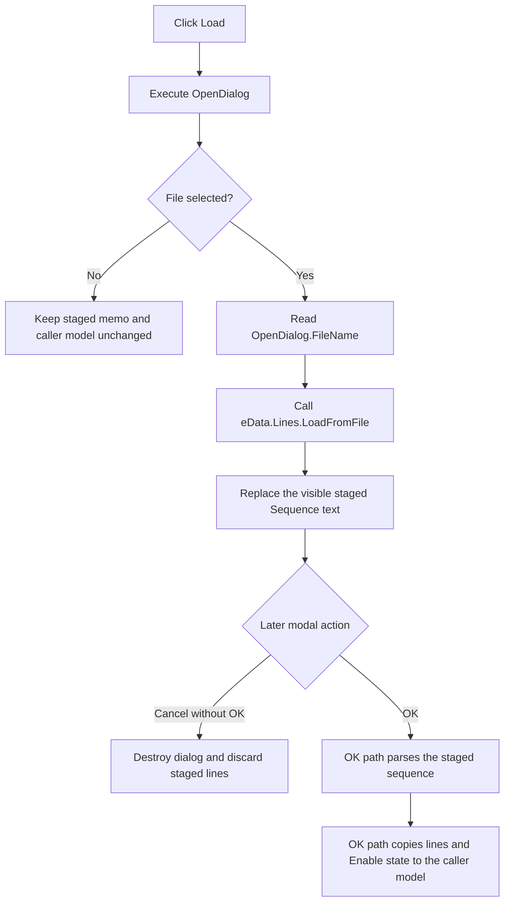

# Load a text file into the staged timed sequence

## Control

| Property | Recovered value |
| --- | --- |
| Form | HTermData |
| Component path | HTermData.bLoad |
| Control class | TButton |
| Caption | Load |
| Hint | Not present in the recovered resource. |
| Handler name | bLoadClick |
| Handler address | 014b8cd0 |
| Graph node | `resource:dfm:HTermData/HTermData.bLoad` |
| Handler node | `function:014b8cd0` |
| Graph layer | UI |

## Purpose

The button opens the form's `OpenDialog`. If the user selects a file, the
handler loads that file into `eData.Lines`. `eData` is the visible **Sequence**
memo and is a dialog-local working copy of the timed sequence.

The load operation replaces the current memo lines. It does not append the
selected path or the file contents to the memo. The handler does not parse the
timed sequence, change the **Enable** check box, update the caller's model, or
close the dialog.

## Click behavior

1. The handler executes the `TOpenDialog` stored at form offset `+0x6f8`.
2. If the user cancels or closes the file dialog, the handler returns. It does
   not read a file name and does not change the memo or caller model.
3. If the user accepts the dialog, `FUN_00724270` reads
   `OpenDialog.FileName`.
4. The handler gets the `TStrings` object from `eData.+0x4d8` and calls its
   virtual method at slot `+0xd8`. Independent recovered call sites identify
   this slot as `TStrings.LoadFromFile`.
5. On normal completion, the selected text replaces the visible staged
   sequence lines. The `TMemo` displays the new `Lines` content without a
   separate application-level rebuild call.

The resource does not contain a filter, default extension, initial directory,
hint, or glyph for this button. The handler also supplies no explicit text
encoding. File selection and decoding therefore use the recovered VCL dialog
and one-argument `TStrings.LoadFromFile` behavior.

## Staging, OK, and Cancel boundaries

`FUN_014b8c20` initializes the dialog before it is shown. It copies the current
sequence lines from the caller model into `eData.Lines` and copies the current
enabled state into `cbEnableTimedSeq`. This setup proves that `eData` is staged
dialog data, not the caller-owned collection.

The later `bOK` handler owns parsing and model copy-back. It saves the staged
memo lines to a temporary `serial.txt`, calls the timed-sequence parser, and
copies `eData.Lines` plus the **Enable** state to the caller model. The Load
handler performs none of these operations.

The **Cancel** button has Delphi kind `bkCancel` and no explicit click handler.
If the user clicks Load and then cancels the modal dialog without first
clicking OK, destruction of the form discards the staged memo, and the caller
model stays unchanged. This statement does not apply after an OK attempt: the
OK handler has its own validation and copy-back side effects before the form's
close query decides whether closing is allowed.

## Click flow

## Boundaries and failures

- Repeated successful loads replace the current staged lines each time.
- A successfully loaded empty file makes the staged memo empty.
- The handler has no separate empty-path, extension, existence, size, content,
  or sequence-syntax check. The file dialog and `LoadFromFile` own file access.
  The OK path owns sequence parsing.
- The handler has no local exception handler, status message, retry, or
  rollback. A file-name or load exception propagates through the Delphi event
  path. The recovered source does not establish whether `TStrings` preserves,
  clears, or partly replaces the old lines after a mid-load failure.
- The handler does not write a file or persistent setting. It also does not
  copy the selected path to a model field. Any path state that the VCL dialog
  retains is dialog-owned state and is not persistence established by this
  handler.
- `eExample` is a read-only example memo. This handler does not read or change
  it.

## Source evidence

- [Load handler `FUN_014b8cd0`](../../../DecompiledSources/Tina16/functions/00000000014B8CD0__FUN_014b8cd0.c) executes the file dialog, gates all work on its Boolean result, reads the selected name, and calls the `eData.Lines` load slot.
- [File-name getter `FUN_00724270`](../../../DecompiledSources/Tina16/functions/0000000000724270__FUN_00724270.c) returns the selected name from the dialog or its native backing object.
- [Dialog setup `FUN_014b8c20`](../../../DecompiledSources/Tina16/functions/00000000014B8C20__FUN_014b8c20.c) copies caller-owned lines and enabled state into the form's controls before `ShowModal`.
- [OK handler `FUN_014b8d70`](../../../DecompiledSources/Tina16/functions/00000000014B8D70__FUN_014b8d70.c) performs the separate temporary-file, parser, and caller-model copy-back path.
- [Close-query handler `FUN_014b8fc0`](../../../DecompiledSources/Tina16/functions/00000000014B8FC0__FUN_014b8fc0.c) uses the validation flag written by the OK path; Load does not write that flag.
- [Modal caller `FUN_014ba580`](../../../DecompiledSources/Tina16/functions/00000000014BA580__FUN_014ba580.c) initializes, shows, and then destroys the HTermData form without a separate post-modal copy-back call.
- [Independent FileSelect load analysis](../fileselect/sbselect-bb5de5cdb6.md) cross-identifies `TStrings` VMT slot `+0xd8` as `LoadFromFile`.

## Analysis limits

- The recovered resource does not establish a specific accepted file type.
- The one-argument VCL load call does not establish an explicit encoding,
  byte-order-mark policy, or line-ending policy at this application layer.
- The OK parser's detailed syntax rules and error messages belong to the
  separate `bOK` control analysis.
