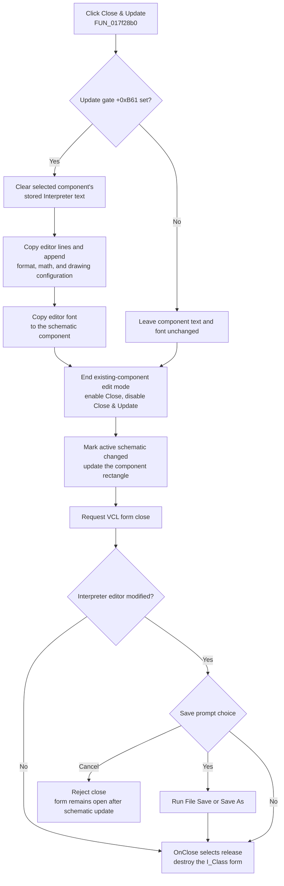

# Close and update the schematic component

> Analysis status: Evidence-backed source review complete.

## Control

| Property | Recovered value |
| --- | --- |
| Form | I_Class |
| Form caption | Interpreter-`<%s>` |
| Component path | I_Class.MainMenu.mFile.CloseUpdate1 |
| Control class | TMenuItem |
| Displayed caption | Close & Update |
| Handler name | CloseUpdate1Click |
| Handler address | 017f28b0 |
| Graph node | `resource:dfm:I_Class/I_Class.MainMenu.mFile.CloseUpdate1` |
| Handler node | `function:017f28b0` |
| Graph layer | UI |

The stored caption is `Close &&  &Update`. Delphi displays `&&` as one literal ampersand and uses the other ampersand as the keyboard-access marker. The item has no hint, action binding, image reference, or glyph.

This is a direct `OnClick` event. It is not an `OnUpdate` event and does not receive or inspect an action object. The handler uses the form state and the schematic object stored in the form.

## What happens when clicked

`FUN_017f28b0` finishes the special mode that edits an existing Interpreter component from the schematic.

When the form's update gate at `+0xB61` is true, the handler performs these updates before it tries to close the form:

1. It gets the selected schematic component through the edit-owner stored at `I_Class +0xB58`.
2. It clears the component's stored Interpreter text list.
3. It calls `FUN_017f2850` to copy the current editor lines into that list and append the current numerical-format, math, and drawing configuration block.
4. It copies the `TSynEdit` font into the component's associated font object.

The helper does not save a file. It serializes the in-memory Interpreter editor and configuration into the selected schematic component.

## Schematic and menu state

After the guarded copy, the handler always performs the remaining state changes:

- It clears the existing-component edit-mode flag at `+0xB60` and resets the update gate at `+0xB61` to true.
- It marks the active schematic state as changed through `FUN_0199e310`.
- It asks the edited schematic object for its bounds and sends that rectangle to the active schematic surface for an update.
- It enables the normal **Close Interpreter** menu item and disables **Close & Update**.
- It calls the common VCL form-close pipeline.

The entry path `FUN_0149e460` establishes the opposite state when an existing schematic Interpreter component is opened: it stores the edit owner, disables normal Close, enables Close & Update, sets both mode flags, and loads the component text into the Interpreter editor. The **Place to Schematic** handler also calls `FUN_017f28b0` when this update mode is active.

If the `+0xB61` gate is false, the text and font copy is skipped. The handler still resets the mode, marks and updates the schematic, switches the menu items, and requests closure. It has no sender check and no null check for the stored edit owner; the UI mode is expected to keep the command unavailable outside this context.

## Close query and file-save interaction

The schematic-component update and the Interpreter file save are separate operations.

The handler applies the schematic update first. It then clears the special edit-mode flag and calls `TCustomForm.Close`. The I_Class close-query handler checks the `TSynEdit` modified flag:

- If the editor is not modified, closure continues without an Interpreter file prompt.
- If it is modified, the cleared mode flag selects the normal save prompt that includes the current `.ipr` file name.
- **Yes** calls the File Save path. A named file is written directly; `noname.ipr` routes through Save As.
- **No** permits closure without saving the `.ipr` file.
- **Cancel** rejects closure and leaves the form open.

The close-query code does not inspect a success result from File Save. If Save As is canceled, its worker returns without writing, but the close query still reports that closure can continue. The sibling File Save and Save As Beads own the detailed file-format and dialog behavior.

On an accepted close, I_Class `OnClose` selects the release action. The form and its private working model are then destroyed by the VCL close pipeline. This handler does not call New, Open, Save, or Save As directly; Save is reachable only through the later close-query choice.

## Click flow

## Persistence, no-op, and repeated use

- The component text, configuration, and font are changed in the active schematic model. The handler marks that model as changed, but it does not save the containing circuit. Durable circuit persistence depends on a later circuit save.
- An optional close-query **Yes** can save the current Interpreter source as an `.ipr` file. This file operation is separate from the schematic update.
- **Cancel** at the close prompt does not roll back the component copy, schematic-changed state, bounds update, mode flags, or menu enablement changes.
- After a normal close, the form is released, so the same form instance cannot process a second click. If close is rejected, Close & Update is already disabled and normal Close is enabled.
- A false update gate skips only the text and font copy. It does not turn the complete handler into a no-op.
- The handler does not add an explicit undo record. The recovered path does not prove whether a broader schematic undo service can later reverse the update.

## Error and partial-state behavior

The handler and copy helper have no local exception handler, validation dialog, transaction, or rollback.

- The target text list is cleared before the editor text and configuration are copied. An exception during serialization can leave the component text empty or incomplete.
- A later font, schematic-state, bounds, surface-update, or close exception can occur after the component text changed.
- A close-query cancellation is not treated as an error and does not undo the earlier update.
- The source does not show a success message, retry, target-validity guard, circuit save, or automatic restoration of the old component state.

## Source evidence

- Click handler, component copy, schematic update, menu state, and close request: [FUN_017f28b0](../../../DecompiledSources/Tina16/functions/00000000017F28B0__FUN_017f28b0.c)
- Editor-line and configuration serializer: [FUN_017f2850](../../../DecompiledSources/Tina16/functions/00000000017F2850__FUN_017f2850.c)
- Configuration-block construction: [FUN_010cde90](../../../DecompiledSources/Tina16/functions/00000000010CDE90__FUN_010cde90.c)
- Existing-component edit-mode setup and initial text/font copy: [FUN_0149e460](../../../DecompiledSources/Tina16/functions/000000000149E460__FUN_0149e460.c)
- Place-to-Schematic mode router: [FUN_017f2a00](../../../DecompiledSources/Tina16/functions/00000000017F2A00__FUN_017f2a00.c)
- I_Class close query and modified-state decision: [FUN_017f0f20](../../../DecompiledSources/Tina16/functions/00000000017F0F20__FUN_017f0f20.c) and [FUN_017f1540](../../../DecompiledSources/Tina16/functions/00000000017F1540__FUN_017f1540.c)
- File Save and Save As routing reached from the prompt: [FUN_017ef8e0](../../../DecompiledSources/Tina16/functions/00000000017EF8E0__FUN_017ef8e0.c), [FUN_017ef6c0](../../../DecompiledSources/Tina16/functions/00000000017EF6C0__FUN_017ef6c0.c), and [FUN_017ef730](../../../DecompiledSources/Tina16/functions/00000000017EF730__FUN_017ef730.c)
- I_Class release action and shared VCL close pipeline: [FUN_017f0f10](../../../DecompiledSources/Tina16/functions/00000000017F0F10__FUN_017f0f10.c) and [FUN_00805200](../../../DecompiledSources/Tina16/functions/0000000000805200__FUN_00805200.c)
- Recovered caption and `OnClick` binding: [ui-evidence.json](../../../DecompiledSources/Tina16/resources/dfm/ui-evidence.json)

## Evidence and annotation limits

- The edit-mode entry and exit paths establish that the target is an existing schematic Interpreter component. Recovered type names are not available for the nested owner fields.
- Repeated placement and edit paths establish the object-bounds and schematic-surface update pairing. The virtual method names are not recovered.
- `FUN_0199e310` sets the active schematic's changed-state field. This Bead does not assign a broader role to that shared notifier.
- Bead `.640` owns `FUN_017f28b0` and `FUN_017f2850`. Bead `.641` owns the normal Close wrapper. Beads `.642` through `.645` own New, Open, Save, and Save As. The VCL close routine has an existing canonical annotation and remains citation only here.
