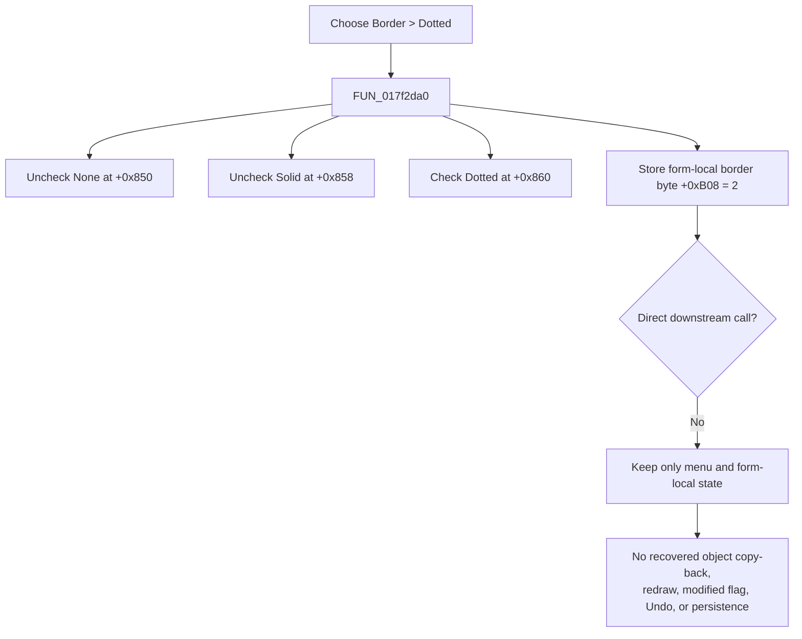

# Select the dotted I_Class border option

> Analysis status: Complete. The recovered handler, sibling border commands, form-state initializer, existing-object entry path, schematic update path, placement path, and text renderer establish the local border value and the limits of its recovered propagation.

## Control

| Property | Recovered value |
| --- | --- |
| Form | I_Class |
| Form caption | `Interpreter-<%s>` |
| Component path | I_Class.pmBackground.Border1.DottedMnu |
| Parent menu | Border (`B&order`) |
| Control class | TMenuItem |
| Caption | Dotted |
| Hint | Not present in the recovered resource. |
| Handler name | DottedMnuClick |
| Handler address | 017f2da0 |
| Graph node | `resource:dfm:I_Class/I_Class.pmBackground.Border1.DottedMnu` |
| Handler node | `function:017f2da0` |
| Graph layer | UI |

## What happens when selected

`FUN_017f2da0` performs four direct state changes:

1. It unchecks the menu item at I_Class field `+0x850`, identified as **None**.
2. It unchecks the item at `+0x858`, identified as **Solid**.
3. It checks the item at `+0x860`, identified as **Dotted**.
4. It writes byte value `2` to the form-local border-style field at `+0xB08`.

The value is not inferred from the caption. The sibling **None** handler writes `0`, and **Solid** writes `1`. The shared initializer `FUN_017f2de0` uses the same mapping to restore one of the three check marks. When an existing schematic Interpreter object enters the I_Class edit mode, `FUN_0149e460` passes the object's border byte at nested offset `+0xA0` to that initializer. The common text-object renderer maps border value `2` to its dotted pen-style argument and draws a border rectangle.

The menu items do not have recovered `RadioItem`, `GroupIndex`, or initial `Checked` properties. Their handlers enforce exclusivity with three explicit checked-state calls.

## Local state versus the schematic object

This click changes the menu marks and the I_Class field at `+0xB08`. The recovered code does not prove that it applies the value to the current schematic object:

- The handler does not read the existing-object owner at form field `+0xB58` and does not write a schematic object.
- It does not call a renderer, invalidate a rectangle, mark the schematic changed, or refresh layout.
- **Close & Update** copies the editor text, serialized Interpreter configuration, and editor font to the existing schematic object. Its recovered path does not copy I_Class field `+0xB08` back to the object's border field `+0xA0`.
- The new-placement path passes editor lines and font into the schematic insertion coordinator, but it does not pass or read `+0xB08`. The new schematic Interpreter object constructor loads its own border default from `TINA.INI`, section `Text Dialog Setup`, key `Border`.
- No recovered I_Class destruction or close path writes `+0xB08` to that INI key.

Therefore, the recovered effect of this specific click is a form-local border selection. It can represent the loaded object's dotted style in the menu, but no recovered consumer proves that a later update, placement, repaint, or save uses a newly selected value. This is an explicit evidence gap, not a claim that an unrecovered indirect consumer cannot exist.

## Dotted selection flow

## Initialization and sibling behavior

| Path | Menu states | Border byte |
| --- | --- | --- |
| None `FUN_017f2d20` | None checked; Solid and Dotted unchecked | `0` |
| Solid `FUN_017f2d60` | Solid checked; None and Dotted unchecked | `1` |
| Dotted `FUN_017f2da0` | Dotted checked; None and Solid unchecked | `2` |
| Initializer `FUN_017f2de0` | Restores the matching exclusive state for values `0`, `1`, or `2` | Supplied value |

Form initialization calls the initializer with value `0`, so the initial form-local border mode is None. Opening an existing schematic Interpreter object later replaces this state with the object's border value before the form is shown in update mode.

Selecting Dotted again requests the same three check states. `FUN_007e2d20` skips its menu notification when the requested state already matches, but the handler still writes `2` to `+0xB08`. It does not toggle Dotted off.

## Undo, modified state, and persistence

- The handler does not touch the `TSynEdit` buffer or its Undo list. It does not set the editor's modified flag.
- It does not add a schematic Undo record or call the recovered schematic changed-state notifier.
- It does not save the `.ipr` Interpreter file, circuit, registry, or application preferences.
- A later **Close & Update** can update other parts of the schematic object and mark the schematic changed, but its recovered copy path omits `+0xB08`.
- Closing or reopening I_Class can replace the local value through normal initialization or an existing object's loaded border value. No recovered persistence boundary stores this click's changed value.

## No-target, repeated, and error behavior

- The click handler does not require a selected schematic object. It only dereferences the three form-owned menu items and writes the form itself. Thus, it has no target-selection no-op branch.
- A repeated click is idempotent for the recovered state: Dotted remains checked, the siblings remain unchecked, and the border byte remains `2`.
- There is no confirmation, validation, status message, result check, retry, transaction, or rollback.
- The handler has no local exception block. A failure while changing a menu item propagates through the Delphi event path. Earlier menu changes can remain applied because the handler has no rollback.

## Source and graph evidence

- Dotted handler: [FUN_017f2da0](../../../DecompiledSources/Tina16/functions/00000000017F2DA0__FUN_017f2da0.c)
- None sibling: [FUN_017f2d20](../../../DecompiledSources/Tina16/functions/00000000017F2D20__FUN_017f2d20.c)
- Solid sibling: [FUN_017f2d60](../../../DecompiledSources/Tina16/functions/00000000017F2D60__FUN_017f2d60.c)
- Shared form-state initializer and menu-state restore: [FUN_017f2de0](../../../DecompiledSources/Tina16/functions/00000000017F2DE0__FUN_017f2de0.c)
- VCL menu checked-state setter: [FUN_007e2d20](../../../DecompiledSources/Tina16/functions/00000000007E2D20__FUN_007e2d20.c)
- Existing schematic Interpreter edit-mode entry: [FUN_0149e460](../../../DecompiledSources/Tina16/functions/000000000149E460__FUN_0149e460.c)
- Existing-object Close & Update path: [FUN_017f28b0](../../../DecompiledSources/Tina16/functions/00000000017F28B0__FUN_017f28b0.c)
- Editor/configuration copy helper used by Close & Update: [FUN_017f2850](../../../DecompiledSources/Tina16/functions/00000000017F2850__FUN_017f2850.c)
- New schematic placement path: [FUN_017f2a50](../../../DecompiledSources/Tina16/functions/00000000017F2A50__FUN_017f2a50.c)
- Schematic Interpreter object creation and INI default load: [FUN_0149d1a0](../../../DecompiledSources/Tina16/functions/000000000149D1A0__FUN_0149d1a0.c)
- Text-object renderer that distinguishes dotted border value `2`: [FUN_01a5daf0](../../../DecompiledSources/Tina16/functions/0000000001A5DAF0__FUN_01a5daf0.c)

The graph records one distinct outgoing call from `FUN_017f2da0`, to the shared VCL menu checked-state setter. Its application entry is the recovered `DottedMnu.OnClick` trigger.

## Resource evidence

- The DFM binds `I_Class.pmBackground.Border1.DottedMnu.OnClick` to `DottedMnuClick` at `017f2da0`.
- The parent caption is `B&order`; the sibling captions are `None`, `Solid`, and `Dotted`.
- The Dotted item has no recovered hint, text, initial checked state, radio-item property, group index, action, image reference, or glyph.
- No same-parent label candidate is available for this popup-menu item.

## Analysis and annotation limits

- This article owns only `FUN_017f2da0`.
- `TIARA-diz.6.7.140` canonically owns shared menu checked-state setter `FUN_007e2d20`.
- The Opaque control analysis `TIARA-diz.6.7.652` owns shared I_Class style initializer `FUN_017f2de0`. This article cites it without redefining it.
- The None and Solid control analyses own their unique sibling handlers.
- The original Delphi field name and enumeration type for I_Class offset `+0xB08` are not recovered. The border role and value mapping come from existing-object input, sibling handlers, initializer behavior, the text-object field, and its renderer.
