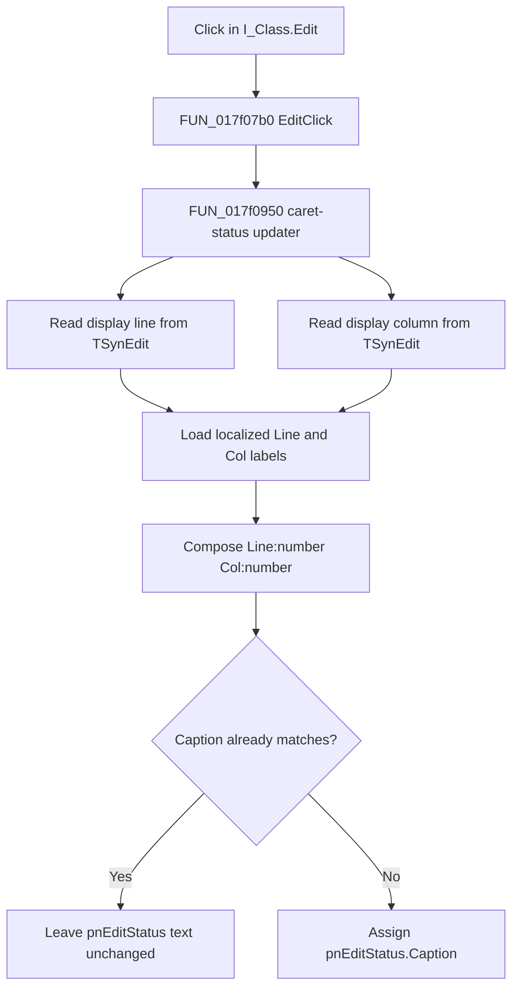

# Refresh the Interpreter caret position

> Analysis status: Complete source review.

## Control

| Property | Recovered value |
| --- | --- |
| Form | I_Class |
| Form caption | Interpreter-<%s> |
| Component path | I_Class.Edit |
| Control class | TSynEdit |
| Layout | Client-aligned source editor |
| Handler name | EditClick |
| Handler address | 017f07b0 |
| Status target | I_Class.pnPanel1.pnEditStatus |
| Initial status caption | Line:1 Col:1 |
| Graph node | `resource:dfm:I_Class/I_Class.Edit` |
| Handler node | `function:017f07b0` |
| Graph layer | UI |

The editor has no recovered caption, hint, initial text, glyph, or image. Its
form is the TINA **Interpreter** window. The DFM binds the same editor to click,
key-up, mouse-down, and mouse-up events.

## What happens when clicked

`FUN_017f07b0` is a one-call wrapper. It invokes `FUN_017f0950` for the current
`I_Class` form. The recovered call expression omits Delphi's implicit `Self`
argument, but the callee reads both the form's editor and its status panel.

The shared updater reads the current display caret coordinates from the
`TSynEdit` instance at form field `+0x868`:

1. `FUN_00bfaa50` supplies the vertical coordinate, which is shown as the line;
2. `FUN_00bfaa40` supplies the horizontal coordinate, which is shown as the
   column;
3. the updater converts both values to text;
4. it loads localized string resources `997` and `998` for the two labels;
5. it composes the labels and numbers in line-then-column order;
6. it assigns the result to `pnEditStatus.Caption` through form field `+0x7c8`.

The DFM's initial caption, `Line:1 Col:1`, confirms the meaning and order of
the two coordinates. The coordinate path converts the editor's stored buffer
position to its display position, so the status follows the position that the
editor presents to the user.

## Selection, focus, and editing state

The application handler does not set the caret, create or clear a selection,
set focus, change text, or switch an editing mode. It only reads the caret
position that `TSynEdit` has when `OnClick` runs. Mouse selection and focus
behavior remain inside the `TSynEdit` control and are not recovered as work by
this application handler.

Three other editor events reuse the same status updater:

- `EditKeyUp` refreshes it after its separate Enter-key processing;
- `EditMouseDown` refreshes it;
- `EditMouseUp` refreshes it.

This reuse shows that `FUN_017f0950` synchronizes the line and column display.
It does not update `pnErrorStatus`, `ErrorLine`, or `pnWritingStatus`.

## Interpreter and command integration

The editor contains Interpreter source, but this click does not parse, compile,
run, save, or transform that source. It does not invoke an Interpreter backend,
macro command, placement command, or editor command. The separate menu and
toolbar **Run** handlers enter the execution path; neither is called here.

The click also does not change the document's modified state. It writes no IPR
file, project model, INI setting, registry setting, or backend object. Only the
transient status-panel caption can change.

## Repeated clicks and errors

- Repeated clicks at the same display coordinate calculate the same caption.
  The shared VCL text setter compares the requested caption with the current
  caption and does not send the control-text change path when they match.
- There is no application-level no-selection branch. The updater reads the
  current `TSynEdit` caret coordinate, independent of whether text is selected.
- The wrapper and updater have no local exception handler or rollback. A
  string-allocation, localization, or VCL update exception can leave the old
  status caption visible. The click handler does not show an error message.
- Normal dispatch requires the form and editor to exist. The recovered handler
  has no explicit null guard for a manually invoked event outside that
  lifecycle.

## Click flow

## Source evidence

- Click wrapper: [FUN_017f07b0](../../../DecompiledSources/Tina16/functions/00000000017F07B0__FUN_017f07b0.c)
- Shared caret-status updater: [FUN_017f0950](../../../DecompiledSources/Tina16/functions/00000000017F0950__FUN_017f0950.c)
- Display-coordinate conversion: [FUN_00bfaa90](../../../DecompiledSources/Tina16/functions/0000000000BFAA90__FUN_00bfaa90.c)
- Horizontal coordinate wrapper: [FUN_00bfaa40](../../../DecompiledSources/Tina16/functions/0000000000BFAA40__FUN_00bfaa40.c)
- Vertical coordinate getter: [FUN_00bfaa50](../../../DecompiledSources/Tina16/functions/0000000000BFAA50__FUN_00bfaa50.c)
- Change-aware VCL caption setter: [FUN_0064de00](../../../DecompiledSources/Tina16/functions/000000000064DE00__FUN_0064de00.c)
- Key-up caller: [FUN_017f16e0](../../../DecompiledSources/Tina16/functions/00000000017F16E0__FUN_017f16e0.c)
- Mouse-down caller: [FUN_017f1730](../../../DecompiledSources/Tina16/functions/00000000017F1730__FUN_017f1730.c)
- Mouse-up caller: [FUN_017f1750](../../../DecompiledSources/Tina16/functions/00000000017F1750__FUN_017f1750.c)
- Menu Run route: [FUN_017efc30](../../../DecompiledSources/Tina16/functions/00000000017EFC30__FUN_017efc30.c)
- Toolbar Run route: [FUN_017efdd0](../../../DecompiledSources/Tina16/functions/00000000017EFDD0__FUN_017efdd0.c)
- Recovered form and component evidence: [ui-evidence.json](../../../DecompiledSources/Tina16/resources/dfm/ui-evidence.json)

The graph classifies `FUN_017f07b0` as a simple function in the `UI` layer with
one distinct outgoing call. `FUN_017f0950` has five recovered application
callers: the click, key-up, mouse-down, mouse-up, and editor-reinitialization
paths.

## Analysis ownership

- This analysis owns `FUN_017f07b0` and shared caret-status updater
  `FUN_017f0950`.
- Sibling menu-control analyses own their Copy, Cut, Delete, Find, and Paste
  handlers.
- Generic SynEdit coordinate functions, Delphi string functions, localization,
  and VCL control-text functions remain evidence-only.

## Analysis limits

- Localized resources can change the exact Line and Col label text. The DFM
  provides the recovered English initial caption.
- The recovered application source proves only the status refresh. Caret
  movement, selection, and focus rules belong to the embedded `TSynEdit`
  implementation and are not restated as behavior of `EditClick`.
