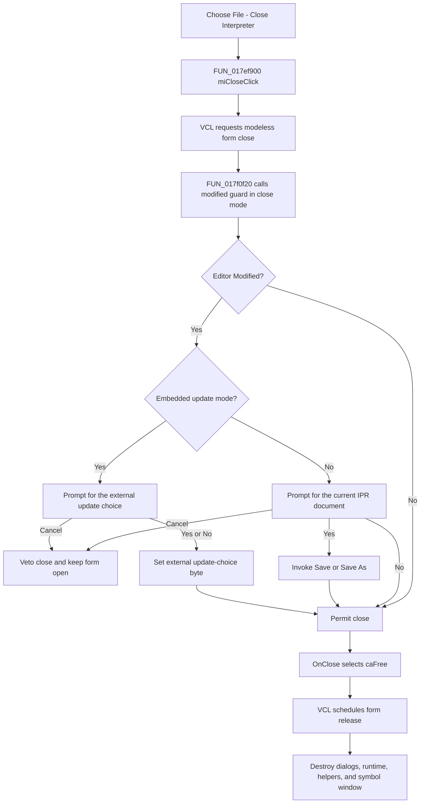

# Close the Interpreter window

> Analysis status: Complete source review.

## Control

| Property | Recovered value |
| --- | --- |
| Form | I_Class |
| Form caption | Interpreter-<%s> |
| Component path | I_Class.MainMenu.mFile.miClose |
| Control class | TMenuItem |
| Caption | &Close Interpreter |
| Handler name | miCloseClick |
| Handler address | 017ef900 |
| Graph node | `resource:dfm:I_Class/I_Class.MainMenu.mFile.miClose` |
| Handler node | `function:017ef900` |
| Graph layer | UI |

The menu item has no recovered hint, image, glyph, or shortcut. The form is a
modeless Interpreter source window with a `TSynEdit` editor.

## Close request

`FUN_017ef900` is a one-call wrapper around the shared VCL form-close routine
`FUN_00805200`. The recovered call expression omits Delphi's implicit `Self`
argument. The VCL routine uses the current `I_Class` form, runs its virtual
close query, and stops immediately if that query returns false.

`I_Class.OnCloseQuery`, recovered as `FUN_017f0f20`, delegates its decision to
`FUN_017f1540` in close mode `2`. This application guard reads the `Modified`
byte at editor offset `+0x5e0`.

- If the editor is not modified, the guard permits the close without a prompt.
- If the editor is modified, it shows a localized Yes, No, or Cancel prompt.
- **Cancel** returns false. The VCL does not dispatch `OnClose`, and the form,
  editor, runtime, and unsaved text stay open.
- **No** permits the close without writing the source.
- **Yes** enters the existing **Save** handler before permitting the close.

For a normal standalone Interpreter document, the prompt includes an uppercase
copy of the current name at form field `+0x888`. The initial name is
`noname.ipr`.

## Save result and close boundary

The guard calls the **Save** handler as a procedure. It does not receive a
success result and does not test the editor's `Modified` byte again.

- A named document is written to its current IPR path, then the save route
  clears `Modified`.
- `noname.ipr` enters **Save As**. Acceptance stores the selected path, writes
  the IPR data, and clears `Modified`.
- If the user answers **Yes** to the close prompt and then cancels **Save As**,
  the save route returns without writing or clearing `Modified`. The close
  guard still returns true, so the form continues to close and the unsaved
  editor text is discarded.
- A save or allocation exception is not caught by the close handler or guard.
  It interrupts the normal close path. A writer failure can leave a partial
  file, and there is no rollback here.

The IPR save functions are owned by the sibling **Save** and **Save As**
analyses. This article follows them only far enough to establish the close
decision.

## Embedded update mode

Another recovered path opens this same Interpreter form for an externally
owned source item and sets mode byte `+0xb60` to `1`. In that mode, a modified
close uses a separate prompt:

- **Yes** sets update-choice byte `+0xb61` to `1`;
- **No** sets it to `0`;
- **Cancel** vetoes the close.

This `miClose` path does not itself copy editor text back to the external item
and does not write an IPR file in that branch. The sibling **Close & Update**
command owns the explicit external copy-back operation. This distinction is
important: the **Close Interpreter** caption does not imply an update.

## Release and runtime cleanup

When the query permits the close, `I_Class.OnClose` sets the Delphi close
action to value `2`, `caFree`. The VCL therefore takes its release path rather
than hiding or minimizing the Interpreter. Release is scheduled through the
VCL message path; destruction occurs when that release is processed.

`I_Class.FormDestroy` then:

- destroys the owned Open IPR dialog at `+0xb18`;
- destroys the owned Save IPR dialog at `+0xb20`;
- destroys the Interpreter runtime/session object at `+0xb48`;
- releases another owned helper reached through `+0xb38`;
- destroys the owned string-list object at `+0xb50`;
- destroys and clears the shared symbol-table window pointer;
- clears the recovered active-Interpreter callback pointer.

There is no explicit run-stop or cooperative abort call in the menu handler,
close query, or `OnClose`. Runtime shutdown occurs through destruction of the
owned Interpreter session. Cleanup has no local exception recovery, so a
destructor exception can leave later cleanup steps incomplete.

## Persistence and repeated use

The command persists data only when the user selects **Yes** and the delegated
save completes. **No** and an unmodified close write no IPR data. The close
does not write an INI setting, registry setting, or project setting.

After a permitted close, the form is released, so the same menu item cannot be
clicked again on that instance. After **Cancel**, the same form stays open and
another close attempt performs the modified check again.

## Click flow

## Source evidence

- Menu wrapper: [FUN_017ef900](../../../DecompiledSources/Tina16/functions/00000000017EF900__FUN_017ef900.c)
- VCL modeless close coordinator: [FUN_00805200](../../../DecompiledSources/Tina16/functions/0000000000805200__FUN_00805200.c)
- Interpreter close query: [FUN_017f0f20](../../../DecompiledSources/Tina16/functions/00000000017F0F20__FUN_017f0f20.c)
- Shared modified-document guard: [FUN_017f1540](../../../DecompiledSources/Tina16/functions/00000000017F1540__FUN_017f1540.c)
- Interpreter close action: [FUN_017f0f10](../../../DecompiledSources/Tina16/functions/00000000017F0F10__FUN_017f0f10.c)
- Interpreter destruction: [FUN_017f0730](../../../DecompiledSources/Tina16/functions/00000000017F0730__FUN_017f0730.c)
- Save handler: [FUN_017ef8e0](../../../DecompiledSources/Tina16/functions/00000000017EF8E0__FUN_017ef8e0.c)
- Save coordinator: [FUN_017ef6c0](../../../DecompiledSources/Tina16/functions/00000000017EF6C0__FUN_017ef6c0.c)
- Save As coordinator: [FUN_017ef730](../../../DecompiledSources/Tina16/functions/00000000017EF730__FUN_017ef730.c)
- IPR writer route: [FUN_017ef620](../../../DecompiledSources/Tina16/functions/00000000017EF620__FUN_017ef620.c)
- Embedded Interpreter opener: [FUN_0149e460](../../../DecompiledSources/Tina16/functions/000000000149E460__FUN_0149e460.c)
- Close and Update command: [FUN_017f28b0](../../../DecompiledSources/Tina16/functions/00000000017F28B0__FUN_017f28b0.c)
- Symbol-table opener: [FUN_017efbc0](../../../DecompiledSources/Tina16/functions/00000000017EFBC0__FUN_017efbc0.c)
- Recovered form and menu evidence: [ui-evidence.json](../../../DecompiledSources/Tina16/resources/dfm/ui-evidence.json)

The graph classifies `FUN_017ef900` as a simple function in the `UI` layer with
one direct call. The generic VCL close function already has a Delphi VCL layer
role and remains evidence-only in this control analysis.

## Analysis ownership

- This analysis owns `FUN_017ef900`, `FUN_017f0f20`, `FUN_017f1540`,
  `FUN_017f0f10`, and `FUN_017f0730`.
- Sibling analyses own **Close & Update**, **New**, **Open**, **Save**, and
  **Save As** functions.
- Generic VCL close, message-dialog, object-lifetime, and string helpers remain
  evidence-only.

## Analysis limits

- The localized prompt text is not exported as a direct literal. Its branches,
  current-name input, and Yes, No, and Cancel result codes are recovered.
- The source proves that close mode `+0xb60` stages `+0xb61`; it does not prove
  an additional hidden copy-back in this menu handler.
- The callback pointer cleared during destruction has no recovered Delphi
  field name, so this article describes it by its observed use and lifecycle.
