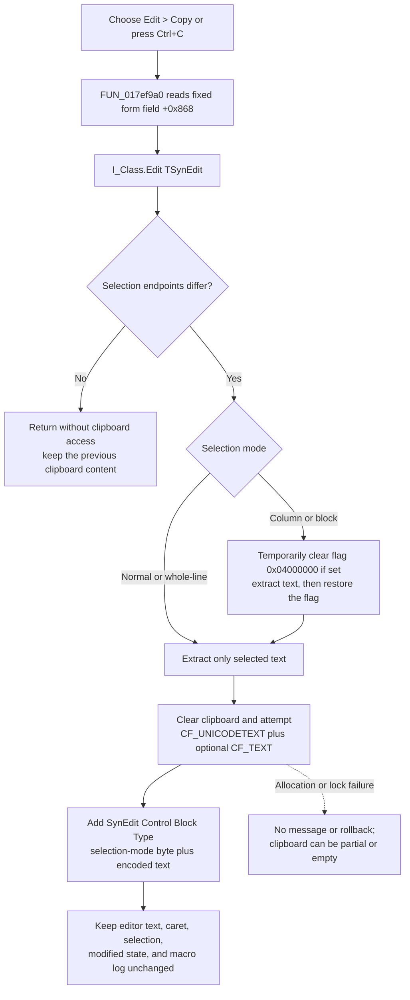

# Copy the selected Interpreter text

> Analysis status: Complete. The recovered menu handler, fixed form-field target, SynEdit selection and clipboard helpers, application-idle menu updater, and sibling Cut and Paste commands support this explanation.

## Control

| Property | Recovered value |
| --- | --- |
| Form | I_Class |
| Form caption | `Interpreter-<%s>` |
| Component path | I_Class.MainMenu.mEdit.miCopy |
| Parent menu | mEdit |
| Control class | TMenuItem |
| Caption | &Copy |
| Initial enabled state | False |
| Shortcut | Ctrl+C (`16451`) |
| Hint | Not present in the recovered resource. |
| Handler name | miCopyClick |
| Handler address | 017ef9a0 |
| Graph node | `resource:dfm:I_Class/I_Class.MainMenu.mEdit.miCopy` |
| Handler node | `function:017ef9a0` |
| Graph layer | UI |

## What happens when selected

`FUN_017ef9a0` copies the current selection from the Interpreter form's `Edit` control. It does not use the sender, keyboard focus, or active-control state to choose a target. The handler always reads the object at form offset `+0x868` and passes it to `FUN_00bf1d60`. The recovered form identifies this object as `I_Class.Edit`, a client-aligned `TSynEdit`. The editor's Click, KeyUp, MouseDown, and MouseUp handlers also use this same field.

The canonical SynEdit copy routine has this sequence:

1. `FUN_00bf2c80` compares the SynEdit selection endpoints. Equal endpoints make Copy a no-op.
2. For normal, whole-line, or column/block selection, `FUN_00bf2ed0` extracts only the selected text and supplies the required line separators.
3. For a column/block selection, Copy temporarily clears editor flag `0x04000000` when that flag is set. It restores the flag after text extraction. This temporary operation does not change the stored selection mode.
4. `FUN_00bd1c50` clears the Windows clipboard and attempts to publish `CF_UNICODETEXT` (`13`). It also attempts `CF_TEXT` (`1`) unless the recovered platform-mode check returns `2`.
5. `FUN_00bf1bf0` adds the registered `SynEdit Control Block Type` format. Its first byte is the SynEdit selection-mode value. The remaining bytes contain an encoded form of the copied text. This extra format lets a compatible SynEdit paste restore normal, whole-line, or column/block semantics.

The standard formats let other text applications consume the selection. The private SynEdit payload adds editor-specific selection metadata; it is not a TINA document or Interpreter-command format.

## Enabled state and empty selections

The resource initializes **Copy** as disabled. `I_ClassEvents.OnIdle` resolves to `FUN_017f14b0`. When `Edit` exists, this idle handler calls `FUN_00c0faf0` for the editor and enables the menu object at form offset `+0x718` only when the flattened difference between the two selection endpoints is nonzero. The neighboring form fields and menu order identify `+0x710`, `+0x718`, `+0x720`, and `+0x728` as Cut, Copy, Paste, and Delete. Thus the normal UI disables Copy when no text is selected.

The copy routine also checks the selection. If the handler runs from code or from stale menu state with an empty selection, it returns before it opens or clears the clipboard. It does not select the current word, line, or complete document, and the previous clipboard content stays unchanged.

## Read-only, editor, and persistence effects

- Copy has no read-only check. It only reads the existing selection, so a selection in a read-only `TSynEdit` can still be copied. The idle enablement test also depends only on the selection span.
- The operation does not delete, insert, or replace editor text. The caret and selection endpoints stay in place.
- The operation does not create an undo item, set an editor or document modified flag, or change the Interpreter form's modal or navigation state.
- The direct handler and canonical descendants contain no call to a recovered macro recorder. This menu command does not add a TINA macro event or an Interpreter command record. The `SynEdit Control Block Type` payload is clipboard metadata, not macro logging.
- The only external output of this click path is the system clipboard content. The handler does not write a project, file, registry value, or application preference.

## No-op and error behavior

- If `I_Class.Edit` has no selection, the copy helper returns silently and does not access the clipboard.
- The handler does not receive or inspect a success result. It shows no status text or confirmation.
- The standard clipboard writer clears the clipboard before it allocates all text payloads. An allocation or lock failure skips the affected format without a message. Therefore, a failure after the clear can leave the clipboard empty or with only some of the standard or SynEdit formats. There is no rollback to the previous clipboard content.
- The custom-format writer separately tests its allocation and lock. A failure can leave standard text available without `SynEdit Control Block Type` metadata.
- The click handler has no local retry or exception dialog. An exception from clipboard opening, SynEdit extraction, or helper dispatch propagates through the Delphi event path.

## Copy flow

## Source and graph evidence

- Menu handler: [FUN_017ef9a0](../../../DecompiledSources/Tina16/functions/00000000017EF9A0__FUN_017ef9a0.c)
- Canonical SynEdit Copy routine: [FUN_00bf1d60](../../../DecompiledSources/Tina16/functions/0000000000BF1D60__FUN_00bf1d60.c)
- Selection-presence test: [FUN_00bf2c80](../../../DecompiledSources/Tina16/functions/0000000000BF2C80__FUN_00bf2c80.c)
- Selection extractor for normal, whole-line, and column modes: [FUN_00bf2ed0](../../../DecompiledSources/Tina16/functions/0000000000BF2ED0__FUN_00bf2ed0.c)
- Standard and SynEdit-specific clipboard publisher: [FUN_00bf1bf0](../../../DecompiledSources/Tina16/functions/0000000000BF1BF0__FUN_00bf1bf0.c)
- Standard Windows text-format writer: [FUN_00bd1c50](../../../DecompiledSources/Tina16/functions/0000000000BD1C50__FUN_00bd1c50.c)
- Registration of `SynEdit Control Block Type`: [FUN_00c116d0](../../../DecompiledSources/Tina16/functions/0000000000C116D0__FUN_00c116d0.c)
- Application-idle menu-state updater: [FUN_017f14b0](../../../DecompiledSources/Tina16/functions/00000000017F14B0__FUN_017f14b0.c)
- Selection-span calculator used by the idle updater: [FUN_00c0faf0](../../../DecompiledSources/Tina16/functions/0000000000C0FAF0__FUN_00c0faf0.c)
- Sibling Cut and Paste wrappers: [FUN_017ef980](../../../DecompiledSources/Tina16/functions/00000000017EF980__FUN_017ef980.c) and [FUN_017ef9c0](../../../DecompiledSources/Tina16/functions/00000000017EF9C0__FUN_017ef9c0.c)
- The graph gives `FUN_017ef9a0` one outgoing call, to canonical SynEdit Copy routine `FUN_00bf1d60`. Its only incoming application edge is the recovered `miCopy.OnClick` trigger.

## Resource evidence

- The DFM binds `I_Class.MainMenu.mEdit.miCopy.OnClick` to `miCopyClick` at `017ef9a0`.
- `miCopy` has caption `&Copy`, Ctrl+C shortcut value `16451`, and initial `Enabled = false` state. It has no recovered hint, image reference, checked state, action, or extracted glyph.
- `I_Class.Edit` is a `TSynEdit` aligned to the client area. Its event handlers use the same form field `+0x868` that the Copy handler reads.
- `I_Class.I_ClassEvents.OnIdle` resolves to `017f14b0`, which refreshes the enabled state of Cut, Copy, Paste, and Delete.
- There is no same-parent label candidate for this menu item.

## Relationship to Cut and Paste

| Command | Handler | Target and effect |
| --- | --- | --- |
| Cut | `FUN_017ef980` | Uses the same `Edit` field and the SynEdit Cut routine. Cut can copy and then delete a selection, subject to its editor-state guard. |
| Copy | `FUN_017ef9a0` | Uses the same `Edit` field and copies the selection without changing the editor. |
| Paste | `FUN_017ef9c0` | Uses the same `Edit` field and the SynEdit Paste routine, which can consume the private selection-mode format or standard text. |

The three menu items use Ctrl+X, Ctrl+C, and Ctrl+V. This article does not redefine the Cut or Paste implementation.

## Analysis limits and annotation ownership

- `TIARA-diz.6.7.39` canonically owns `FUN_00bf1d60`, `FUN_00bf2ed0`, `FUN_00bf1bf0`, and `FUN_00bd1c50`. This article cites those shared SynEdit and clipboard functions without redefining them.
- This article owns only `FUN_017ef9a0`. The Cut and Paste articles own their unique menu wrappers.
- The source does not recover a Delphi field name for offsets `+0x868` or `+0x718`. Their identities come from the DFM component tree, bound event functions, neighboring menu-field order, and repeated data flow.
