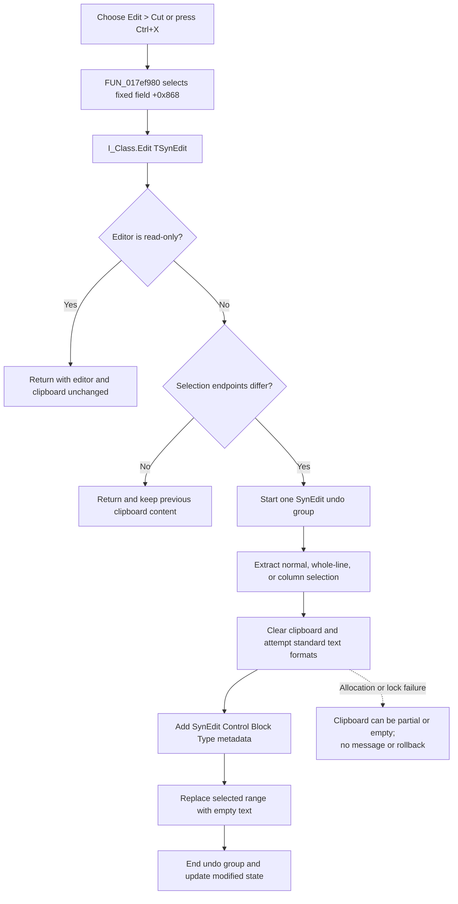

# Cut the selected Interpreter text

> Analysis status: Complete. The recovered menu handler, fixed form-field
> target, SynEdit selection and clipboard helpers, idle menu updater, undo
> callbacks, and sibling Copy and Paste commands support this explanation.

## Control

| Property | Recovered value |
| --- | --- |
| Form | I_Class |
| Form caption | Interpreter-<%s> |
| Component path | I_Class.MainMenu.mEdit.miCut |
| Parent menu | mEdit |
| Control class | TMenuItem |
| Caption | Cu&t |
| Initial enabled state | False |
| Shortcut | Ctrl+X (`16472`) |
| Hint | Not present in the recovered resource. |
| Handler name | miCutClick |
| Handler address | 017ef980 |
| Graph node | `resource:dfm:I_Class/I_Class.MainMenu.mEdit.miCut` |
| Handler node | `function:017ef980` |
| Graph layer | UI |

## What happens when selected

`FUN_017ef980` always cuts from the Interpreter form's `Edit` control. It does
not use `Sender`, keyboard focus, or the active control to select a target. The
handler reads the object at form offset `+0x868` and passes it to
`FUN_00bf1e50`. The DFM identifies this object as the client-aligned
`I_Class.Edit` `TSynEdit`. The editor's bound mouse and key handlers use the
same field.

The canonical SynEdit cut routine has this sequence:

1. It calls the editor's virtual read-only getter at slot `+0x278`. A true
   result stops the operation before clipboard access.
2. `FUN_00bf2c80` compares the selection endpoints. Equal endpoints stop the
   operation and preserve the existing clipboard.
3. `FUN_00c08780` starts an outer SynEdit undo group.
4. `FUN_00bf2ed0` extracts the selected text. It supports normal, whole-line,
   and column/block selection modes and inserts the applicable line separators.
5. `FUN_00bf1bf0` publishes the selection. Its standard writer clears the
   clipboard, attempts `CF_UNICODETEXT` (`13`), and also attempts `CF_TEXT`
   (`1`) unless the recovered platform-mode check returns `2`. It then adds the
   registered `SynEdit Control Block Type` format. The private payload starts
   with the SynEdit selection-mode byte and contains the copied text.
6. `FUN_00c08be0` replaces the selected range with an empty string. Its undo
   record retains the removed text, original endpoints, and selection mode.
   The selection collapses to the cut boundary.
7. `FUN_00c087b0` ends the outer undo group. The undo-list callback updates the
   editor's modified state and runs the normal SynEdit change notification.

The standard formats let other text applications paste the text. The private
format lets a compatible SynEdit paste preserve normal, whole-line, or column
selection semantics.

## Enabled state and guarded no-op paths

The DFM initializes **Cut** as disabled. `I_ClassEvents.OnIdle` resolves to
`FUN_017f14b0`. When the editor exists, this function calls
`FUN_00c0faf0` and enables the menu object at form offset `+0x710` only when
the flattened selection span is nonzero. Neighboring form fields identify
`+0x710`, `+0x718`, `+0x720`, and `+0x728` as Cut, Copy, Paste, and Delete.

The menu-state test does not inspect the editor's read-only state. Therefore,
a selected range can make the menu enabled in a read-only editor. The shared
cut routine supplies the authoritative read-only guard and then returns
without changing the clipboard, text, selection, undo list, or modified state.

If no text is selected, normal idle processing disables the command. If the
handler still runs from code or stale menu state, the shared cut routine
repeats the selection test and returns before it clears the clipboard.

## Undo, modified state, logging, and persistence

The deletion is an editor change, not a file operation. The outer undo-group
end invokes the SynEdit undo callback. That callback recalculates the modified
flag from the undo save point. `FUN_017f1540` later reads this flag when the
Interpreter document can close and offers the separate save decision. An Undo
command can restore the removed range as one grouped edit.

The direct handler and cut routine do not call an application macro recorder,
Interpreter command logger, or TINA audit logger. The undo record is editor
history, not a macro or persistent log. The Ctrl+X menu shortcut reaches the
same handler; this path does not add a separate keyboard-command record.

The command does not save the Interpreter file, project, registry, or
preference state. Its immediate external output is clipboard data. Its
application state change is the in-memory editor deletion and modified flag.
Persistence occurs only if a later Save operation writes the changed editor
content.

## Cut flow

## Clipboard and mutation failures

- The standard clipboard writer clears the existing clipboard before all
  allocations and locks have succeeded. A failed allocation or lock skips the
  affected format without a message. The clipboard can therefore contain only
  some formats, only the private SynEdit format, or no usable text format.
- The custom-format allocation and lock are also optional. Their failure can
  leave standard text available without SynEdit selection-mode metadata.
- These allocation failures do not return a failure status to the cut routine.
  The routine continues to delete the selection. Undo remains the recovered
  way to restore text when clipboard publication was incomplete.
- Clipboard publication happens before editor deletion. If a propagated
  exception stops the clipboard path, deletion has not started. If an
  exception occurs during deletion or notification, the clipboard can already
  contain the selection while the editor can be partly changed. The recovered
  path has no transaction or rollback across clipboard and editor state.
- The menu handler has no local retry, status text, confirmation, or exception
  dialog. A non-handled clipboard or editor exception propagates through the
  Delphi event path.

## Source and graph evidence

- Menu handler: [FUN_017ef980](../../../DecompiledSources/Tina16/functions/00000000017EF980__FUN_017ef980.c)
- Canonical SynEdit Cut routine: [FUN_00bf1e50](../../../DecompiledSources/Tina16/functions/0000000000BF1E50__FUN_00bf1e50.c)
- Selection-presence test: [FUN_00bf2c80](../../../DecompiledSources/Tina16/functions/0000000000BF2C80__FUN_00bf2c80.c)
- Selection extractor: [FUN_00bf2ed0](../../../DecompiledSources/Tina16/functions/0000000000BF2ED0__FUN_00bf2ed0.c)
- Standard and private clipboard publisher: [FUN_00bf1bf0](../../../DecompiledSources/Tina16/functions/0000000000BF1BF0__FUN_00bf1bf0.c)
- Standard clipboard text writer: [FUN_00bd1c50](../../../DecompiledSources/Tina16/functions/0000000000BD1C50__FUN_00bd1c50.c)
- Selection replacement and deletion helper: [FUN_00c08be0](../../../DecompiledSources/Tina16/functions/0000000000C08BE0__FUN_00c08be0.c)
- Undo-group begin and end wrappers: [FUN_00c08780](../../../DecompiledSources/Tina16/functions/0000000000C08780__FUN_00c08780.c) and [FUN_00c087b0](../../../DecompiledSources/Tina16/functions/0000000000C087B0__FUN_00c087b0.c)
- Undo callback and modified-state update: [FUN_00c0ea80](../../../DecompiledSources/Tina16/functions/0000000000C0EA80__FUN_00c0ea80.c), [FUN_00c0ea50](../../../DecompiledSources/Tina16/functions/0000000000C0EA50__FUN_00c0ea50.c), and [FUN_00c0dad0](../../../DecompiledSources/Tina16/functions/0000000000C0DAD0__FUN_00c0dad0.c)
- Interpreter close/save query: [FUN_017f1540](../../../DecompiledSources/Tina16/functions/00000000017F1540__FUN_017f1540.c)
- Application-idle menu updater: [FUN_017f14b0](../../../DecompiledSources/Tina16/functions/00000000017F14B0__FUN_017f14b0.c)
- Selection-span calculator used by the idle updater: [FUN_00c0faf0](../../../DecompiledSources/Tina16/functions/0000000000C0FAF0__FUN_00c0faf0.c)
- Sibling Copy and Paste wrappers: [FUN_017ef9a0](../../../DecompiledSources/Tina16/functions/00000000017EF9A0__FUN_017ef9a0.c) and [FUN_017ef9c0](../../../DecompiledSources/Tina16/functions/00000000017EF9C0__FUN_017ef9c0.c)

The graph gives `FUN_017ef980` one outgoing call, to `FUN_00bf1e50`. Its only
incoming application edge is the recovered `miCut.OnClick` trigger.

## Resource evidence

- The DFM binds `I_Class.MainMenu.mEdit.miCut.OnClick` to `miCutClick` at
  `017ef980`.
- `miCut` has caption `Cu&t`, Ctrl+X shortcut value `16472`, and initial
  `Enabled = false` state. It has no recovered hint, image reference, checked
  state, action, or extracted glyph.
- `I_Class.Edit` is a `TSynEdit` aligned to the client area. Its event handlers
  use the same form field `+0x868` that the Cut handler reads.
- `I_Class.I_ClassEvents.OnIdle` resolves to `017f14b0` and refreshes the
  enabled state of Cut, Copy, Paste, and Delete.
- No same-parent label candidate is available for this menu item.

## Relationship to Copy, Paste, and the VCL wrapper

| Command | Handler | Target and effect |
| --- | --- | --- |
| Copy | `FUN_017ef9a0` | Uses the same `Edit` field and copies the current selection without changing editor text. |
| Cut | `FUN_017ef980` | Uses the SynEdit Cut routine to copy and then delete a nonempty editable selection. |
| Paste | `FUN_017ef9c0` | Uses the same `Edit` field and the SynEdit Paste routine, which can consume private or standard clipboard data. |

The standard Delphi VCL edit Cut wrapper is
[FUN_00680a10](../../../DecompiledSources/Tina16/functions/0000000000680A10__FUN_00680a10.c).
It sends `WM_CUT` to a native edit-control window. This I_Class command does
not call that wrapper. `TSynEdit` owns its text buffer and uses the recovered
`FUN_00bf1e50` path instead.

## Analysis limits and annotation ownership

- `TIARA-diz.6.7.39` canonically owns `FUN_00bf2ed0`, `FUN_00bf1bf0`, and
  `FUN_00bd1c50`. This article cites these shared selection and clipboard
  functions without redefining them.
- This article owns `FUN_017ef980` and the previously unannotated shared
  SynEdit Cut routine `FUN_00bf1e50`. The separate Delete article owns its
  command wrapper; this article keeps broad selection replacement helper
  `FUN_00c08be0` as evidence only.
- The symbolic property name for virtual slot `+0x278` is not present in the
  recovered C. Its role as the read-only getter is established by its repeated
  use as the gate for SynEdit mutation commands, while Copy does not use it.
- The recovered path proves the undo and modified-state callbacks. It does not
  expose every application listener that the final virtual change notification
  can invoke.
