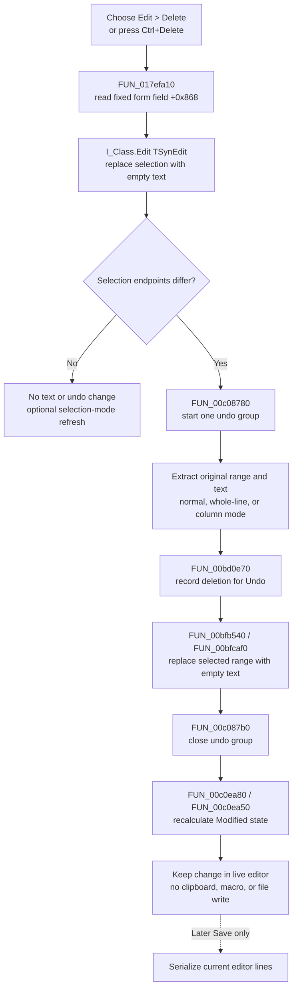

# Delete the selected Interpreter text

> Analysis status: Complete. The recovered menu handler, fixed form-field target, SynEdit selection replacement and undo paths, application-idle menu updater, modified-state callback, CloseQuery, and Save path support this explanation.

## Control

| Property | Recovered value |
| --- | --- |
| Form | I_Class |
| Form caption | `Interpreter-<%s>` |
| Component path | I_Class.MainMenu.mEdit.miDelete |
| Parent menu | mEdit |
| Control class | TMenuItem |
| Caption | &Delete |
| Initial enabled state | False |
| Shortcut | Ctrl+Delete (`16430`) |
| Hint | Not present in the recovered resource. |
| Handler name | miDeleteClick |
| Handler address | 017efa10 |
| Graph node | `resource:dfm:I_Class/I_Class.MainMenu.mEdit.miDelete` |
| Handler node | `function:017efa10` |
| Graph layer | UI |

## What happens when selected

`FUN_017efa10` always reads form field `+0x868` and passes that object plus an empty replacement string to `FUN_00c08be0`. The DFM and the other bound editor events identify this fixed field as `I_Class.Edit`, a client-aligned `TSynEdit`. The handler does not inspect the menu sender, current keyboard focus, or active control. It cannot delete text from another editor.

For a nonempty selection, the shared SynEdit path performs these operations:

1. It starts one undo group.
2. It orders the selection endpoints and extracts the original selected text. The extractor supports normal, whole-line, and column selection modes.
3. It records the original range, selection mode, and text as a deletion change in the undo manager.
4. It replaces the selected range with the supplied empty string. No replacement characters are inserted.
5. It completes the editor update and closes the undo group.

The selected text is removed from the live editor line collection. The deleted range no longer remains selected. The precise active-caret endpoint after each selection mode is inside the recovered SynEdit virtual text-store method, so the source does not prove one caret coordinate for all three modes.

## Enabled state and empty selection

The DFM initializes **Delete** as disabled. `I_ClassEvents.OnIdle` resolves to `FUN_017f14b0`. When `Edit` exists, this idle handler calls `FUN_00c0faf0` and enables the menu object at form offset `+0x728` only when the flattened selection span is nonzero. The neighboring fields and DFM menu order identify `+0x710`, `+0x718`, `+0x720`, and `+0x728` as Cut, Copy, Paste, and Delete.

The shared replacement helper also tests the selection. If code invokes the handler while the menu has stale state or no selection exists, it inserts no text, deletes no text, and adds no undo change. It can synchronize the editor's internal selection mode and request an editor refresh, but the document content stays unchanged.

Delete does not select the current character, word, line, or complete document when the selection is empty. This differs from a plain keyboard Delete command; the menu shortcut is Ctrl+Delete, and this handler is a selected-text replacement wrapper.

## Undo and modified state

`FUN_00c08780` and `FUN_00c087b0` bracket the change as one undo group. `FUN_00bd0e70` stores the removed text and range before the text-store mutation. The sibling **Undo** menu calls the canonical SynEdit undo routine, so a completed Delete operation can be reversed as one editor action.

The SynEdit constructor attaches `FUN_00c0ea80` as the undo-list change callback. When the group closes, that callback compares the current undo position with the saved marker through `FUN_00c0ea50` and updates the editor's Modified byte at `+0x5e0`. A successful deletion therefore marks the live editor modified unless the resulting undo position is the saved marker. Undoing back to that marker can clear the flag.

`I_Class.FormCloseQuery` reads this Modified state through `FUN_017f1540` and can ask whether to save, discard, or cancel closure. Delete itself does not show that prompt and does not save. The later Save path serializes the current editor line collection, including the deletion, and then clears the editor's modified marker through the normal file lifecycle.

## Read-only, macro, and persistence limits

- The normal DFM does not set `I_Class.Edit.ReadOnly`. Neither `FUN_017efa10` nor the idle enablement test checks the SynEdit read-only virtual property.
- The sibling Cut routine does have an explicit read-only guard before it reaches the same deletion helper. Delete does not. The recovered low-level virtual text-store body is not available, so this evidence does not prove whether an externally forced read-only editor rejects or accepts the mutation. There is no proven read-only no-op branch in this command.
- The direct handler and its shared descendants contain no recovered application macro-recorder or command-log call. The undo change is local editor history, not a TINA macro or Interpreter execution record.
- Delete does not use the Windows clipboard. The removed text exists in the undo record, but it is not published for Paste or for another application.
- The click writes no file, project, registry value, or preference. It changes only the live editor buffer, selection state, undo history, and modified state. Persistence requires a later Save action.

## Errors and partial state

- The handler receives no Boolean or status result and shows no confirmation or success message.
- It assumes that DFM field `+0x868` contains the editor. A missing editor object would fail before a safe no-op branch; the normal form construction supplies it.
- The handler and shared replacement path have no local exception handler, retry, or rollback. An allocation, undo-record, or text-store exception propagates through the Delphi event path.
- The undo record is prepared before the buffer mutation. If an exception occurs after that point, the recovered path has no explicit transaction that restores both editor text and undo history.
- An empty selection is not an error. It returns without a document or undo mutation.

## Delete flow

## Source and graph evidence

- [Delete menu wrapper `FUN_017efa10`](../../../DecompiledSources/Tina16/functions/00000000017EFA10__FUN_017efa10.c) passes fixed form field `+0x868` and null text to the shared selection-replacement helper.
- [SynEdit selected-text replacement `FUN_00c08be0`](../../../DecompiledSources/Tina16/functions/0000000000C08BE0__FUN_00c08be0.c) groups the update, tests and captures the selection, records the removed range, replaces it with the supplied text, and closes the group.
- [Selection-presence test `FUN_00bf2c80`](../../../DecompiledSources/Tina16/functions/0000000000BF2C80__FUN_00bf2c80.c) compares the two editor selection endpoints.
- [Selection extractor `FUN_00bf2ed0`](../../../DecompiledSources/Tina16/functions/0000000000BF2ED0__FUN_00bf2ed0.c) reconstructs the selected text for normal, whole-line, and column selection modes.
- [Undo change builder `FUN_00bd0e70`](../../../DecompiledSources/Tina16/functions/0000000000BD0E70__FUN_00bd0e70.c) adds the recovered selection-range change to the editor's undo list.
- [Replacement wrapper `FUN_00bfb540`](../../../DecompiledSources/Tina16/functions/0000000000BFB540__FUN_00bfb540.c) supplies the selection mode and replacement length to [the buffer update `FUN_00bfcaf0`](../../../DecompiledSources/Tina16/functions/0000000000BFCAF0__FUN_00bfcaf0.c), which removes a nonempty selection, inserts only nonempty replacement text, and emits editor update notifications.
- [Undo-group start `FUN_00c08780`](../../../DecompiledSources/Tina16/functions/0000000000C08780__FUN_00c08780.c) and [undo-group end `FUN_00c087b0`](../../../DecompiledSources/Tina16/functions/0000000000C087B0__FUN_00c087b0.c) bracket the Delete change.
- [SynEdit constructor `FUN_00bf1f20`](../../../DecompiledSources/Tina16/functions/0000000000BF1F20__FUN_00bf1f20.c) attaches [undo-list callback `FUN_00c0ea80`](../../../DecompiledSources/Tina16/functions/0000000000C0EA80__FUN_00c0ea80.c), which calls [modified-state updater `FUN_00c0ea50`](../../../DecompiledSources/Tina16/functions/0000000000C0EA50__FUN_00c0ea50.c).
- [Application-idle updater `FUN_017f14b0`](../../../DecompiledSources/Tina16/functions/00000000017F14B0__FUN_017f14b0.c) enables Cut, Copy, and Delete only for a nonzero [selection span from `FUN_00c0faf0`](../../../DecompiledSources/Tina16/functions/0000000000C0FAF0__FUN_00c0faf0.c).
- [Cut wrapper `FUN_017ef980`](../../../DecompiledSources/Tina16/functions/00000000017EF980__FUN_017ef980.c) reaches a shared Cut path whose explicit read-only guard is absent from Delete.
- [Form CloseQuery `FUN_017f0f20`](../../../DecompiledSources/Tina16/functions/00000000017F0F20__FUN_017f0f20.c) delegates to [modified-document guard `FUN_017f1540`](../../../DecompiledSources/Tina16/functions/00000000017F1540__FUN_017f1540.c), which reads editor Modified byte `+0x5e0` and can offer Save, discard, or cancel.
- [Interpreter Save writer `FUN_017ef620`](../../../DecompiledSources/Tina16/functions/00000000017EF620__FUN_017ef620.c) passes the editor's current line collection to the file serializer; this function is not called by Delete.
- [Recovered Delphi resource evidence](../../../DecompiledSources/Tina16/resources/dfm/ui-evidence.json) identifies the fixed `Edit` component as `TSynEdit` and supplies the menu caption, initial disabled state, Ctrl+Delete shortcut, and OnClick binding.

## Relationship to Cut, Copy, and Paste

| Command | Handler | Target and effect |
| --- | --- | --- |
| Cut | `FUN_017ef980` | Copies a selected range to the clipboard and then deletes it when its editor-state guard permits. |
| Copy | `FUN_017ef9a0` | Copies the same editor selection without changing the buffer or undo state. |
| Paste | `FUN_017ef9c0` | Replaces or inserts text in the same editor from SynEdit-specific or standard clipboard data. |
| Delete | `FUN_017efa10` | Replaces the same editor selection with empty text without clipboard access. |

This article does not redefine the shared clipboard or SynEdit implementation owned by other Beads.

## Analysis limits and annotation ownership

- This Bead annotates only `FUN_017efa10`, the unique `I_Class.miDeleteClick` wrapper.
- Shared SynEdit selection, replacement, undo, and modified-state functions remain evidence only. Other control articles use the same framework code.
- The source does not recover Delphi field names for form offsets `+0x868` and `+0x728`. Their identities come from the DFM component tree, bound event functions, neighboring menu order, and repeated data flow.
- The shared virtual buffer-deletion body and one universal post-delete caret coordinate are not recovered. The article does not infer them.
