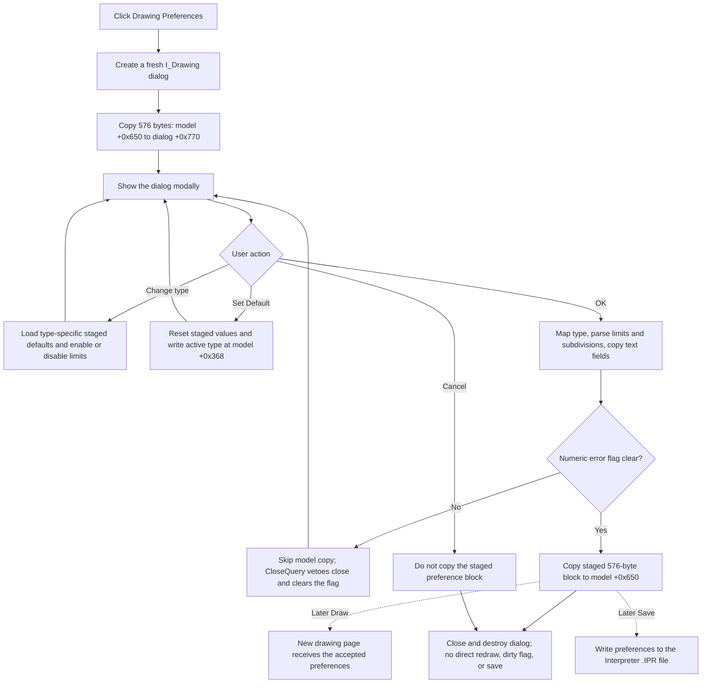

# Open Interpreter drawing preferences

> Analysis status: Complete. The recovered handler, dialog resource, staging path, validation path, and later consumers support this explanation.

## Control

| Property | Recovered value |
| --- | --- |
| Form | I_Class |
| Component path | I_Class.MainMenu.miSettings.miDrawing |
| Control class | TMenuItem |
| Caption | &Drawing Preferences |
| Handler name | miDrawingClick |
| Handler address | 017efb70 |
| Graph node | `resource:dfm:I_Class/I_Class.MainMenu.miSettings.miDrawing` |
| Handler node | `function:017efb70` |
| Graph layer | UI |

## What happens when clicked

`FUN_017efb70` creates a new `I_Drawing` dialog. It passes the Interpreter model from the `I_Class` form field at `+0xb48` to `FUN_017ebb80`, shows the dialog modally, ignores the returned modal result, and destroys the dialog. The handler does not render a diagram, change the editor text, mark the document as modified, or save a file.

`FUN_017ebb80` stores the model pointer in the dialog and copies the complete 576-byte drawing-preference block from model offset `+0x650` to dialog offset `+0x770`. It then fills the controls from this staged copy. Thus, opening the dialog does not change the model.

## Staged drawing fields

The recovered setup and OK handlers map these controls to the staged block:

| Control | Staged field | Meaning |
| --- | --- | --- |
| `rgType` | `+0x770` | Drawing type |
| `eUPar` | `+0x771` | Parameter unit, maximum 40 characters |
| `eURes` | `+0x79a` | Result unit, maximum 40 characters |
| `eNPar` | `+0x7c3` | Parameter name, maximum 40 characters |
| `eNRes` | `+0x7ec` | Result name, maximum 40 characters |
| `eLLimit` | `+0x840` | Left limit |
| `eRLimit` | `+0x848` | Right limit |
| `ePoints` | `+0x850` | Interval subdivision count |

The radio group contains `Lin-Lin`, `Log-Lin`, `Bode`, `Amplitude & Phase`, and `Fourier`. The index-to-model mapping is `0, 1, 2, 3, 5`; model value 4 is not available in this dialog. Fourier disables both limit editors. The other types enable them.

When the user selects a drawing type, `FUN_017eba20` loads the type-specific defaults into the staged controls. Lin-Lin and Log-Lin use limits 0 to `2e-5` and 100 subdivisions. Bode, Amplitude & Phase, and Fourier use limits 10,000 to 1,000,000 and 100 subdivisions. The handler also replaces the staged names and units with the defaults for the selected type. It does not preview or redraw a page.

## OK, validation, and Cancel

The OK handler `FUN_017eb7f0` reads the selected type, parses the two floating-point limits and the integer subdivision count, and copies the four text fields into the staged block. If no edit has reported an error, it copies the complete 576-byte staged block back to model offset `+0x650`.

The recovered code does not test that the left limit is less than the right limit. It relies on the numeric edit controls and their error callbacks. A numeric error is shown once and sets a dialog error flag. OK then skips the model copy. `FUN_017ebac0` vetoes that close attempt and clears the flag, so the dialog stays open and the user can correct the value.

The Cancel button is a standard `bkCancel` button and has no custom click handler. It normally closes the modal dialog without calling the OK copy path. Therefore, Cancel leaves the model preference block at `+0x650` unchanged.

## Set Default exception

`Set Default` is not a passive reset. `FUN_017eba90` replaces the staged controls with factory values: Lin-Lin, parameter unit `s`, result unit `V`, parameter name `t`, result name `Out`, limits 0 to `2e-5`, and 100 subdivisions. It also calls `FUN_017e3310`, which immediately writes the selected drawing-type value to a separate model field at `+0x368`.

Consequently, Cancel after `Set Default` still leaves the main preference block at `+0x650` unchanged, but it does not restore the separate active drawing-type field at `+0x368`. No direct redraw or file write follows this side effect.

## Later use and persistence

The accepted preferences are defaults for later drawing creation. `FUN_017e4620` copies the model block at `+0x650` into a new drawing page. If it reuses a page with another curve type, it reports `Curve type mismatch`. Explicit drawing instructions can replace these defaults before page creation.

The preferences are stored in an Interpreter `.IPR` file only when the user later runs the editor Save command. The Drawing Preferences handler and its OK path do not write an INI file, registry value, or project file. They also do not set the recovered editor-modified flag. A preference-only change therefore does not, by itself, produce the editor's existing unsaved-text prompt in this recovered path.

The nearby Settings commands use separate paths:

- `Numerical Format` opens another modal dialog and refreshes numeric display settings after it closes.
- `View symbol table` creates or reuses a separate modeless symbols form.
- `Options` opens a modal dialog for a separate global options object.

These commands do not share the Drawing Preferences staging or commit block.

## Click flow

## Handler evidence

- [Click handler `FUN_017efb70`](../../../DecompiledSources/Tina16/functions/00000000017EFB70__FUN_017efb70.c) creates, shows, and destroys the modal dialog.
- [Dialog initializer `FUN_017ebb80`](../../../DecompiledSources/Tina16/functions/00000000017EBB80__FUN_017ebb80.c) copies the model preference block into dialog staging.
- [Control loader `FUN_017eb410`](../../../DecompiledSources/Tina16/functions/00000000017EB410__FUN_017eb410.c) maps the staged fields to the dialog controls.
- [Form-show handler `FUN_017eb780`](../../../DecompiledSources/Tina16/functions/00000000017EB780__FUN_017eb780.c) sets the initial radio selection and limit-editor state.
- [Type handler `FUN_017eba20`](../../../DecompiledSources/Tina16/functions/00000000017EBA20__FUN_017eba20.c) selects type defaults after initialization.
- [Type-default loader `FUN_017eb590`](../../../DecompiledSources/Tina16/functions/00000000017EB590__FUN_017eb590.c) supplies the recovered ranges, subdivision count, names, and units.
- [OK handler `FUN_017eb7f0`](../../../DecompiledSources/Tina16/functions/00000000017EB7F0__FUN_017eb7f0.c) parses controls and conditionally commits the staged block.
- [Close-query handler `FUN_017ebac0`](../../../DecompiledSources/Tina16/functions/00000000017EBAC0__FUN_017ebac0.c) vetoes a close after a numeric error.
- [Set Default handler `FUN_017eba90`](../../../DecompiledSources/Tina16/functions/00000000017EBA90__FUN_017eba90.c), [default coordinator `FUN_017e2560`](../../../DecompiledSources/Tina16/functions/00000000017E2560__FUN_017e2560.c), and [factory initializer `FUN_010cd100`](../../../DecompiledSources/Tina16/functions/00000000010CD100__FUN_010cd100.c) establish the default values.
- [Active-type writer `FUN_017e3310`](../../../DecompiledSources/Tina16/functions/00000000017E3310__FUN_017e3310.c) proves the immediate `+0x368` side effect.
- [Drawing-page coordinator `FUN_017e4620`](../../../DecompiledSources/Tina16/functions/00000000017E4620__FUN_017e4620.c) consumes accepted defaults during later drawing creation.
- [Interpreter Save handler `FUN_017ef620`](../../../DecompiledSources/Tina16/functions/00000000017EF620__FUN_017ef620.c) establishes the later `.IPR` persistence boundary.

## Analysis limits

- Recovered field names are unavailable. This article identifies model fields by their offsets.
- The physical `.IPR` encoding is not established by this click path.
- The dialog does not contain a recovered exception handler. An allocation, modal-dialog, or later file-write exception follows the surrounding Delphi runtime behavior; the click handler has no local recovery or rollback branch.
- Only `FUN_017efb70` is annotated by this control task. The direct `I_Drawing` handlers belong to their own control articles.
