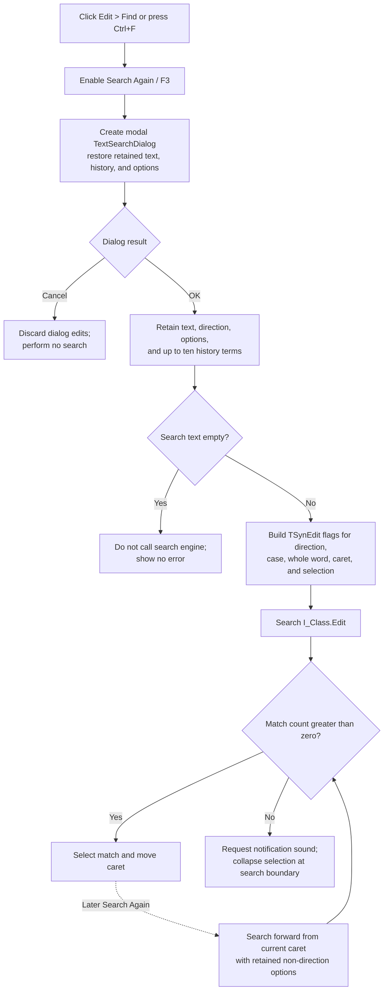

# Find text in the Interpreter editor

> Analysis status: Complete for the recovered control boundary. The modal dialog, option mapping, Interpreter editor target, first search, Search Again behavior, no-match response, retained history, and persistence boundary are recovered. The regular-expression checkbox has no recovered effect in this path.

## Control

| Property | Recovered value |
| --- | --- |
| Form | I_Class |
| Form caption | Interpreter-`<%s>` |
| Component path | I_Class.MainMenu.mEdit.miFind |
| Control class | TMenuItem |
| Caption | &Find... |
| Shortcut | Ctrl+F (`16454`) |
| Handler name | miFindClick |
| Handler address | 017efa50 |
| Graph node | `resource:dfm:I_Class/I_Class.MainMenu.mEdit.miFind` |
| Handler node | `function:017efa50` |
| Graph layer | UI |

The menu item has no hint, glyph, checked state, or list data. Its behavior is established by the handler and the custom search-dialog and TSynEdit paths.

## What happens when clicked

`FUN_017efa50` first enables adjacent **Search Again** at form field `+0x748`. That menu item starts disabled in the recovered resource and has shortcut F3. The handler then calls shared dialog coordinator `FUN_017f2f00` in Find mode.

The coordinator creates a `TTextSearchDialog`, restores the retained search text, direction, options, and up to ten history items, and shows it modally. The dialog targets `I_Class.Edit`, the form's `TSynEdit` at `+0x868`; it does not search a file name, compiler message, or status panel.

When a retained preload flag is set, the coordinator can replace the retained search text with a same-line editor selection. If there is no suitable selection, it derives text at the caret. The source does not recover the user-facing setting that controls this preload flag, so this is a conditional initialization path, not a guaranteed click effect.

### Dialog result

- **Cancel** returns modal result 2. The coordinator destroys the dialog without copying its edited text, direction, options, or history to the retained search state, and it performs no search. **Search Again** remains enabled because the menu handler enabled it before the dialog opened.
- **OK** returns modal result 1. The coordinator copies the dialog state to process-level search fields. If the search text is nonempty, it immediately calls `FUN_017f32c0` against `I_Class.Edit` and marks later searches as starting from the current caret. If the text is empty, it does not call the search engine and gives no error or beep.

`TextSearchDialog.OnCloseQuery` updates the combo-box history only for OK with nonempty text. It moves an existing equal term to index zero or inserts a new term at index zero. The coordinator retains at most the first ten history entries for the next dialog.

## Search option mapping

The custom dialog exposes these recovered controls:

| Dialog option | TSynEdit effect in the first accepted Find |
| --- | --- |
| Direction: Forward | Searches forward; option bit `0x04` is clear |
| Direction: Backward | Searches backward; option bit `0x04` is set |
| Case sensitivity | Adds match-case bit `0x01` |
| Whole words only | Adds whole-word bit `0x02` |
| Search from caret | Omits entire-scope bit `0x08` |
| Search from caret clear | Adds entire-scope bit `0x08` |
| Selected text only | Adds selection-scope bit `0x10` |
| Regular expression | No recovered read, stored field, or search flag in the I_Class coordinator |

The options are independent. For example, selection-only and backward can be active together. There is no wrap option in the dialog and no second search call at the opposite document boundary.

The regular-expression checkbox is present in the shared `TTextSearchDialog` DFM, but `FUN_017f2f00` does not initialize or read its control field and `FUN_017f32c0` does not add a regular-expression flag. This evidence does not support regular-expression matching for Interpreter Find.

## Match and no-match effects

`FUN_017f32c0` calls the TSynEdit search routine with the retained search text, empty replacement text in Find mode, and the option mask above.

- A match increments the engine result count, selects the matching text, moves the caret to that selection, and makes it visible. Find does not change the editor text or modified state.
- A zero result requests the recovered standard notification sound with argument `0x40`. It then collapses the current selection at its forward end or backward beginning, moves the caret to that boundary, and leaves the document text unchanged.
- An empty search string passed through Search Again also returns zero and reaches this no-match notification path. The initial modal OK path avoids it because it does not call the executor for empty text.
- The executor releases a temporary global search object after each attempt when one exists. It has no local exception handler, message dialog, retry, or rollback.

The TSynEdit routine raises an exception if the editor has no search engine. FormCreate assigns an editor search engine before normal use; the menu handler does not add a separate guard.

## Search Again behavior

The adjacent **Search Again** handler calls `FUN_017f32c0` directly in Find mode with direction argument false. Therefore F3 is not a literal replay of every dialog option:

- it reuses the retained search text, match-case, whole-word, and selection-only values;
- it uses the current-caret scope established after an accepted nonempty Find;
- it always searches forward, even if the accepted dialog search used **Backward**;
- it does not wrap and uses the same notification-and-selection-collapse behavior when no later match exists.

Because `miFind` enables Search Again before the modal result is known, Cancel can leave F3 available with the search state from an earlier accepted search. If no nonempty term has ever been accepted, F3 reaches the empty-term no-match path.

## Click flow

## State and persistence boundaries

- A successful Find changes only the `TSynEdit` caret and selection. It does not edit Interpreter source, mark the document modified, compile, run, or save it.
- Accepted dialog values and up to ten history entries are kept in module-level memory and are reused by later Find and Replace dialogs. This state can outlive one `I_Class` form instance during the same process.
- Module finalization clears the retained search, replacement, and history strings. The traced path has no INI, registry, project, or file write, so it does not prove persistence across application restarts.
- Cancel does not overwrite retained search fields, but it does leave the current form's Search Again menu enabled.

## Contrast with Equation Editor Find

The Equation Editor comparison establishes that the menu caption alone is insufficient evidence. `TEquEditor.EEFindMnuClick` only executes a modeless VCL `TFindDialog`, and its recovered `OnFind` event is unassigned, so Find Next does not search `EEMemo` there. In contrast, `I_Class.miFind` creates the custom modal dialog and directly calls the TSynEdit search routine on `I_Class.Edit`. The two forms do not share their dialog instance or editor target.

## Source evidence

- [Find menu handler `FUN_017efa50`](../../../DecompiledSources/Tina16/functions/00000000017EFA50__FUN_017efa50.c) enables form menu field `+0x748` and enters the shared dialog coordinator in Find mode.
- [Find/Replace dialog coordinator `FUN_017f2f00`](../../../DecompiledSources/Tina16/functions/00000000017F2F00__FUN_017f2f00.c) creates the modal dialog, initializes and retains its options and histories, seeds text from the editor when configured, and starts the first nonempty search.
- [Editor search executor `FUN_017f32c0`](../../../DecompiledSources/Tina16/functions/00000000017F32C0__FUN_017f32c0.c) builds the option mask, calls TSynEdit search, and performs the zero-result notification and selection collapse.
- [Search Again handler `FUN_017efa90`](../../../DecompiledSources/Tina16/functions/00000000017EFA90__FUN_017efa90.c) proves the later hard-coded forward Find call.
- [TextSearchDialog close-query handler `FUN_0106ea70`](../../../DecompiledSources/Tina16/functions/000000000106EA70__FUN_0106ea70.c) updates nonempty accepted history terms, and [history collector `FUN_0106e7d0`](../../../DecompiledSources/Tina16/functions/000000000106E7D0__FUN_0106e7d0.c) retains at most ten entries.
- [TSynEdit search routine `FUN_00c09100`](../../../DecompiledSources/Tina16/functions/0000000000C09100__FUN_00c09100.c) proves scope, direction, match selection, caret movement, empty-string return, and lack of wrap.
- [Equation Editor Find handler `FUN_014645e0`](../../../DecompiledSources/Tina16/functions/00000000014645E0__FUN_014645e0.c) supplies the comparison: it only calls its VCL dialog's Execute method.
- [Recovered Delphi resource evidence](../../../DecompiledSources/Tina16/resources/dfm/ui-evidence.json) identifies `I_Class.Edit`, the Find and Search Again menu states and shortcuts, the custom dialog controls and modal results, and the unbound Equation Editor dialog.

## Analysis ownership

- `.634` owns unique Find handler `FUN_017efa50`, shared Find/Replace dialog coordinator `FUN_017f2f00`, and shared editor search executor `FUN_017f32c0`.
- Sibling `.636` owns the Replace wrapper and `.637` owns the Search Again wrapper. They cite and omit the shared functions above.
- The generic `TTextSearchDialog` handlers, TSynEdit internals, VCL menu setter, Equation Editor handler, and notification thunk remain evidence-only.
