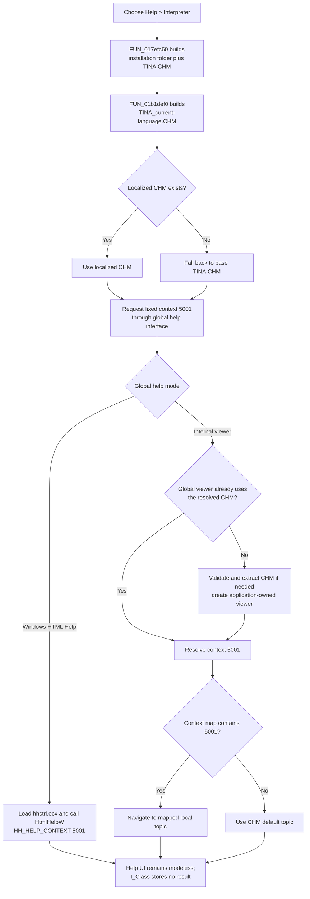

# Open the Interpreter help topic

> Analysis status: Complete. The recovered handler, form help-context initialization, localized CHM resolver, global help dispatcher, Windows HTML Help path, and internal CHM viewer support this explanation.

## Control

| Property | Recovered value |
| --- | --- |
| Form | I_Class |
| Form caption | `Interpreter-<%s>` |
| Component path | I_Class.MainMenu.mHelp.miHelp |
| Parent menu | Help |
| Control class | TMenuItem |
| Caption | &Interpreter |
| Hint | Not present in the recovered resource. |
| Shortcut | Not present in the recovered resource. |
| Handler name | miHelpClick |
| Handler address | 017efc60 |
| Help file | `TINA.CHM`, with an existing language-specific variant preferred |
| Help context | `5001` (`0x1389`) |
| Graph node | `resource:dfm:I_Class/I_Class.MainMenu.mHelp.miHelp` |
| Handler node | `function:017efc60` |
| Graph layer | UI |

## What happens when selected

`FUN_017efc60` requests the Interpreter help context from TINA's local compiled HTML Help collection. It does not open an Interpreter document, a web URL, or a browser.

The handler performs these operations:

1. It concatenates the global TINA installation folder, the recovered path separator, and `TINA.CHM`.
2. It passes that base path to canonical resolver `FUN_01b1def0`.
3. The resolver builds a language-specific candidate in the same directory: `TINA_<current-language-marker>.CHM`.
4. If that candidate exists, the resolver returns it. If it does not exist, the resolver returns the original `TINA.CHM` path without an error.
5. The handler calls virtual help-context method `+0x20` on the process-wide application help interface at application offset `+0xb8`. It supplies fixed context `5001` and the resolved CHM path.

The virtual call reaches canonical dispatcher `FUN_01d46890`. It selects Windows HTML Help or TINA's internal CHM viewer from a global mode flag.

## Fixed context and dynamic state

This menu command does not calculate its help context from the sender, focused control, editor caret, selected Interpreter command, or current status panel. It always sends `5001`.

`FUN_017eed60`, the I_Class help-context initializer, also assigns `5001` to the form through the VCL help-context setter. It assigns other context numbers to individual form controls. This confirms that `5001` is the form-level Interpreter context, while this menu wrapper deliberately ignores the more specific context of a focused child control.

Three runtime values can change the final route:

- the TINA installation-folder string;
- the current language marker and whether the localized CHM candidate exists;
- the global choice between Windows HTML Help and the internal viewer.

The recovered binary does not expose the final HTML topic name that context `5001` maps to inside the selected CHM. The **Interpreter** menu caption, form-level context assignment, and fixed context request establish the help area, but not the CHM's internal file name or title.

## Windows HTML Help mode

When the global mode flag selects external help, `FUN_01d46890` does this work:

1. It initializes the application help manager and resolves the requested CHM path through that manager.
2. It gets the registered application help-window handle. The I_Class handler does not supply or retain its own window handle.
3. `FUN_0042a4a0` loads `hhctrl.ocx` when needed and resolves both `HtmlHelpA` and `HtmlHelpW`.
4. `FUN_0042a560` calls `HtmlHelpW` with command `0x0f` (`HH_HELP_CONTEXT`) and data value `5001`.
5. If `HtmlHelpW` returns a window handle, the dispatcher asks Windows to show that window.

This route is modeless from the menu handler's point of view. The handler does not wait for a modal result and does not keep the help-window handle.

## Internal CHM viewer mode

When the global mode flag selects internal help, the dispatcher compares the resolved CHM path with the path stored in the process-global internal viewer:

- If the existing viewer uses the same CHM, the dispatcher reuses it.
- If there is no viewer, or its CHM path differs, the dispatcher constructs a viewer for the resolved file and stores it in the global viewer slot.

The internal viewer verifies the CHM file, extracts its data into the recovered `DesignSoft\Help\` cache when necessary, and builds its context and topic indexes. It creates and shows its viewer form through the global VCL `Application`, so the window is application-owned and not an I_Class child form.

For context `5001`, `FUN_00b04480` starts with the CHM default topic and searches the context map. A matching entry replaces the default. `FUN_00b046f0` then asks the viewer to navigate to the selected local topic.

## Help flow

## No-op and error behavior

- The click handler has no selection, editor-state, license, or network guard. Each invocation attempts the help request.
- A missing localized CHM is an expected fallback. The resolver uses the base `TINA.CHM` path and shows no message.
- In Windows HTML Help mode, failure to load `hhctrl.ocx`, resolve its entry points, or open the requested context can return zero. The I_Class handler ignores all results and has no retry, alternate file, status message, or control-specific error dialog.
- In internal mode, a missing selected CHM raises an exception with the recovered suffix ` does not exist.`. An extraction failure raises an exception with the recovered suffix ` could not extract help file.`. The menu handler has no local catch or fallback to Windows HTML Help.
- If internal mode finds no mapping for context `5001`, it uses the CHM default topic. If the resulting local topic cannot be loaded, the shared navigator does not establish a new page; this handler does not report that no-op.
- Repeated clicks can reuse the same process-global internal viewer. A change in language that resolves to a different CHM path causes the dispatcher to construct a viewer for that different path.

## State and persistence

- The handler does not change Interpreter text, caret position, command execution, undo state, modified state, or form visibility.
- It does not record a recovered macro command. Its direct call graph contains no recorder; viewer dispatch occurs through the virtual global-help call.
- It does not write a project, circuit, user preference, registry value, or the CHM itself.
- Internal-viewer mode can create extracted help-cache files under the recovered `DesignSoft\Help\` location, including `chm_ok.dat`, and can retain a viewer in process-global state. These are shared help-system effects, not I_Class document state.
- Windows HTML Help owns its own window lifetime. The I_Class wrapper stores no selected path, context, return code, or help handle.

## Source and graph evidence

- I_Class help menu wrapper: [FUN_017efc60](../../../DecompiledSources/Tina16/functions/00000000017EFC60__FUN_017efc60.c)
- I_Class help-context initializer: [FUN_017eed60](../../../DecompiledSources/Tina16/functions/00000000017EED60__FUN_017eed60.c)
- Canonical localized-help resolver: [FUN_01b1def0](../../../DecompiledSources/Tina16/functions/0000000001B1DEF0__FUN_01b1def0.c)
- Canonical help-context dispatcher: [FUN_01d46890](../../../DecompiledSources/Tina16/functions/0000000001D46890__FUN_01d46890.c)
- Windows HTML Help loader and Unicode call wrapper: [FUN_0042a4a0](../../../DecompiledSources/Tina16/functions/000000000042A4A0__FUN_0042a4a0.c) and [FUN_0042a560](../../../DecompiledSources/Tina16/functions/000000000042A560__FUN_0042a560.c)
- Internal CHM constructor: [FUN_00b02f00](../../../DecompiledSources/Tina16/functions/0000000000B02F00__FUN_00b02f00.c)
- Internal context navigation and context-map lookup: [FUN_00b046f0](../../../DecompiledSources/Tina16/functions/0000000000B046F0__FUN_00b046f0.c) and [FUN_00b04480](../../../DecompiledSources/Tina16/functions/0000000000B04480__FUN_00b04480.c)
- Internal viewer-form creation and display: [FUN_00b02670](../../../DecompiledSources/Tina16/functions/0000000000B02670__FUN_00b02670.c)
- VCL help-context field setter: [FUN_0064cf60](../../../DecompiledSources/Tina16/functions/000000000064CF60__FUN_0064cf60.c)
- The graph records three direct calls from `FUN_017efc60`: Unicode string concatenation, `FUN_01b1def0`, and UnicodeString array finalization. The global help request is virtual, so `FUN_01d46890` is not a direct graph edge from this wrapper.

## Resource evidence

- The DFM binds `I_Class.MainMenu.mHelp.miHelp.OnClick` to `miHelpClick` at `017efc60`.
- The item is a `TMenuItem` under the **Help** menu and has caption `&Interpreter`.
- It has no recovered hint, shortcut, checked state, action, image reference, or extracted glyph.
- There is no same-parent label candidate for this menu item.

## Analysis limits and annotation ownership

- `TIARA-diz.6.7.291` canonically owns localized resolver `FUN_01b1def0` and help-context dispatcher `FUN_01d46890`. This article cites both without redefining them.
- This article owns only `FUN_017efc60`. Generic string concatenation, UnicodeString finalization, VCL help-context setters, Windows HTML Help wrappers, and internal-viewer functions remain canonical or evidence-only.
- The current language text, global help-mode flag name, registered external owner window, installed CHM files, and context-to-topic table contents are runtime values that this handler does not recover.
