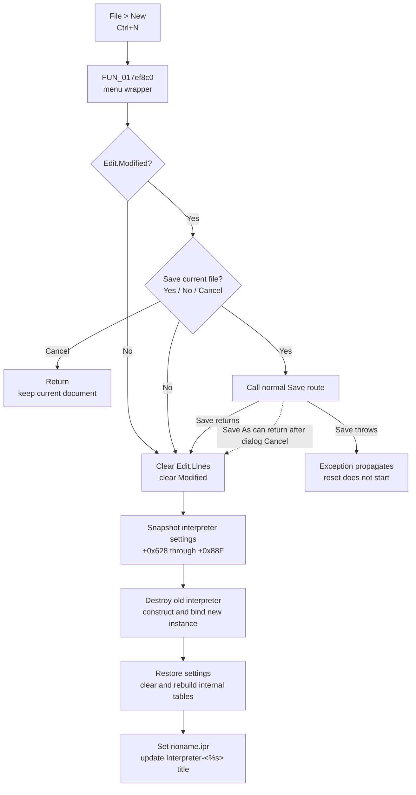

# &New

> Analysis status: Source reviewed. The unsaved-change decision, live document reset, retained interpreter settings, title update, and failure boundaries are supported by recovered code.

## Control

| Property | Recovered value |
| --- | --- |
| Form | I_Class |
| Component path | I_Class.MainMenu.mFile.miNew |
| Control class | TMenuItem |
| Caption | &New |
| Shortcut | `16462` (`Ctrl+N`) |
| Handler name | miNewClick |
| Handler address | `017ef8c0` |
| Graph node | `resource:dfm:I_Class/I_Class.MainMenu.mFile.miNew` |
| Handler node | `function:017ef8c0` |
| Graph layer | UI |

## What happens when clicked

[`FUN_017ef8c0`](../../../DecompiledSources/Tina16/functions/00000000017EF8C0__FUN_017ef8c0.c) is a one-call menu wrapper. It passes the current `I_Class` form to the shared New coordinator [`FUN_017eef40`](../../../DecompiledSources/Tina16/functions/00000000017EEF40__FUN_017eef40.c). The toolbar **New** button uses a different wrapper, `FUN_017efd40`, but reaches the same coordinator. The coordinator does not inspect `Sender`, so the menu and toolbar routes have the same document effect.

### Unsaved-change decision

The coordinator first calls the shared close guard [`FUN_017f1540`](../../../DecompiledSources/Tina16/functions/00000000017F1540__FUN_017f1540.c) with operation value `1`.

- If `Edit.Modified` is false, the guard accepts New without a prompt.
- If `Edit.Modified` is true, it builds a Yes/No/Cancel prompt from localized text and the current file name.
- **Cancel** returns false. The New coordinator then returns without changing the editor, file name, title, or interpreter object.
- **No** accepts the reset without writing a file.
- **Yes** calls the normal Save menu handler. A named document is written to its current path. `noname.ipr` opens Save As.

The guard calls a `void` Save handler and does not test whether Save As accepted a path. Therefore, if the user selects **Yes** and then cancels Save As for `noname.ipr`, the guard still returns true and New discards the current document. A save exception has a different result: it propagates before the guard returns, so the reset does not start.

### Accepted reset

After the guard accepts the command, the coordinator performs these operations in order:

1. It clears `Edit.Lines` and clears `Edit.Modified`.
2. It resets the form's current status string and refreshes the line/column, error, and interpreter-mode status controls. The exact localized text for the numeric string identifiers is not present in the recovered DFM evidence.
3. It copies the old interpreter object's configuration block at offsets `+0x628` through `+0x88F` to form-owned temporary fields. This block is also used by the Interpreter's numerical-format configuration and file serialization paths.
4. It destroys the old interpreter object at form offset `+0xB48`, constructs a new interpreter object, and binds it to the existing `Edit` control and line/column status panel.
5. It copies the saved configuration block into the new interpreter. Thus, New removes document and session content but retains this interpreter configuration.
6. It clears and rebuilds the new interpreter's internal tables. The path clears the table at interpreter offset `+0x550`, initializes built-in parameter definitions such as `l_limit`, `r_limit`, and `i_subdiv`, imports available host parameters, clears the generated symbol-text list at `+0x890`, and rebuilds that list. It does not compile or run the empty editor.
7. It changes the current file-name field to `noname.ipr`, extracts that base name, formats it through the DFM caption template `Interpreter-<%s>`, and assigns the result to the form caption.

The reset changes live editor, interpreter, status, path, and title state. It does not create or write `noname.ipr`, update a recent-file list, close the form, or persist a preference.

## Click flow

## State and error boundaries

- The reset is immediate. There is no OK/Cancel staging dialog after the unsaved-change prompt.
- A direct prompt Cancel is a full no-op because it occurs before the first editor or model mutation.
- A canceled Save As is not a no-op. The shared guard treats the normal return from Save As as approval and continues with the reset.
- The coordinator has no local exception handler or rollback. After the reset starts, a constructor, table-initialization, string, or UI exception can leave some earlier operations applied. For example, the editor is cleared and marked unmodified before the old interpreter is replaced.
- The command retains the copied interpreter configuration block, but it does not retain the prior source lines, current file path, interpreter tables, or generated symbol-text list.
- The form remains open. Its normal destroy handler later owns the current interpreter object.

## Handler evidence

- [`FUN_017ef8c0`](../../../DecompiledSources/Tina16/functions/00000000017EF8C0__FUN_017ef8c0.c) contains only the call to the shared New coordinator.
- [`FUN_017eef40`](../../../DecompiledSources/Tina16/functions/00000000017EEF40__FUN_017eef40.c) contains the guard, editor clear, interpreter replacement, settings copy, table rebuild, `noname.ipr` assignment, and caption update.
- [`FUN_017f1540`](../../../DecompiledSources/Tina16/functions/00000000017F1540__FUN_017f1540.c) reads `Edit.Modified`, maps dialog results `2`, `6`, and `7` to Cancel, Yes, and No, and calls Save only for Yes.
- [`FUN_017ef6c0`](../../../DecompiledSources/Tina16/functions/00000000017EF6C0__FUN_017ef6c0.c) selects Save As for `noname.ipr`. [`FUN_017ef730`](../../../DecompiledSources/Tina16/functions/00000000017EF730__FUN_017ef730.c) returns normally when its dialog is canceled.
- [`FUN_017e8080`](../../../DecompiledSources/Tina16/functions/00000000017E8080__FUN_017e8080.c) binds the new interpreter to the editor and status control. [`FUN_017e1bd0`](../../../DecompiledSources/Tina16/functions/00000000017E1BD0__FUN_017e1bd0.c) constructs its internal lists and default state.
- [`FUN_017f0730`](../../../DecompiledSources/Tina16/functions/00000000017F0730__FUN_017f0730.c), the form destroy handler, later destroys the interpreter object stored at `+0xB48`.

## Resource evidence

- [Recovered UI evidence](../../../DecompiledSources/Tina16/resources/dfm/ui-evidence.json) binds `miNew.OnClick` to `017ef8c0`, supplies caption **&New** and shortcut `16462`, identifies `Edit` as `TSynEdit`, and supplies the caption template `Interpreter-<%s>`.
- The menu item has no hint, action, image reference, or embedded glyph.
- The related `sbFileNew` speed button has hint **New**, two glyph frames, and handler `017efd40`. Its [extracted blank-page glyph](../../../glyph/0229_I_Class_I_Class_pnToolPanel_sbFileNew_Glyph_Data.png) supports the resource intent, while the shared call to `FUN_017eef40` proves that it performs the same reset.

## Analysis limits

- Recovered offsets do not supply original Delphi field names for the retained interpreter configuration block.
- The localized prompt and status strings are requested by numeric identifiers. The source proves their control flow, but not all displayed wording.
- The source proves the canceled Save As continuation. It does not prove that this data-loss edge was intentional.
