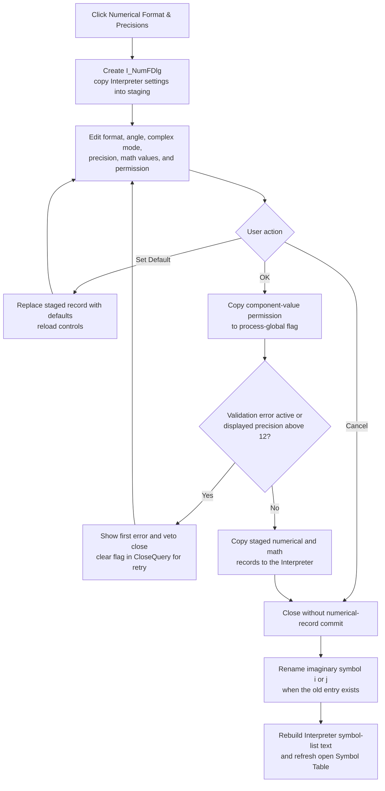

# Configure Interpreter numerical formats and precision

> Analysis status: Complete for the recovered control boundary. The dialog staging, valid-OK commit, validation retry, early global-checkbox write, Interpreter consumers, symbol refresh, Cancel behavior, and later persistence paths are recovered.

## Control

| Property | Recovered value |
| --- | --- |
| Form | I_Class |
| Form caption | Interpreter-`<%s>` |
| Component path | I_Class.MainMenu.miSettings.miNumericalformat |
| Control class | TMenuItem |
| Caption | &Numerical Format && Precisions |
| Handler name | miNumericalformatClick |
| Handler address | 017efab0 |
| Graph node | `resource:dfm:I_Class/I_Class.MainMenu.miSettings.miNumericalformat` |
| Handler node | `function:017efab0` |
| Graph layer | UI |

The menu item has no recovered shortcut, hint, glyph, checked state, or list data. Its behavior is established by the handler, `I_NumFDlg` resource, and Interpreter settings consumers.

## What happens when clicked

`FUN_017efab0` reads the Interpreter instance at form field `+0xB48`, remembers whether its current imaginary-unit name is `i` or `j`, and creates a modal `TI_NumFDlg`. `FUN_01476a00` stores the Interpreter reference in the dialog and copies its numerical settings into dialog-local staging fields before `FUN_01476690` loads the controls.

The recovered dialog exposes these settings:

| Control | Choices or value | Interpreter field or target |
| --- | --- | --- |
| Numerical format | SCL, FIX, EXP | byte `+0x628` |
| Angle | DEG, RAD | byte `+0x629` |
| Complex format | ALGEBRIC, POLAR | byte `+0x62A` |
| Imaginary | i, j | byte `+0x62B` |
| Displayed precision | Integer; explicit maximum 12 | integer `+0x62C` |
| Step (diff.) | Floating-point differentiation step | double `+0x630` |
| Interv. subdivision (integr.) | Integer integration subdivision count | integer `+0x638` |
| Enable modifying component values | Check box | process-global flag `PTR_DAT_02004aa8` |

The dialog also copies two internal math-setting values at `+0x640` and `+0x648`. They have no separate recovered control in this form. They remain unchanged unless **Set Default** replaces the complete staged math-settings record.

## Staging, defaults, and commit

Changing a radio group or edit does not immediately write the Interpreter numerical record. The values remain in the controls and dialog staging fields until `I_NumFDlg.OKBtnClick` runs.

**Set Default** calls the shared numerical and math default initializers, then reloads the controls. The visible staged defaults are:

- SCL numerical format;
- RAD angle mode;
- ALGEBRIC complex format;
- `j` as the imaginary-unit name;
- displayed precision 4;
- differentiation step 0.01;
- integration subdivision count 100.

Set Default does not commit these values to the Interpreter and does not change the component-value check box. Cancel after Set Default discards the staged defaults.

On **OK**, `FUN_01476770` reads the four radio groups and displayed precision into staging. It then copies **Enable modifying component values** to the process-global flag. If no validation error is active, it copies the staged numerical and math records to the Interpreter at `+0x628` through `+0x648`.

## Validation and retry behavior

- Displayed precision greater than 12 raises a localized error through resource key `0x200` and sets the dialog error flag at `+0x768`.
- `E_Diff.OnError` and the integer-edit `OnError` handlers forward the edit's validation text to the same error path. The first active error shows a modal error message and sets the flag; later errors do not show a second message while the flag remains set.
- `I_NumFDlg.FormCloseQuery` rejects a close when the error flag is set, then clears the flag. The user can correct the value and try OK again. A Cancel immediately after an edit error can also be rejected once; a later Cancel can close after the flag is cleared.
- When the error flag is set, OK does not copy the staged numerical or math record to the Interpreter.

The component-value check box has an important earlier boundary. OK writes it to the process-global flag before the precision check and before the error guard. A failed OK can therefore change that preference even though the dialog remains open and the Interpreter numerical record stays unchanged. Cancel after that failed OK does not restore the earlier global value.

No explicit lower bound for displayed precision, differentiation step, or integration subdivisions is present in this handler. The custom edit controls can report their own parse or range errors through the handlers above; this analysis does not invent additional limits.

## Effects after the dialog closes

The menu handler does not test the modal result. Instead, only the dialog's OK handler performs the numerical-record commit. A normal Cancel therefore leaves that record unchanged. After either OK or Cancel, the menu handler performs the same refresh path:

1. It compares the imaginary-unit selector before and after the dialog and maps it to `i` or `j`.
2. `FUN_013b37d0` looks up the old one-character entry in the Interpreter symbol collection at `+0x4E8`. If found, it copies the complete symbol record, changes its name to the selected character, and writes the record back. If the old entry is absent, this step is a no-op.
3. It clears and rebuilds the Interpreter symbol-list text through `FUN_01115c40`. The rebuilt text includes `pi`, the current `i` or `j` symbol, constants, variables, and available parameter groups. An already open Symbol Table window is refreshed by that shared path.

On Cancel, the old and new imaginary selector are equal, so the rename writes the same name when the symbol exists. The symbol-list rebuild still runs. This refresh does not execute Interpreter source or rewrite the editor text.

## Runtime and presentation consumers

The committed values affect later Interpreter operations:

- `FUN_010cc470` reads the packed format record. It selects separate SCL, FIX, or EXP formatting paths, applies displayed precision, emits complex values in algebraic or polar form, converts polar angles to degrees for DEG mode, and uses the selected `i` or `j` suffix.
- The Interpreter evaluation path reads the differentiation step at `+0x630` for its two-sided finite-difference calculation.
- Integration paths read the subdivision count at `+0x638` for Simpson-style interval subdivision.
- New Interpreter execution contexts derive their component-value modification permission from the process-global check box. Assignment paths pass the resulting permission flag when they update component-backed symbols.

The click does not recalculate an existing result, rerun the Interpreter, repaint prior output, or alter source text. Other than the symbol-list rebuild, the changed display choices take effect when a later operation formats a value.

## Click flow

## Persistence and modified-state boundaries

- This click performs no Interpreter-file write. The separate Save path serializes the format record under `; numerical format` and the math record under `; math` in the Interpreter configuration block. Open reads those records back. A later explicit Save therefore persists accepted numerical settings in the Interpreter file.
- The handler does not set `I_Class.Edit.Modified`. The form's close guard checks that editor flag, not a separate numerical-settings dirty flag. A settings-only change does not establish a save prompt through the recovered path.
- The component-value permission is process-global. Startup loads it from `TINA.INI`, and the shared application-settings writer includes the same key. This handler changes only the in-memory flag; it does not directly call the INI writer.
- Cancel before any OK leaves both the numerical record and the global permission unchanged. Cancel after a validation-failed OK can leave the early global permission change described above.

## Repeated, null, and error behavior

- Every click creates a new modal dialog and reloads current Interpreter settings. There is no already-open or unchanged-value guard.
- A valid OK copies the complete staged record even when values equal the current values, then runs the symbol refresh.
- The handler dereferences form field `+0xB48` before its later non-null test. It assumes a valid Interpreter instance; the later test only guards the symbol-list object refresh.
- There is no local exception handler, retry, or transaction rollback in the menu handler. An allocation, dialog, symbol-table, or refresh exception propagates through the application exception path. The early global check-box write and any completed model writes are not rolled back.

## Source evidence

- [Menu handler `FUN_017efab0`](../../../DecompiledSources/Tina16/functions/00000000017EFAB0__FUN_017efab0.c) records the imaginary selector, opens the numerical dialog, renames the symbol, and refreshes symbol text.
- [Dialog initializer `FUN_01476a00`](../../../DecompiledSources/Tina16/functions/0000000001476A00__FUN_01476a00.c) copies the Interpreter numerical and math records into staging. [Control refresh `FUN_01476690`](../../../DecompiledSources/Tina16/functions/0000000001476690__FUN_01476690.c) maps staging to the recovered controls.
- [OK handler `FUN_01476770`](../../../DecompiledSources/Tina16/functions/0000000001476770__FUN_01476770.c) proves the early global check-box write, precision maximum, validation guard, and accepted record copy.
- [Default handler `FUN_01476910`](../../../DecompiledSources/Tina16/functions/0000000001476910__FUN_01476910.c) and the [numerical](../../../DecompiledSources/Tina16/functions/00000000010CD0B0__FUN_010cd0b0.c) and [math](../../../DecompiledSources/Tina16/functions/00000000010CD0D0__FUN_010cd0d0.c) default initializers prove the staged default values.
- [Dialog error adapter `FUN_01476960`](../../../DecompiledSources/Tina16/functions/0000000001476960__FUN_01476960.c), [shared first-error reporter `FUN_01b1cf30`](../../../DecompiledSources/Tina16/functions/0000000001B1CF30__FUN_01b1cf30.c), and [CloseQuery `FUN_01476940`](../../../DecompiledSources/Tina16/functions/0000000001476940__FUN_01476940.c) prove error presentation, close veto, and retry behavior.
- [Imaginary-symbol rename `FUN_013b37d0`](../../../DecompiledSources/Tina16/functions/00000000013B37D0__FUN_013b37d0.c) finds and rewrites the old one-character symbol record. [Symbol-list rebuild `FUN_01115c40`](../../../DecompiledSources/Tina16/functions/0000000001115C40__FUN_01115c40.c) proves the post-dialog display refresh.
- [Value formatter `FUN_010cc470`](../../../DecompiledSources/Tina16/functions/00000000010CC470__FUN_010cc470.c), [complex composer `FUN_010cbf20`](../../../DecompiledSources/Tina16/functions/00000000010CBF20__FUN_010cbf20.c), [differentiation consumer `FUN_017e8dc0`](../../../DecompiledSources/Tina16/functions/00000000017E8DC0__FUN_017e8dc0.c), and [integration consumer `FUN_017e8f40`](../../../DecompiledSources/Tina16/functions/00000000017E8F40__FUN_017e8f40.c) prove later runtime effects.
- [Interpreter serializer `FUN_010cd780`](../../../DecompiledSources/Tina16/functions/00000000010CD780__FUN_010cd780.c) writes the numerical and math configuration. [Interpreter Save wrapper `FUN_017ef620`](../../../DecompiledSources/Tina16/functions/00000000017EF620__FUN_017ef620.c) supplies the current records to it.
- [Global preference loader `FUN_017e1500`](../../../DecompiledSources/Tina16/functions/00000000017E1500__FUN_017e1500.c) reads **Enable modifying component values** from `TINA.INI`; the shared application-settings writer later writes the same key.
- [Recovered Delphi resource evidence](../../../DecompiledSources/Tina16/resources/dfm/ui-evidence.json) identifies `I_NumFDlg`, all control captions and choices, field error bindings, OK, Cancel, Help, Set Default, and the menu binding.

## Analysis ownership and limits

- `.649` owns the menu handler, numerical-dialog initializer and control refresh, OK commit, Set Default, dialog error adapter, CloseQuery, and precise imaginary-symbol rename helper.
- The broad symbol-list rebuild `FUN_01115c40`, generic first-error reporter, formatter internals, evaluation algorithms, serializer, INI services, and Delphi object helpers remain evidence-only.
- The two staged fields copied from Interpreter offsets `+0x640` and `+0x648` have recovered runtime consumers but no individual controls or original Delphi field names in this dialog. This article does not invent names for them.
- Resource key `0x200` is recovered for the displayed-precision error, but its localized text is not present in the decompiled function. The explicit `> 12` test is the supported limit.
