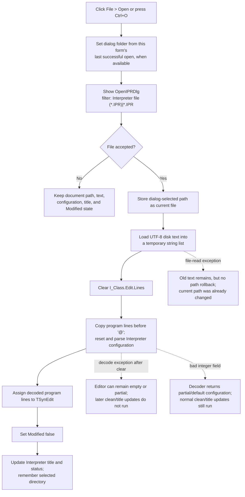

# Open an Interpreter program

> Analysis status: Complete for the recovered control boundary. The dialog setup, path and UTF-8 text loading, Interpreter configuration import, clean-state update, title update, cancel behavior, and failure ordering are recovered.

## Control

| Property | Recovered value |
| --- | --- |
| Form | I_Class |
| Form caption | Interpreter-`<%s>` |
| Component path | I_Class.MainMenu.mFile.miOpen |
| Control class | TMenuItem |
| Caption | &Open... |
| Shortcut | Ctrl+O (`16463`) |
| Handler name | miOpenClick |
| Handler address | 017ef8d0 |
| Graph node | `resource:dfm:I_Class/I_Class.MainMenu.mFile.miOpen` |
| Handler node | `function:017ef8d0` |
| Graph layer | UI |

The menu item has no hint, glyph, checked state, or list data. The same open coordinator is also reached from `sbFileOpen`, whose recovered hint is **Open file** and whose speed-button resource has a two-state glyph. The menu item behavior is established by its handler and the shared coordinator, not by that toolbar glyph.

## What happens when clicked

`FUN_017ef8d0` delegates directly to `FUN_017ef290`. The coordinator opens the form-owned `OpenIPRDlg`. Form creation configures this dialog with filter **Interpreter file (*.IPR)|*.IPR**, adds **User Examples** and **Tina Examples** places, and initially points it at the TINA Examples directory. After one successful open, the coordinator uses the directory of that selected file as the initial directory for the next open in the same form instance.

The application code does not check the selected extension or inspect a file signature. The dialog filter guides selection, but the recovered coordinator passes any accepted path to the loader.

### Cancel

If the dialog does not return an accepted result, the coordinator does not change the current document path, editor text, Interpreter configuration, modified flag, form caption, status text, or remembered directory. Preparing the dialog can update its internal initial folder, but Cancel does not commit document state.

### Accepted selection

For an accepted result, the coordinator performs these operations in order:

1. It reads the dialog-selected path and stores it as the form's current file at `+0x888`.
2. `FUN_017ef4d0` loads the file through a temporary Delphi string list with the runtime UTF-8 encoding singleton. The singleton constructor uses code page `65001` (`0xFDE9`). The Save serializer uses the same encoding provider.
3. Only after the file is in the temporary list does the loader clear `I_Class.Edit.Lines`.
4. Shared IPR decoder `FUN_010cd270` separates the program lines from the configuration section. It writes program lines to a second string list and resets and fills configuration fields in the form's current Interpreter runtime at offsets `+0x628`, `+0x630`, and `+0x650`.
5. The loader assigns the decoded program-line list to `I_Class.Edit.Lines`.
6. After the loader returns, the coordinator marks the TSynEdit document unmodified, changes the form caption to the recovered `Interpreter-<%s>` template with the selected path, clears one retained status/detail string, restores localized status message ID 10, and remembers the selected directory.

The configuration boundary is line based. The decoder copies lines until the first line whose first character is `@`. It treats that line as the start of the saved configuration data. The matching writer emits `@ Configuration begin`, numeric format and math values, drawing values, and `.@ Configuration end`. These loaded fields are later used when the Interpreter runtime is rebuilt for Run, and Save writes the editor lines and the current configuration fields back to an IPR file.

## Unsaved document behavior

Open does **not** call the modified-document guard `FUN_017f1540`. It shows the file dialog and can replace `I_Class.Edit` even when the editor's Modified byte is set.

This differs from New and form close. New calls the guard before it clears and rebuilds the document. `FormCloseQuery` also calls the guard and can veto closure after Cancel. Save and Save As are available as separate commands, but Open does not invoke either one and does not offer a Yes, No, or Cancel save prompt.

## Invalid files and failure ordering

The recovered Open path has no local exception handler, validation message, success flag, or rollback transaction.

- If reading the selected file raises, the old editor text remains because `Edit.Lines.Clear` has not run. However, the form's current-path field already contains the selected path. The old caption, modified state, status, and remembered directory remain because their updates occur after the loader.
- If a failure raises after the editor is cleared, the visible document can be empty or only partly replaced. The current-path field still contains the selected path, while the later clean-state, caption, and directory updates do not run.
- The IPR decoder resets the configuration records before it parses them. An invalid integer field makes the decoder stop and return without a success indication. The loader then assigns the program lines collected before the `@` marker, and the coordinator treats the load as successful: it marks the editor clean and updates the caption. Configuration can therefore remain in a reset and partly populated state, including the destination written by the failed conversion helper.
- If the file has no `@` marker, every line becomes editor program text and the configuration remains at the decoder's reset defaults. This path also completes without an IPR-format error.

No recovered branch deletes, rewrites, or truncates the selected source file. Open itself is a read operation. The partial states above concern the in-memory document and Interpreter configuration.

## Click flow

## State and persistence boundaries

- The loaded source and configuration become the active in-memory Interpreter document. A later Run rebuilds the runtime from `I_Class.Edit.Lines` and restores these configuration fields.
- A later Save serializes `I_Class.Edit.Lines` and the current configuration fields. Open does not write them automatically.
- The dialog-selected path becomes the target used by the normal Save path and appears in the form caption after a normal load.
- The last successful open directory is stored in the form field at `+0xB10`. The recovered Open and form-destruction paths contain no INI, registry, project, or preference write for this value. It is therefore proven only for later opens in the same live form.
- Cancel has no document persistence effect. A successful open marks the loaded document clean even when the decoder stopped early on an invalid integer field.

## Source evidence

- [Open menu handler `FUN_017ef8d0`](../../../DecompiledSources/Tina16/functions/00000000017EF8D0__FUN_017ef8d0.c) is the DFM-bound menu wrapper and calls the shared coordinator.
- [Open coordinator `FUN_017ef290`](../../../DecompiledSources/Tina16/functions/00000000017EF290__FUN_017ef290.c) proves dialog execution, cancel gating, path assignment, loader call, Modified reset, caption and status updates, and last-directory storage.
- [IPR editor loader `FUN_017ef4d0`](../../../DecompiledSources/Tina16/functions/00000000017EF4D0__FUN_017ef4d0.c) proves temporary file loading before editor clearing, UTF-8 provider selection, decoder inputs, and final `Edit.Lines` assignment. [Encoding singleton `FUN_0045ae90`](../../../DecompiledSources/Tina16/functions/000000000045AE90__FUN_0045ae90.c) and [its constructor `FUN_0045b660`](../../../DecompiledSources/Tina16/functions/000000000045B660__FUN_0045b660.c) prove code page 65001.
- [Shared IPR decoder `FUN_010cd270`](../../../DecompiledSources/Tina16/functions/00000000010CD270__FUN_010cd270.c) proves the `@` boundary, program-line copy, configuration reset and population, and silent return after an integer conversion failure.
- [IPR writer `FUN_010cd780`](../../../DecompiledSources/Tina16/functions/00000000010CD780__FUN_010cd780.c) proves the matching configuration-section layout and use of the same runtime encoding provider.
- [Interpreter Save serializer wrapper `FUN_017ef620`](../../../DecompiledSources/Tina16/functions/00000000017EF620__FUN_017ef620.c) proves that later Save writes editor lines plus the runtime configuration records.
- [Interpreter Run coordinator `FUN_017f17c0`](../../../DecompiledSources/Tina16/functions/00000000017F17C0__FUN_017f17c0.c) proves that later execution rebuilds the runtime from the current editor lines and restores the configuration fields.
- [Modified-document guard `FUN_017f1540`](../../../DecompiledSources/Tina16/functions/00000000017F1540__FUN_017f1540.c), [New coordinator `FUN_017eef40`](../../../DecompiledSources/Tina16/functions/00000000017EEF40__FUN_017eef40.c), and [close-query handler `FUN_017f0f20`](../../../DecompiledSources/Tina16/functions/00000000017F0F20__FUN_017f0f20.c) prove the guard used by New and close but absent from Open.
- [Form creation `FUN_017efdf0`](../../../DecompiledSources/Tina16/functions/00000000017EFDF0__FUN_017efdf0.c) proves the initial `noname.ipr` path, title formatting, Open dialog ownership, IPR filter, custom places, initial directory, and Interpreter runtime field.
- [Recovered Delphi resource evidence](../../../DecompiledSources/Tina16/resources/dfm/ui-evidence.json) binds `miOpenClick` to `017ef8d0`, supplies Ctrl+O and the form caption, identifies `Edit` as TSynEdit, and supplies the toolbar Open hint and glyph presence.

## Analysis ownership

- `.643` owns menu handler `FUN_017ef8d0`, shared open coordinator `FUN_017ef290`, and IPR editor loader `FUN_017ef4d0`.
- `.641` owns modified-document guard `FUN_017f1540`; `.644` and `.645` own the Save and Save As paths. This article cites and omits those functions.
- Shared IPR decoder and writer, Run coordinator, generic Delphi string-list and encoding routines, custom dialog helpers, status setters, and TSynEdit internals remain evidence-only here.
