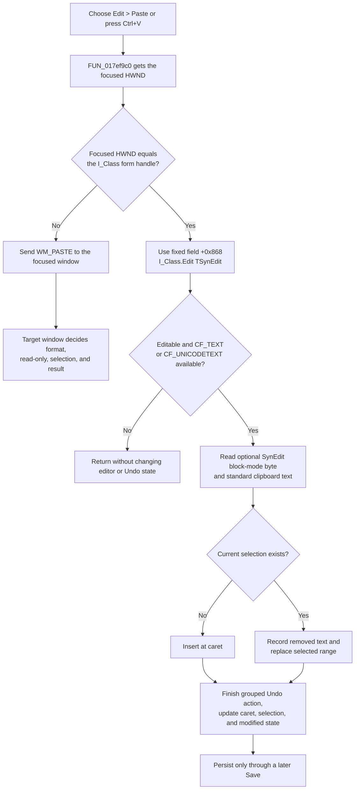

# Paste text into the focused Interpreter control

> Analysis status: Complete. The recovered menu handler, focus and window-handle tests, SynEdit paste implementation, clipboard-format helpers, idle menu updater, undo callbacks, and sibling clipboard commands support this explanation.

## Control

| Property | Recovered value |
| --- | --- |
| Form | I_Class |
| Form caption | `Interpreter-<%s>` |
| Component path | I_Class.MainMenu.mEdit.miPaste |
| Parent menu | mEdit |
| Control class | TMenuItem |
| Caption | &Paste |
| Initial enabled state | False |
| Shortcut | Ctrl+V (`16470`) |
| Hint | Not present in the recovered resource. |
| Handler name | miPasteClick |
| Handler address | 017ef9c0 |
| Graph node | `resource:dfm:I_Class/I_Class.MainMenu.mEdit.miPaste` |
| Handler node | `function:017ef9c0` |
| Graph layer | UI |

## What happens when selected

`FUN_017ef9c0` routes Paste from the current native focus. It does not use `Sender`.

1. It gets the focused window and compares it with the native handle of the `I_Class` form.
2. If the form window itself has focus, it passes form field `+0x868` to `FUN_00bf9d90`. The recovered DFM and other event handlers identify this fixed field as the client-aligned `I_Class.Edit` `TSynEdit`.
3. If another window has focus, it sends synchronous message `0x0302` (`WM_PASTE`) to that focused window. The target window, not this menu handler, decides whether it accepts the paste.

The second branch is important. Paste can target a focused child or other native edit control instead of always forcing text into `I_Class.Edit`. The recovered handler does not test the focused window's class, ownership, selection, or read-only state before it sends `WM_PASTE`.

## SynEdit paste behavior

The fixed `I_Class.Edit` branch uses the recovered SynEdit paste implementation:

1. `FUN_00bff8b0` reads the editor's virtual read-only property and checks for standard text. A read-only editor, or a clipboard without `CF_TEXT` (`1`) or `CF_UNICODETEXT` (`13`), makes the operation a silent no-op.
2. The routine starts one SynEdit update and undo group. It records a PasteBegin marker and later a PasteEnd marker.
3. If the clipboard contains the registered `SynEdit Control Block Type` format, the first byte selects normal, whole-line, or column/block paste mode. This byte is metadata only. The inserted text still comes from a standard clipboard text format.
4. `FUN_00bd1a50` prefers `CF_UNICODETEXT`. If only `CF_TEXT` is present, it reads `CF_LOCALE` when available and converts the text.
5. With no selection, the routine inserts at the caret. With a selection, it records the removed text and replaces the selected normal, whole-line, or column/block range.
6. It records the inserted text for Undo, ends the update group, optionally refreshes scrollbars, makes the caret visible, and sends the SynEdit selection/status update.

The private selection-mode format is compatible with the sibling Copy and Cut routines. It preserves SynEdit block semantics when text is copied between compatible SynEdit controls. It is not an Interpreter source-file format or command log.

## Enabled state and guard differences

The DFM initializes **Paste** as disabled. `I_ClassEvents.OnIdle` resolves to `FUN_017f14b0`. When `Edit` exists, this idle handler enables form field `+0x720`, identified by menu order as **Paste**, only when `CF_TEXT` is available.

This menu test is not the authoritative SynEdit guard:

- The SynEdit predicate accepts `CF_TEXT` or `CF_UNICODETEXT`, and it also rejects a read-only editor.
- The idle updater tests only `CF_TEXT`; it does not test `CF_UNICODETEXT` or read-only state.
- A Unicode-only clipboard can therefore be acceptable to a directly invoked SynEdit paste while the menu remains disabled. An enabled but later read-only editor still stops safely in `FUN_00bff8b0`.
- The non-SynEdit branch does not call this predicate. It sends `WM_PASTE` and leaves format and read-only checks to the focused window.

If no window has focus, the recovered else branch still sends `WM_PASTE` to the zero handle. The handler has no local fallback, status message, or retry for this case.

## Selection, Undo, modified state, and persistence

A successful SynEdit paste changes the in-memory editor buffer and moves or collapses the caret and selection according to the paste mode. Its PasteBegin/PasteEnd markers and removed/inserted text records make the operation one grouped Undo action. The undo-list callback recalculates the editor's modified state from its save point and sends the normal change notification. `FUN_017f1540` later reads this modified flag when the Interpreter document can close and presents the separate save decision.

Paste does not save an Interpreter file. New, Open, Save, and Save As use separate paths that clear the modified state at their document boundaries. The pasted text becomes persistent only if a later Save operation writes the editor content.

The handler and direct SynEdit paste path do not call an application macro recorder, Interpreter command logger, or audit logger. SynEdit undo data is transient editor history, not a macro or persistent log. In the native-window branch, any text, selection, Undo, modified-state, or persistence effect belongs to the focused window's own `WM_PASTE` implementation; this handler does not inspect it.

## Paste flow

## No-op and error behavior

- The SynEdit branch returns before update, Undo, or buffer mutation when the editor is read-only or neither standard text format is available. Custom `SynEdit Control Block Type` metadata alone is not enough.
- Repeated Paste inserts or replaces the text again. The command does not suppress duplicate content.
- The handler shows no confirmation and does not inspect a success result from either branch.
- The SynEdit implementation opens and reads the clipboard during the operation. The handler has no local retry or exception dialog. A clipboard, allocation, conversion, editor, or dispatch exception propagates through the Delphi event path.
- The recovered SynEdit path groups Undo markers and uses normal cleanup, but it does not implement a transaction that restores editor text after every possible later failure. An exception after insertion or replacement can leave changed editor or Undo state.
- The native branch ignores the `WM_PASTE` result. A focused control can accept the text, reject it, or do nothing without an application-side message.

## Source and graph evidence

- Menu handler and focus routing: [FUN_017ef9c0](../../../DecompiledSources/Tina16/functions/00000000017EF9C0__FUN_017ef9c0.c)
- I_Class form-handle getter: [FUN_0065b870](../../../DecompiledSources/Tina16/functions/000000000065B870__FUN_0065b870.c)
- Canonical SynEdit Paste routine: [FUN_00bf9d90](../../../DecompiledSources/Tina16/functions/0000000000BF9D90__FUN_00bf9d90.c)
- SynEdit editable-text predicate: [FUN_00bff8b0](../../../DecompiledSources/Tina16/functions/0000000000BFF8B0__FUN_00bff8b0.c)
- Standard clipboard-format predicate: [FUN_00bd1a20](../../../DecompiledSources/Tina16/functions/0000000000BD1A20__FUN_00bd1a20.c)
- Standard clipboard text reader: [FUN_00bd1a50](../../../DecompiledSources/Tina16/functions/0000000000BD1A50__FUN_00bd1a50.c)
- SynEdit insertion and replacement engine: [FUN_00bfcaf0](../../../DecompiledSources/Tina16/functions/0000000000BFCAF0__FUN_00bfcaf0.c)
- Selection extractor used for replacement Undo data: [FUN_00bf2ed0](../../../DecompiledSources/Tina16/functions/0000000000BF2ED0__FUN_00bf2ed0.c)
- Undo-group begin and end: [FUN_00c08780](../../../DecompiledSources/Tina16/functions/0000000000C08780__FUN_00c08780.c) and [FUN_00c087b0](../../../DecompiledSources/Tina16/functions/0000000000C087B0__FUN_00c087b0.c)
- Modified-state callbacks: [FUN_00c0ea80](../../../DecompiledSources/Tina16/functions/0000000000C0EA80__FUN_00c0ea80.c), [FUN_00c0ea50](../../../DecompiledSources/Tina16/functions/0000000000C0EA50__FUN_00c0ea50.c), and [FUN_00c0dad0](../../../DecompiledSources/Tina16/functions/0000000000C0DAD0__FUN_00c0dad0.c)
- Interpreter close/save query: [FUN_017f1540](../../../DecompiledSources/Tina16/functions/00000000017F1540__FUN_017f1540.c)
- Custom clipboard-format registration: [FUN_00c116d0](../../../DecompiledSources/Tina16/functions/0000000000C116D0__FUN_00c116d0.c)
- Idle menu-state updater: [FUN_017f14b0](../../../DecompiledSources/Tina16/functions/00000000017F14B0__FUN_017f14b0.c)
- Canonical native VCL paste wrapper for comparison: [FUN_00680a40](../../../DecompiledSources/Tina16/functions/0000000000680A40__FUN_00680a40.c)

The generated graph records direct recovered calls from `FUN_017ef9c0` to the form-handle getter and SynEdit paste routine. The focus and `WM_PASTE` calls are recovered as import thunks in the source but are not separate outgoing graph edges.

## Resource evidence

- The DFM binds `I_Class.MainMenu.mEdit.miPaste.OnClick` to `miPasteClick` at `017ef9c0`.
- `miPaste` has caption `&Paste`, Ctrl+V shortcut value `16470`, and initial `Enabled = false` state. It has no recovered hint, image reference, checked state, action, or extracted glyph.
- `I_Class.Edit` is a client-aligned `TSynEdit`. Its bound mouse and key handlers use the same form field `+0x868` that the form-focus branch reads.
- `I_Class.I_ClassEvents.OnIdle` resolves to `017f14b0`, which refreshes the enabled state of Cut, Copy, Paste, and Delete.
- No same-parent label candidate is available for this menu item.

## Relationship to Cut, Copy, and native edit Paste

| Command or path | Target and effect |
| --- | --- |
| I_Class Cut | Uses the fixed `Edit` field. It copies and removes a selected editable range through the SynEdit implementation. |
| I_Class Copy | Uses the fixed `Edit` field. It publishes the selected text and SynEdit block metadata without changing the editor. |
| I_Class Paste with form focus | Uses the fixed `Edit` field. It inserts or replaces standard clipboard text through the SynEdit implementation. |
| I_Class Paste with another focused window | Sends `WM_PASTE` directly to that focused window. |

The canonical Delphi VCL edit Paste wrapper `FUN_00680a40` also gets a native edit handle and sends `WM_PASTE`. This handler does not call that wrapper. Its non-form-focus branch performs the equivalent message operation against the already focused window.

## Analysis limits and annotation ownership

- This article owns `FUN_017ef9c0`, `FUN_00bf9d90`, and `FUN_00bff8b0`.
- `TIARA-diz.6.7.39` canonically owns the shared SynEdit Copy, selection-extraction, private-format, and standard clipboard-writer functions. This article cites those functions without redefining them.
- `TIARA-diz.6.7.143` canonically owns the native VCL `WM_PASTE` wrapper `FUN_00680a40`. This article cites it for comparison.
- The source does not recover Delphi field names for offsets `+0x868` or `+0x720`. Their identities come from the DFM component tree, bound events, neighboring menu-field order, and repeated data flow.
