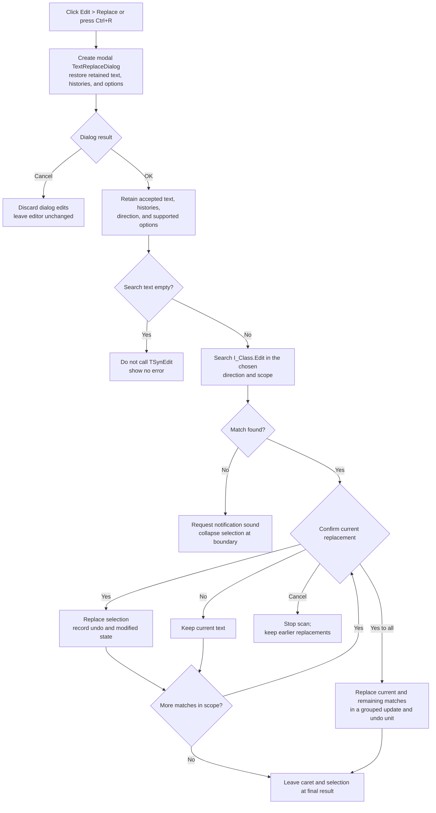

# Replace text in the Interpreter editor

> Analysis status: Complete for the recovered control boundary. The source establishes the custom dialog, option mapping, prompted replacement scan, editor and undo effects, Cancel boundaries, no-match response, and persistence limits. The visible regular-expression option has no recovered effect in this path.

## Control

| Property | Recovered value |
| --- | --- |
| Form | I_Class |
| Form caption | Interpreter-`<%s>` |
| Component path | I_Class.MainMenu.mEdit.miReplace |
| Control class | TMenuItem |
| Caption | &Replace... |
| Shortcut | Ctrl+R (`16466`) |
| Handler name | miReplaceClick |
| Handler address | 017efa80 |
| Graph node | `resource:dfm:I_Class/I_Class.MainMenu.mEdit.miReplace` |
| Handler node | `function:017efa80` |
| Graph layer | UI |

The menu item has no hint, glyph, checked state, or list data. Its behavior is established by the handler, the custom dialog resources, and the TSynEdit replacement path.

## What happens when clicked

`FUN_017efa80` calls the shared Find/Replace coordinator `FUN_017f2f00` with mode `1`. This mode creates a modal `TTextReplaceDialog`. The operation targets `I_Class.Edit`, the form's `TSynEdit` at `+0x868`. It does not change a file name, compiler message, or status panel.

The dialog contains **Search for** and **Replace with** combo boxes. It restores retained search and replacement text, up to ten entries from each history, the direction, and the supported search options. A conditional preload flag can replace the retained search text with a current editor selection or text at the caret. The recovered source does not identify the user-facing source of that flag, so this is not a guaranteed effect of each click.

### Dialog result

- **Cancel** returns modal result 2. The coordinator destroys the dialog without copying edited values or histories to its retained state. It does not search or modify the editor.
- **OK** returns modal result 1. The coordinator retains the search and replacement text, direction, supported options, and histories. An existing equal history entry moves to the front; a new nonempty entry is inserted at the front. Only the first ten entries are retained.
- If the accepted search text is empty, the coordinator does not call the search engine. It shows no error and makes no editor change. The replacement text can be empty; when a match is accepted, this deletes the matched text.

After a nonempty accepted operation, the coordinator marks later searches as starting from the current caret. A later Replace click still reloads the dialog's **Search from caret** choice before it starts its first scan.

## Search and replacement options

The accepted dialog values map to the TSynEdit search operation as follows:

| Dialog option | Recovered effect |
| --- | --- |
| Direction: Forward | Searches toward the document end |
| Direction: Backward | Adds backward flag `0x04` and searches toward the document start |
| Case sensitivity | Adds match-case flag `0x01` |
| Whole words only | Adds whole-word flag `0x02` |
| Search from caret | Starts at the current caret |
| Search from caret clear | Adds entire-scope flag `0x08` |
| Selected text only | Adds selection-scope flag `0x10`; TSynEdit clears it when there is no selection |
| Regular expression | No recovered read, retained field, or search-engine flag in the I_Class path |

The coordinator adds mode bits `0xE0`: Replace, Replace All, and Prompt. In this combination, TSynEdit prompts at each match. The **Replace All** bit keeps the scan moving after each answer; the **Prompt** bit prevents automatic replacement until the user selects an action. There is no wrap option and no second scan at the opposite document boundary.

The **Regular expression** checkbox is inherited from `TTextSearchDialog` and is visible in the recovered resource. `FUN_017f2f00` does not initialize or read its field, and `FUN_017f32c0` does not add a corresponding option. This evidence does not support regular-expression replacement in the Interpreter editor.

## Match confirmation and editor changes

For each match, TSynEdit selects the matching range in `I_Class.Edit` and invokes its replacement prompt callback. The recovered `TConfirmReplaceDialog` supplies **Yes**, **No**, **Cancel**, and **Yes to all** controls.

- **Yes** replaces the current selection with the replacement text and continues to the next match with another prompt.
- **No** leaves the current match unchanged and continues the scan.
- **Cancel** stops at the current selected match without replacing that match. Replacements accepted earlier in the scan remain; there is no rollback.
- **Yes to all** replaces the current match and the remaining matches without more prompts. TSynEdit groups this unprompted remainder in one editor update and undo group.

Each accepted replacement uses the normal TSynEdit selection-replacement path. It records editor undo data, adjusts the selection and following search range when replacement length differs, and updates the editor's modified state from its undo state. `I_Class.FormCloseQuery` later reads the editor's modified byte at `+0x5E0` and can offer to save changes. Replace does not compile or run the modified Interpreter source.

## No-match, repeated, and error behavior

- If the engine returns zero matches, the shared executor requests the recovered notification sound with argument `0x40`. It then collapses the selection at the forward end or backward beginning and moves the caret to that boundary. It does not wrap or show a recovered text message.
- If every match is answered **No**, the accepted-match count can return to zero and reach the same notification path.
- Canceling a match prompt stops the scan after a match was found, so the zero-result notification is not used for that stop.
- Each menu click creates a new dialog, but accepted text, histories, direction, and supported options are reused from process memory. There is no already-open or repeated-command guard.
- TSynEdit raises `No search engine has been assigned` if its search-engine field is null. Normal form setup assigns an engine, but this handler has no null guard.
- The handler, coordinator, and engine bridge have no local retry or transaction rollback. An exception after one or more replacements can leave those earlier changes in the editor buffer.

## Replace, Find, and Search Again

Find and Replace share the modal coordinator and retained search state. Replace adds the replacement text and prompted replacement mode; Find selects a match without editing text.

The adjacent **Search Again** command starts disabled in the resource. Unlike Find, the Replace handler does not enable it. When Search Again is already enabled, its handler reuses the retained search text and non-direction options, but calls the executor in Find mode and forces forward direction. It finds the next match from the current caret; it does not repeat a replacement.

## Click flow

## State and persistence boundaries

- Replacement changes the live `I_Class.Edit` buffer, selection, caret, undo state, and modified state. It does not save the file automatically.
- A later Interpreter Save or Save As writes the editor buffer and clears the modified flag through a separate path. Closing the form uses the separate modified-document prompt.
- Accepted search and replacement values and their histories remain in module-level process memory for later Find and Replace dialogs. The traced path has no INI, registry, project, or file write for these values, so persistence across application restarts is not established.
- Dialog Cancel changes neither retained search state nor the editor. Match-prompt Cancel can leave earlier replacements and a dirty editor buffer.

## Source evidence

- [Replace menu handler `FUN_017efa80`](../../../DecompiledSources/Tina16/functions/00000000017EFA80__FUN_017efa80.c) calls the shared coordinator with Replace mode `1`.
- [Find/Replace dialog coordinator `FUN_017f2f00`](../../../DecompiledSources/Tina16/functions/00000000017F2F00__FUN_017f2f00.c) creates the replacement dialog, restores and retains text, histories, direction, and options, handles modal results, and starts a nonempty accepted operation.
- [Editor search and replace executor `FUN_017f32c0`](../../../DecompiledSources/Tina16/functions/00000000017F32C0__FUN_017f32c0.c) maps the retained settings and Replace mode to the TSynEdit option mask and handles a zero result.
- [TSynEdit search and replace routine `FUN_00c09100`](../../../DecompiledSources/Tina16/functions/0000000000C09100__FUN_00c09100.c) proves scope, direction, prompt decisions, replacement iteration, selection changes, grouped Replace All updates, and the missing-engine exception.
- [TSynEdit selection-replacement routine `FUN_00c08be0`](../../../DecompiledSources/Tina16/functions/0000000000C08BE0__FUN_00c08be0.c) records undo information and replaces the active selection.
- [TextSearchDialog close-query handler `FUN_0106ea70`](../../../DecompiledSources/Tina16/functions/000000000106EA70__FUN_0106ea70.c) updates the accepted nonempty search history. [TextReplaceDialog close-query handler `FUN_0106f320`](../../../DecompiledSources/Tina16/functions/000000000106F320__FUN_0106f320.c) does the same for replacement history.
- [Interpreter close guard `FUN_017f1540`](../../../DecompiledSources/Tina16/functions/00000000017F1540__FUN_017f1540.c) reads the TSynEdit modified flag and offers the separate save decision.
- [Search Again handler `FUN_017efa90`](../../../DecompiledSources/Tina16/functions/00000000017EFA90__FUN_017efa90.c) proves that the sibling command reuses the search state in forward Find mode.
- [Recovered Delphi resource evidence](../../../DecompiledSources/Tina16/resources/dfm/ui-evidence.json) identifies the Interpreter editor, menu command and shortcut, custom search and replace controls, dialog modal results, and match-confirmation buttons.

## Analysis ownership and limits

- `.636` owns only the unique Replace handler `FUN_017efa80`.
- `.634` owns the shared modal coordinator `FUN_017f2f00` and editor executor `FUN_017f32c0`; this fragment cites and does not duplicate them. `.637` owns the unique Search Again handler.
- The generic dialog handlers, TSynEdit internals, notification thunk, Save path, and close guard remain evidence-only.
- The recovered notification thunk is an indirect import call. Argument `0x40` and the call timing are proven, but the imported API name is not recovered here.
- The source proves normal TSynEdit undo and modified-state behavior. It does not recover user-facing names for all internal undo flags or the application-level exception presentation.
