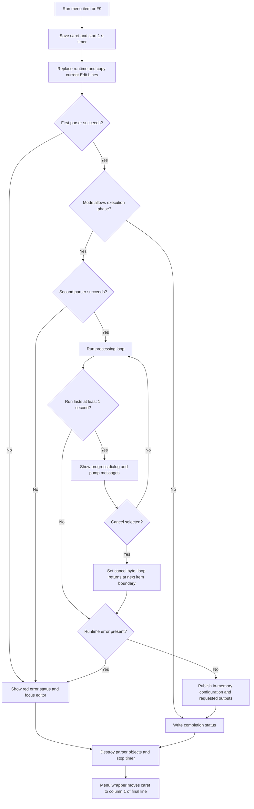

# Run

## Control

| Property | Recovered value |
| --- | --- |
| Form | I_Class |
| Component path | I_Class.MainMenu.mRun.miRun |
| Control class | TMenuItem |
| Caption | &Run |
| Shortcut | F9 |
| Handler name | miRunClick |
| Handler address | 017efc30 |
| Graph node | `resource:dfm:I_Class/I_Class.MainMenu.mRun.miRun` |
| Handler node | `function:017efc30` |
| Graph layer | UI |

The menu item has no recovered hint, image, or glyph. Its caption, F9 shortcut, handler body, and shared runtime coordinator establish the command meaning.

## What happens when clicked

`miRunClick` calls the shared Interpreter run coordinator with the normal Run mode mask. It then moves the editor caret to column 1 of the final line after the coordinator returns. The toolbar Run button calls the same coordinator, but it does not make this second caret move.

The coordinator executes the current in-memory text in `I_Class.Edit`. It does not first save the `.IPR` document and does not require a file name. Unsaved editor changes are therefore part of the run input.

## Runtime preparation

The coordinator first records the editor caret position and starts `MyTimer` with a 1,000 ms interval. It then replaces the previous Interpreter runtime:

1. If a runtime already exists, it copies its numerical and execution configuration fields back to form-owned storage and destroys the runtime.
2. It creates a new runtime, binds it to the `Edit` control and the form status control, and copies `Edit.Lines` into the runtime.
3. It copies the saved configuration fields into the new runtime and applies the normal Run mode mask.
4. It registers the recovered Interpreter variables and current design data before parsing begins.

This is a fresh execution session over the current editor lines. The source does not reuse a compiled program from the previous runtime.

## Parse and execution dispatch

The recovered path has two generated-parser phases.

- `FUN_013bfdc0` is a Yacc-style parser. It reports `syntax error` and parser-stack overflow through the runtime error path. A nonzero result stops the normal Run path and presents the error.
- After the first parser succeeds, the coordinator resets parser state and changes the runtime mode for the second phase. `FUN_010c7360` is another Yacc-style parser with the same zero-success and nonzero-failure convention.
- If both phases succeed and the runtime has data to process, `FUN_017e2760` runs the Interpreter processing loop.

The exact original Delphi names of the two generated grammars are not recovered. Their return checks and error strings prove two parser stages; the code does not support a more specific source-language label for each stage.

On a clean completion, the coordinator does the following work:

- It writes the localized success status to the form status control in blue. The recovered DFM gives the related initial status text as `Successfully compiled`.
- It clears the stored error text.
- It applies recovered configuration data from the runtime symbol collection to the main application model.
- It invokes requested application transfer callbacks when one-shot form flags at `+0xb40`, `+0xb41`, or `+0xb42` are set, and then clears those flags.
- When runtime flag `+0x5f8` is set, it replaces a form-owned string list with the runtime's current line list.

These result paths update in-memory application state. This handler does not save the Interpreter file, write the Run options, or prove that the transferred results are immediately persistent on disk.

## Long runs and cancellation

`MyTimer` does not stop the run. After one second, its callback sets a global request that allows the processing loop to show a progress dialog. The loop pumps application messages while that progress mode is active.

The progress dialog's Cancel callback sets runtime byte `+0x508`. The processing loop tests that byte before each next item and returns when it is set. This is cooperative cancellation, not a synchronous abort.

The recovered coordinator does not roll back work that the loop completed before cancellation. If cancellation does not also set a runtime error, control continues through the normal result-publication path. The source therefore permits accumulated or partial in-memory results to reach the same output path as a completed run.

## Errors, UI state, and re-entry

Parser or runtime errors are converted to text by `FUN_017e3010`. `FUN_017f0b20` writes the error status in red, focuses the editor, and shows `Errors occurred during the execution of the program, the curves will not be drawn!` when the runtime error list is not empty. Error exits destroy the temporary parser objects and disable `MyTimer`.

The menu handler and shared coordinator do not disable the Run menu item or toolbar button and do not test a form-level busy flag before replacing the runtime. The processing loop can dispatch application messages for its progress dialog. The recovered source does not prove a separate guard that blocks a second Run command during that message dispatch. It also has no local exception handler or `finally` block, so cleanup after an escaping exception is not established.

On normal success and handled failure paths, the coordinator disables `MyTimer`. It normally restores the saved editor line when the `Keep cursor pos after run` option is set; otherwise, it moves to the final line. However, `miRunClick` always calls the final-line helper after the coordinator returns. The menu command therefore ends at column 1 of the final editor line on every normal return, even when that option requested line restoration. The toolbar Run wrapper does not add this override.

Moving the caret does not edit the buffer. No call in this path clears the editor modified state, changes the current `.IPR` path, or invokes Save or Save As.

## Run flow

## Evidence

- [Menu Run handler](../../../DecompiledSources/Tina16/functions/00000000017EFC30__FUN_017efc30.c): passes the normal Run mask to the shared coordinator and then calls the final-line caret helper.
- [Shared Interpreter run coordinator](../../../DecompiledSources/Tina16/functions/00000000017F17C0__FUN_017f17c0.c): replaces and configures the runtime, copies live editor lines, dispatches both parsers and the processing loop, reports results, publishes successful data, applies cursor policy, and stops the timer.
- [First generated parser](../../../DecompiledSources/Tina16/functions/00000000013BFDC0__FUN_013bfdc0.c) and [second generated parser](../../../DecompiledSources/Tina16/functions/00000000010C7360__FUN_010c7360.c): prove the two zero-success parser stages and their syntax and stack-overflow failures.
- [Processing-loop dispatcher](../../../DecompiledSources/Tina16/functions/00000000017E2760__FUN_017e2760.c) and [processing loop](../../../DecompiledSources/Tina16/functions/00000000017E4880__FUN_017e4880.c): prove item processing, the cancellation test, delayed progress dialog, application-message dispatch, and return boundary.
- [Timer callback](../../../DecompiledSources/Tina16/functions/00000000017F1780__FUN_017f1780.c), [progress request setter](../../../DecompiledSources/Tina16/functions/00000000017E9A10__FUN_017e9a10.c), and [Cancel callback](../../../DecompiledSources/Tina16/functions/00000000017E32D0__FUN_017e32d0.c): establish delayed progress UI and cooperative cancellation.
- [Error text builder](../../../DecompiledSources/Tina16/functions/00000000017E3010__FUN_017e3010.c), [error presenter](../../../DecompiledSources/Tina16/functions/00000000017F0B20__FUN_017f0b20.c), and [status writer](../../../DecompiledSources/Tina16/functions/00000000017F0D10__FUN_017f0d10.c): establish error text, red error status, editor focus, the nonempty-error-list warning, and blue completion status.
- [Successful configuration publisher](../../../DecompiledSources/Tina16/functions/00000000017EA2D0__FUN_017ea2d0.c): applies recovered runtime configuration entries to main-application objects.
- [Coordinator cleanup](../../../DecompiledSources/Tina16/functions/00000000017F1FA0__FUN_017f1fa0.c), [saved-line restoration](../../../DecompiledSources/Tina16/functions/00000000017F2B70__FUN_017f2b70.c), and [final-line caret helper](../../../DecompiledSources/Tina16/functions/00000000017EFD70__FUN_017efd70.c): prove the timer and caret behavior.
- [Toolbar Run wrapper](../../../DecompiledSources/Tina16/functions/00000000017EFDD0__FUN_017efdd0.c): calls the same coordinator but does not call the final-line helper afterward.
- [Options handler](../../../DecompiledSources/Tina16/functions/00000000017EF930__FUN_017ef930.c) and [settings loader](../../../DecompiledSources/Tina16/functions/00000000017E1500__FUN_017e1500.c): connect the shared cursor-policy byte to `Keep cursor pos after run` in `TINA.INI`.

## Limits

- The recovered source exposes execution-mode masks and several status bits, but not their original Delphi enumeration names. This article describes their tested control-flow effects.
- The original grammar names for the two generated parsers are not recovered.
- The exact product meanings of the three one-shot transfer flags at `+0xb40` through `+0xb42` are not established by this handler alone.
- The path has no direct save call and no proven transaction or rollback for application state that execution changes.
