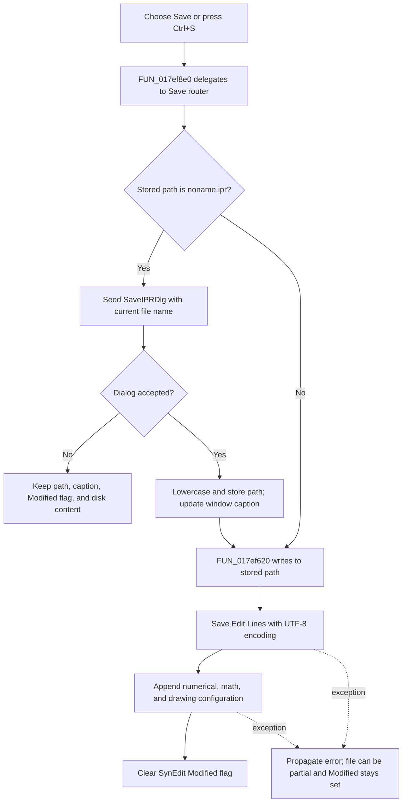

# &Save

The **Save** command writes the current Interpreter source and its active numerical, math, and drawing configuration to an IPR file. It uses the current file path when one exists. A new document uses the sentinel name `noname.ipr`, so Save opens the same Save As path as the **Save As...** menu item.

## Control

| Property | Recovered value |
| --- | --- |
| Form | I_Class |
| Component path | I_Class.MainMenu.mFile.miSave |
| Control class | TMenuItem |
| Caption | &Save |
| Hint | Not present in the recovered resource. |
| Text | Not present in the recovered resource. |
| Handler name | miSaveClick |
| Handler address | 017ef8e0 |
| Graph node | `resource:dfm:I_Class/I_Class.MainMenu.mFile.miSave` |
| Handler node | `function:017ef8e0` |
| Graph layer | UI |

## What happens when clicked

`FUN_017ef8e0` ignores `Sender` and delegates to `FUN_017ef6c0`. The router reads the form string at offset `+0x888`:

- If the value is not `noname.ipr`, it writes directly to that stored path. It does not show a dialog or ask before it replaces the file.
- If the value is `noname.ipr`, it calls the shared Save As helper `FUN_017ef730`. Form creation and the New command both assign this sentinel, so the comparison represents the unnamed-document state.

The DFM shortcut value `16467` is Delphi's Ctrl+S encoding. The menu item and Ctrl+S therefore reach the same handler and the same stored-path decision.

## File content and encoding

The I_Class-specific writer adapter `FUN_017ef620` passes four groups of data to the shared IPR serializer:

1. `I_Class.Edit.Lines`, which is the current SynEdit source text.
2. The active Interpreter numerical-format values.
3. The active math settings.
4. The active drawing settings.

The serializer first calls the line collection's file-save method with the Delphi encoding singleton that the runtime maps to code page 65001, UTF-8. It then opens the same path for appended text and writes a configuration section between `@ Configuration begin` and `.@ Configuration end`. That section contains the numerical-format, math, and drawing values as line-oriented text. Its recovered labels and numeric data are ASCII-compatible; the appended text-file path does not receive a separate encoding object.

This is a direct write to the selected file. The recovered path does not create a temporary file, make a backup, or use an atomic replace operation.

## Save As fallback

The Save dialog is created with the name `SaveIPRDlg`, default extension `ipr`, and filter `Interpreter file (*.IPR)|*.IPR`. Its options include path validation, overwrite confirmation, and a resizable dialog. Form creation initially selects the User Examples location and also adds User Examples and Tina Examples locations to the custom dialog.

Before the dialog opens, `FUN_017ef730` copies the file-name part of the current path into the dialog. If the user accepts, it lowercases the selected full path, stores it at form offset `+0x888`, and rebuilds the window caption from the form's `Interpreter-<%s>` template and the file-name part. It then uses `FUN_017ef620` to write the file.

If the user cancels the dialog or rejects an overwrite prompt, the helper does not change the stored path, caption, editor modified state, or disk content.

## Modified state, errors, and persistence

After a successful direct write, the router clears the `I_Class.Edit` SynEdit Modified flag. The Save As helper does the same after its writer returns. The shared modified-state setter also updates SynEdit's saved-state and status notifications. It does not remove or replace the editor text.

A successful direct save does not change the stored path or window caption. Only an accepted Save As selection replaces those two form-lifetime values.

There is no handler-level exception catch, error dialog, rollback, or success result:

- If a direct write fails, the existing path and caption stay unchanged, and the Modified flag is not cleared.
- Save As stores the new path and caption before it starts the writer. A write exception can therefore leave the new path and caption in memory while the Modified flag remains set.
- The serializer writes the source first and appends the configuration second. A failure can leave a truncated file, a source-only file, or an incomplete configuration block.
- The form assumes that its editor, Interpreter runtime object, and Save dialog have been initialized. This call path has no null-object guard.

The output IPR file is persistent. The current path, window caption, dialog object, and Modified flag are form-lifetime state. This click does not write the current path to a registry or settings store. Because the Save command returns no result, the modified-document guard documented by `TIARA-diz.6.7.641` cannot distinguish a successful save from a canceled Save As operation.

## Click flow

## Handler evidence

- Source: [DecompiledSources/Tina16/functions/00000000017EF8E0__FUN_017ef8e0.c](../../../DecompiledSources/Tina16/functions/00000000017EF8E0__FUN_017ef8e0.c)
- Save router: [DecompiledSources/Tina16/functions/00000000017EF6C0__FUN_017ef6c0.c](../../../DecompiledSources/Tina16/functions/00000000017EF6C0__FUN_017ef6c0.c)
- I_Class writer adapter: [DecompiledSources/Tina16/functions/00000000017EF620__FUN_017ef620.c](../../../DecompiledSources/Tina16/functions/00000000017EF620__FUN_017ef620.c)
- Shared Save As helper: [DecompiledSources/Tina16/functions/00000000017EF730__FUN_017ef730.c](../../../DecompiledSources/Tina16/functions/00000000017EF730__FUN_017ef730.c)
- IPR serializer: [DecompiledSources/Tina16/functions/00000000010CD780__FUN_010cd780.c](../../../DecompiledSources/Tina16/functions/00000000010CD780__FUN_010cd780.c)
- UTF-8 singleton and code-page mapping: [DecompiledSources/Tina16/functions/000000000045AE90__FUN_0045ae90.c](../../../DecompiledSources/Tina16/functions/000000000045AE90__FUN_0045ae90.c), [DecompiledSources/Tina16/functions/000000000045A9E0__FUN_0045a9e0.c](../../../DecompiledSources/Tina16/functions/000000000045A9E0__FUN_0045a9e0.c)
- Dialog and initial document setup: [DecompiledSources/Tina16/functions/00000000017EFDF0__FUN_017efdf0.c](../../../DecompiledSources/Tina16/functions/00000000017EFDF0__FUN_017efdf0.c)
- New-document sentinel setup: [DecompiledSources/Tina16/functions/00000000017EEF40__FUN_017eef40.c](../../../DecompiledSources/Tina16/functions/00000000017EEF40__FUN_017eef40.c)
- SynEdit modified-state setter: [DecompiledSources/Tina16/functions/0000000000C0DAD0__FUN_00c0dad0.c](../../../DecompiledSources/Tina16/functions/0000000000C0DAD0__FUN_00c0dad0.c)
- Recovered role: Save the Interpreter source and configuration to its current IPR path, or request a path for an unnamed document.
- Current graph summary: Handles 1 Delphi UI event: I_Class.MainMenu.mFile.miSave.OnClick.
- Current graph behavior: Routes `noname.ipr` to Save As; otherwise it writes the current SynEdit lines and Interpreter configuration, then clears Modified after success.
- Current graph evidence: The DFM binds `miSaveClick` to `017ef8e0`; the wrapper calls `017ef6c0`, which compares form field `+0x888`, calls the writer or Save As helper, and clears form field `+0x868`'s Modified state only after the writer returns.
- Complexity: simple
- Distinct outgoing calls: 1

## Direct calls

- `function:017ef6c0` — FUN_017ef6c0

## Resource evidence

- Kind: Not present in the recovered resource.
- Modal result: Not present in the recovered resource.
- Checked state: Not present in the recovered resource.
- List items: Not present in the recovered resource.
- Image reference: Not present in the recovered resource.
- Extracted glyph: None.

## Nearby label candidates

Nearby labels are layout candidates only. They are not proof of behavior.

- No same-parent label candidate is available.

## Analysis limits

- `FUN_017ef730` is the shared Save As implementation assigned to `TIARA-diz.6.7.645`; this article uses it as evidence but does not redefine its graph annotation.
- `FUN_017f1540`, the modified-document guard, is canonically documented by `TIARA-diz.6.7.641` and is not duplicated here.
- `FUN_010cd780` is a broader shared IPR serializer. This article documents only the arguments and output path reached from I_Class and does not assign it an I_Class-specific graph role.
- The recovered code proves that the first file-write stage uses the UTF-8 encoding singleton. It does not pass an encoding object to the appended text-file stage, whose recovered configuration labels and values are ASCII-compatible.
- The source has no handler-level exception branch. The exact exception class and any application-wide VCL exception presentation are outside this handler's recovered call path.
