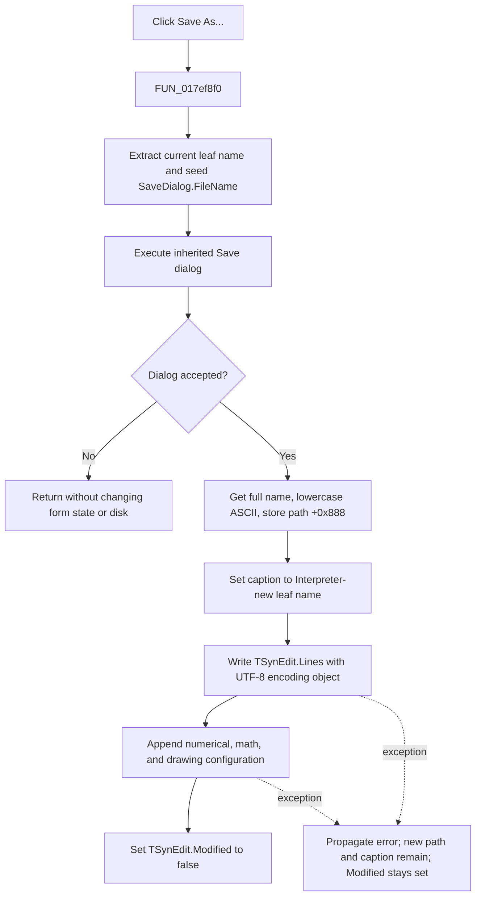

# Save &As...

> Analysis status: Evidence-backed source review complete.

## Control

| Property | Recovered value |
| --- | --- |
| Form | I_Class |
| Component path | I_Class.MainMenu.mFile.miSaveAs |
| Control class | TMenuItem |
| Caption | Save &As... |
| Hint | Not present in the recovered resource. |
| Handler name | miSaveAsClick |
| Handler address | 017ef8f0 |
| Graph node | `resource:dfm:I_Class/I_Class.MainMenu.mFile.miSaveAs` |
| Handler node | `function:017ef8f0` |
| Graph layer | UI |

## What happens when clicked

The menu item opens the inherited Save dialog for the current I_Class interpreter project. `FUN_017ef8f0` is a one-call event wrapper. It delegates the complete operation to `FUN_017ef730`.

Before the dialog opens, the coordinator extracts only the leaf name from the current project path at form offset `+0x888`. It assigns that leaf name to the dialog's `FileName` property. A new I_Class document starts with `noname.ipr`, so that is the initial proposed name until the user has selected another path. The recovered code does not set a filter, default extension, initial directory, or overwrite option in this click path.

If the dialog is cancelled, the accepted branch does not run. The form's current path, caption, editor text, modified state, and disk file remain unchanged. The dialog object was seeded with the current leaf name before execution, but the application performs no post-cancel copy-back.

## Accepted Save As path

When the dialog returns success, the coordinator gets its full `FileName` value and converts every ASCII `A` to `Z` character to lowercase. It stores this lowercase value as the current project path at `+0x888`. This is a conversion of the complete accepted path, not only of the extension.

The coordinator then extracts the new leaf name and formats it into the recovered form-caption template `Interpreter-<%s>`. It updates the I_Class window caption before it starts the file write.

The shared I_Class save adapter receives the accepted path, the `I_Class.Edit` `TSynEdit.Lines` object, and the interpreter model's numerical-format, math, and drawing configuration fields. The broad `.ipr` serializer performs two writes:

1. It asks the editor string list to save the source text with the recovered encoding singleton for code page `0xFDE9` (65001, UTF-8).
2. It opens the same path as a Pascal text file and appends a configuration section. The section starts with `@ Configuration begin`, includes `; numerical format`, `; math`, and `; drawing` groups, and ends with `.@ Configuration end`.

The append path passes code page `0` to the Pascal text-file initializer. The recovered RTL resolves that value to its current default code page. Therefore, only the initial source-text write is explicitly UTF-8 in this path. The recovered application code does not prove whether the UTF-8 writer emits a preamble or whether non-ASCII configuration values use the same encoding.

After both writes return, the coordinator sets the SynEdit `Modified` property to false. This is the only proven dirty-state change in the handler. The saved `.ipr` file is the persistence boundary; this path does not write a registry or database setting.

## Failure and caller boundaries

The application path has no temporary file, rename, transaction, local exception handler, or rollback. The accepted path and window caption are changed before the serializer runs. If the source write or later configuration append raises an exception, the handler does not clear `Modified`, but the form retains the new path and caption. A target file can already contain replaced source text or an incomplete configuration section. The exact file contents after a low-level write failure depend on the RTL failure point.

The normal **Save** command is separate. Its dispatcher calls this Save As coordinator only while the current name is `noname.ipr`; otherwise it writes directly to the existing path. The unsaved-change guard is also separate and owns the prompt logic. It calls normal Save without receiving a save-success result. Consequently, if that route reaches Save As and the user cancels the dialog, this procedure cannot veto the guard's caller. The direct **Save As...** click itself does not run an unsaved-change prompt.

## Click flow

## Handler and call-path evidence

- [FUN_017ef8f0](../../../DecompiledSources/Tina16/functions/00000000017EF8F0__FUN_017ef8f0.c) is the published `miSaveAsClick` wrapper and calls only `FUN_017ef730`.
- [FUN_017ef730](../../../DecompiledSources/Tina16/functions/00000000017EF730__FUN_017ef730.c) seeds and executes the dialog, lowercases and stores an accepted path, updates the caption, calls the save adapter, and clears `Modified` only after that call returns.
- [FUN_0043e1a0](../../../DecompiledSources/Tina16/functions/000000000043E1A0__FUN_0043e1a0.c) proves the ASCII uppercase-to-lowercase conversion.
- [FUN_017ef620](../../../DecompiledSources/Tina16/functions/00000000017EF620__FUN_017ef620.c) passes `TSynEdit.Lines` and the interpreter configuration to the shared writer.
- [FUN_010cd780](../../../DecompiledSources/Tina16/functions/00000000010CD780__FUN_010cd780.c) proves the source-text save followed by the appended configuration groups.
- [FUN_0045b660](../../../DecompiledSources/Tina16/functions/000000000045B660__FUN_0045b660.c) constructs the encoding object with code page `0xFDE9`.
- [FUN_017ef6c0](../../../DecompiledSources/Tina16/functions/00000000017EF6C0__FUN_017ef6c0.c) proves the `noname.ipr` branch used by normal Save.
- [FUN_017f1540](../../../DecompiledSources/Tina16/functions/00000000017F1540__FUN_017f1540.c) proves that the separate unsaved-change guard does not consume a save-success result.
- The DFM resource binds `miSaveAs.OnClick` to `miSaveAsClick` at `017ef8f0`, identifies `I_Class.Edit` as `TSynEdit`, and supplies the `Interpreter-<%s>` caption template.

## Resource evidence

- Caption: `Save &As...`.
- No hint, action, image, shortcut, or extracted glyph is present for this menu item.
- The resource does not expose the inherited Save dialog's filter or options.

## Analysis limits

- No application-level file-existence or overwrite check is present in this handler. Any confirmation performed by the native/VCL Save dialog is not recovered here.
- The low-level RTL exception presentation, partial-write point, and UTF-8 preamble behavior are not proven.
- The exact Delphi field names at offsets `+0x888`, `+0xb20`, and `+0xb48` are not recovered. Their project-path, Save-dialog, and interpreter-model roles follow from repeated reads, writes, and consumers.
