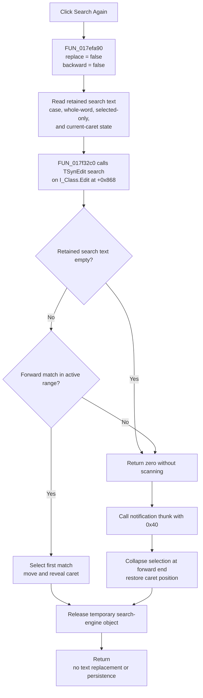

# Search &Again

## Control

| Property | Recovered value |
| --- | --- |
| Form | `I_Class` |
| Component path | `I_Class.MainMenu.mEdit.miSearchAgain` |
| Control class | `TMenuItem` |
| Caption | `Search &Again` |
| Shortcut value | `114` |
| Initial enabled state | `False` |
| Hint, action, or image | Not present in the recovered resource. |
| Handler | `miSearchAgainClick` at `017efa90` |
| Target editor | `I_Class.Edit`, a `TSynEdit` control at form offset `+0x868` |

## Purpose

`Search Again` repeats a text search in the `I_Class` source editor without
opening the search or replace dialog. It uses the retained search text and
supported options from the last accepted Find or Replace dialog, but it does
not repeat the exact direction or action:

- it always searches forward;
- it always performs a find-only operation;
- it does not replace text, even when the retained state came from
  [`Replace`](mireplace-88bdf93249.md).

The resource initializes the menu item as disabled. The
[`Find`](mifind-5b42f6ba31.md) handler explicitly enables it before opening the
search dialog.

## Retained search state

The shared Find and Replace coordinator keeps these values in process-global
state:

| Retained value | Search Again use |
| --- | --- |
| Search text | Passed to the editor search engine. |
| Case sensitivity | Reused. |
| Whole words only | Reused. |
| Selected text only | Reused as the search-range restriction. |
| Search from caret | The editor's repeat-search state is set after an accepted Find or Replace search, so the repeat starts from the current caret or selection boundary. |
| Forward or backward direction | Not reused. `miSearchAgainClick` passes the forward value directly. |
| Replacement text | Passed through the shared call signature, but ignored because replacement flags are not set. |
| Regular expression | Not retained by this `I_Class` wrapper. The common `TextSearchDialog` resource contains this checkbox, but `FUN_017f2f00` does not initialize or read it. |

The search dialog histories are also retained in global strings. Search Again
does not add to or change those histories.

## Click behavior

1. [`FUN_017efa90`](../../../DecompiledSources/Tina16/functions/00000000017EFA90__FUN_017efa90.c)
   calls the shared executor with `replace = false` and `backward = false`.
2. The shared executor builds the editor-search option mask from the retained
   case-sensitive, whole-word, selected-only, and current-caret state. It does
   not set the replace, replace-all, replacement-prompt, or backward bits.
3. It calls the `TSynEdit` search routine with `I_Class.Edit`, the retained
   search text, and the retained replacement text. The replacement string has
   no effect in find-only mode.
4. On a match, the editor search routine selects the found text, moves the
   caret to the match, and makes that position visible. It returns after the
   first forward match. The recovered routine does not wrap to the start after
   it reaches the end of its active range.
5. When the search returns zero matches, the executor calls an unrecovered
   notification thunk with value `0x40`. The source does not establish whether
   this is an audible or visible notification. Because this command is always
   forward, it then collapses the editor selection at its end and restores the
   caret to that position.
6. The executor releases its temporary search-engine object before returning.

## No prior search and cancellation

The disabled menu state is the normal guard against Search Again before Find.
There is one recovered boundary:

- `miFindClick` enables Search Again before it opens the Find dialog.
- If the user cancels that dialog before a search term has been retained, the
  menu can remain enabled with an empty retained term.
- A later Search Again click passes that empty term to the editor search
  routine. The routine returns zero without scanning text, so the common
  no-match notification and forward selection-collapse path runs.

Search Again itself has no dialog and no cancellation branch.

## Errors, state changes, and persistence

- If the editor has no assigned search-engine object, the shared editor routine
  raises the recovered error `No search engine has been assigned`. The handler
  has no local exception handling or recovery.
- A successful click changes only editor interaction state: the selected range,
  caret, and visible position. It does not change the source text or its
  modified flag.
- Search Again does not modify the retained search term, option values, search
  history, or replacement history.
- The retained values are application-process globals. This click does not
  write them to a project file, registry entry, database, or other persistent
  store. The recovered source does not prove that they survive application
  shutdown.
- A selected-only search remains limited to the range supplied by the editor.
  The wrapper has no fallback to the whole document when that range contains no
  next match.

## Click flow

## Source evidence

- [`FUN_017efa90`](../../../DecompiledSources/Tina16/functions/00000000017EFA90__FUN_017efa90.c)
  is the one-call menu handler and supplies both zero mode arguments.
- [`FUN_017f32c0`](../../../DecompiledSources/Tina16/functions/00000000017F32C0__FUN_017f32c0.c)
  assembles the repeat-search flags, calls the editor search routine, handles
  the zero-match result, adjusts the selection and caret, and releases the
  temporary search engine. Its canonical annotation belongs to the Find
  control analysis.
- [`FUN_017f2f00`](../../../DecompiledSources/Tina16/functions/00000000017F2F00__FUN_017f2f00.c)
  owns the Find and Replace dialog lifecycle and retained global state. Its
  canonical annotation also belongs to the Find control analysis.
- [`FUN_00c09100`](../../../DecompiledSources/Tina16/functions/0000000000C09100__FUN_00c09100.c)
  proves the empty-term return, forward-range scan, selection and caret update,
  first-match return, optional replacement branches, and missing-engine error.
- The recovered DFM evidence identifies `I_Class.Edit` as `TSynEdit`, gives
  Search Again caption `Search &Again`, shortcut `114`, and initial
  `Enabled = False`, and provides no hint, action, or image.

## Analysis limits

- The original Delphi names of the retained global variables are unavailable.
- The purpose of the notification thunk called with `0x40` is not recovered.
  This article does not label it as a specific sound or message.
- Search Again uses the application-wide retained state. The source does not
  associate that state with a specific document or editor instance.
