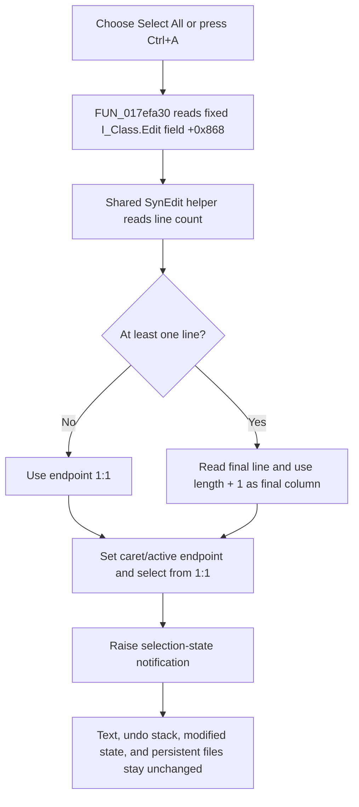

# &Select All

The **Select All** command always targets the `I_Class.Edit` SynEdit control. It selects the complete interpreter source buffer without changing the text.

## Control

| Property | Recovered value |
| --- | --- |
| Form | I_Class |
| Component path | I_Class.MainMenu.mEdit.miSelectAll |
| Control class | TMenuItem |
| Caption | &Select All |
| Hint | Not present in the recovered resource. |
| Text | Not present in the recovered resource. |
| Handler name | miSelectAllClick |
| Handler address | 017efa30 |
| Graph node | `resource:dfm:I_Class/I_Class.MainMenu.mEdit.miSelectAll` |
| Handler node | `function:017efa30` |
| Graph layer | UI |

## What happens when clicked

`FUN_017efa30` ignores `Sender` and passes the form field at offset `+0x868` to the canonical SynEdit select-all helper `FUN_00bfa390`. The recovered DFM identifies that field as `I_Class.Edit`, a `TSynEdit` aligned to the form's client area. The command does not select whichever control currently has focus and does not call `SetFocus`.

The shared helper starts the range at line 1, column 1. It reads the editor line count and, for a nonempty line collection, obtains the final line and sets the other endpoint to that line's length plus one. It passes the document-end coordinate as the caret/active endpoint, applies the start and end selection coordinates as one batched editor update, preserves the selection mode, and raises the SynEdit selection-state notification.

If the line collection has no entries, the helper clamps the endpoint to line 1, column 1. A normal empty SynEdit buffer with one empty line also calculates 1:1 because the last-line length is zero. Both cases leave an empty selection at 1:1. The handler has no separate no-content message.

## Read-only, undo, and modified state

The `I_Class.Edit` resource does not set `ReadOnly`; it uses the editable default. Neither the wrapper nor the shared helper checks read-only state, and the command calls only coordinate, selection, and status-update paths. A read-only setting therefore does not introduce a different recovered branch.

Selecting text does not write the editor's line collection, call the interpreter's Undo command, add an undo record, or set a source-modified flag. The caret and selection are transient editor state. The selection-state notification lets normal SynEdit and form-idle UI logic react to a nonempty selection, but this handler does not directly enable menu items or repaint another control.

The DFM shortcut value `16449` is Delphi's Ctrl+A encoding. Choosing the menu item or using Ctrl+A reaches the same wrapper and fixed editor target.

## Errors and persistence

- The wrapper assumes that the form's `Edit` field is initialized. It does not null-check the editor, return a status, catch an exception, or show an error dialog.
- Line and column values are clamped by the shared helper. Empty content is a supported no-op selection, not an error.
- The command does not copy text to the clipboard. Copy remains a separate command that consumes the resulting selection.
- It does not change or save the interpreter source, project, settings, or registry. The selection and caret are not persistent document data.

## Click flow

## Handler evidence

- Source: [DecompiledSources/Tina16/functions/00000000017EFA30__FUN_017efa30.c](../../../DecompiledSources/Tina16/functions/00000000017EFA30__FUN_017efa30.c)
- Canonical SynEdit select-all helper: [DecompiledSources/Tina16/functions/0000000000BFA390__FUN_00bfa390.c](../../../DecompiledSources/Tina16/functions/0000000000BFA390__FUN_00bfa390.c)
- Batched selection transaction: [DecompiledSources/Tina16/functions/0000000000C0A5F0__FUN_00c0a5f0.c](../../../DecompiledSources/Tina16/functions/0000000000C0A5F0__FUN_00c0a5f0.c)
- I_Class selection-dependent idle update: [DecompiledSources/Tina16/functions/00000000017F14B0__FUN_017f14b0.c](../../../DecompiledSources/Tina16/functions/00000000017F14B0__FUN_017f14b0.c)
- Recovered role: Select all text in the `I_Class` interpreter editor.
- Current graph summary: Handles 1 Delphi UI event: I_Class.MainMenu.mEdit.miSelectAll.OnClick.
- Current graph behavior: Passes the form's fixed `Edit` SynEdit control to the shared select-all helper; empty content produces an empty selection at 1:1.
- Current graph evidence: The DFM identifies `I_Class.Edit` as a `TSynEdit`, the wrapper reads form field `+0x868`, and the shared helper calculates and applies the complete document range.
- Complexity: simple
- Distinct outgoing calls: 1

## Direct calls

- `function:00bfa390` — FUN_00bfa390

## Resource evidence

- Kind: Not present in the recovered resource.
- Modal result: Not present in the recovered resource.
- Checked state: Not present in the recovered resource.
- List items: Not present in the recovered resource.
- Image reference: Not present in the recovered resource.
- Extracted glyph: None.

## Nearby label candidates

Nearby labels are layout candidates only. They are not proof of behavior.

- No same-parent label candidate is available.

## Analysis limits

- `FUN_00bfa390` is the canonical shared SynEdit Select All implementation documented by `TIARA-diz.6.7.39`; this article does not redefine its graph annotation.
- The helper's internal editor coordinate setter is recovered through a virtual slot. Its role as the caret/active coordinate setter is established by the selection transaction and repeated SynEdit coordinate call sites; its original Delphi method name is not recovered.
- The resource has no explicit `ReadOnly` property. Runtime code could change that property, but this command has no read-only branch and performs no text mutation.
